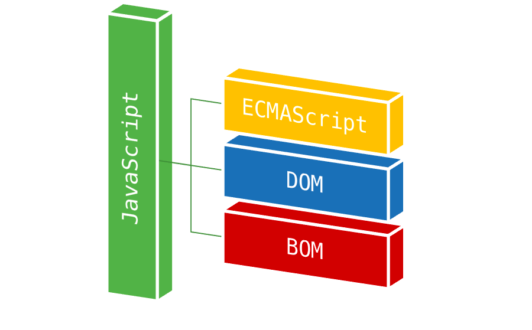
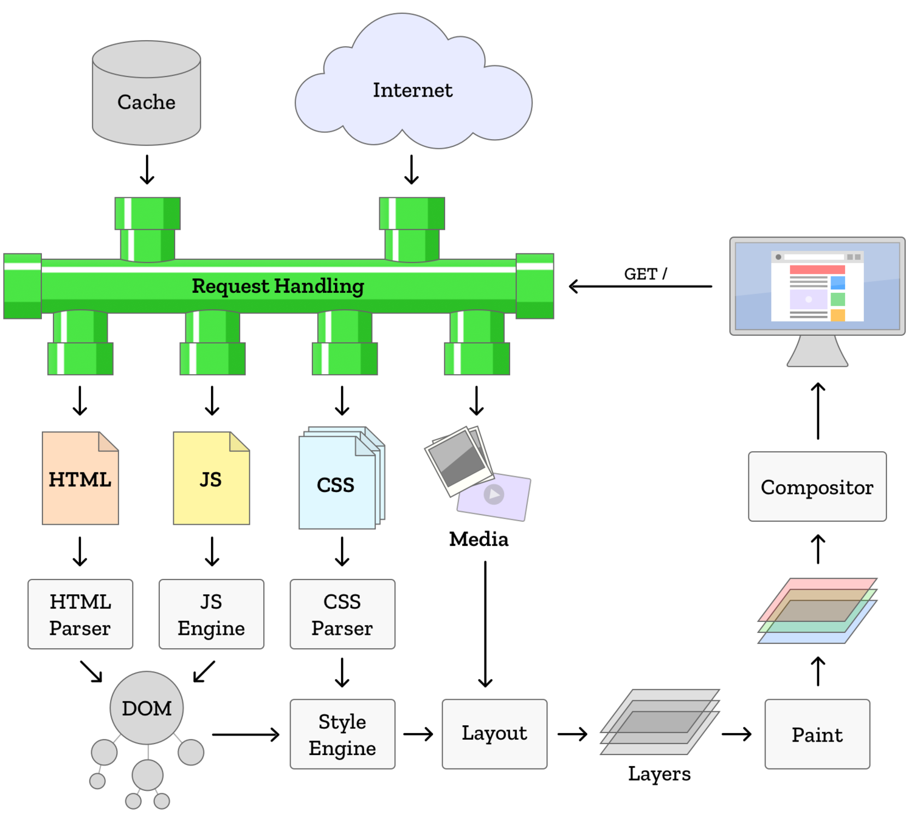

# Máster en Programación FullStack con JavaScript y Node.js
### JS, Node.js, Frontend, Backend, Firebase, Express, Patrones, HTML5_APIs, Asincronía, Websockets, Testing

## Clase 12


### BOM (Browser Object Model)



### Window history

```javascript
history.length

// Ir atras
history.go(-1);
history.back();

// Ir adelante
history.go(1);
history.forward();
```

### Window Navigator 

```javascript
function informacionSistema(){
	console.log("appCodeName:", window.navigator.appCodeName);
	console.log("appName:", window.navigator.appName);
	console.log("appVersion:", window.navigator.appVersion);
	console.log("platform:", window.navigator.platform);
	console.log("product:", window.navigator.product);
	console.log("userAgent:", window.navigator.userAgent);
	console.log("javaEnabled:", window.navigator.javaEnabled());
	console.log("language (used):", window.navigator.language);
	console.log("language (support):", window.navigator.languages);
	console.log("conectado a internet?", window.navigator.onLine);
	console.log("mimeTypes:",window.navigator.mimeTypes);
	console.log("Plugins:", navigator.plugins);
}
```

### Window Screen

```javascript
function informacionPantalla(){
	console.log("availTop:", window.screen.availTop);
	console.log("availLeft:", window.screen.availLeft);
	console.log("availHeight:", window.screen.availHeight);
	console.log("availWidth:", window.screen.availWidth);
	console.log("colorDepth:", window.screen.colorDepth);
	console.log("height:", window.screen.height);
	console.log("left:", window.screen.left);
	console.log("orientation:", window.screen.orientation);
	console.log("pixelDepth:", window.screen.pixelDepth);
	console.log("top:", window.screen.top);
	console.log("width:", window.screen.width);
}
```


###  window & document location

```javascript
	function informacionEnlace(url){
	
		var enlace = document.createElement('a');
		enlace.href = url || 'https://fictizia.com:3000/formacion/curso_javascript?q=JS#contenido-curso';
		
		console.log("href:" ,enlace.href);
		console.log("protocol:", enlace.protocol);
		console.log("host:", enlace.host);
		console.log("hostname:", enlace.hostname);
		console.log("port:", enlace.port);
		console.log("pathname:", enlace.pathname);
		console.log("search:", enlace.search);
		console.log("hash:", enlace.hash);
		console.log("origin:", enlace.origin);
	}
```

**Métodos:**
- .assign() *Carga una página nueva*
```javascript
document.location.assign('http://fictizia.com/formacion/curso_javascript');
```
- .reload() *Recarga*
```javascript
document.location.reload(); // Recarga
document.location.reload(true); // Recarga sin usar el cache
```
- .replace() *Carga una página nueva, sustituyendo la actual en el historial*
```javascript
document.location.replace('http://fictizia.com/formacion/curso_javascript');
```
- .toString() *Devuelve el href como cadena*
```javascript
var enlace = document.createElement('a');
enlace.href = 'http://fictizia.com/formacion/curso_javascrip';

console.log("toString:" ,enlace.toString());
```

### Terminología

`<a href="https://fictizia.com">Fictizia</a>`
- `a` es la etiqueta o tag
- `href` es el atributo
- `"https://fictizia.com"` es el valor del atributo
- `Fictizia` es el texto

### Data-Attibutes

```html
<article
  id="electriccars"
  data-columns="3"
  data-index-number="12314"
  data-parent="cars">
...
</article>
```

```javascript
var article = document.getElementById('electriccars');
 
article.dataset.columns // "3"
article.dataset.indexNumber // "12314"
article.dataset.parent // "cars"
```


```css
article::before {
  content: attr(data-parent);
}

article[data-columns='4'] {
  width: 600px;
}
```


### Render del browser



- [An Introduction to Browser Rendering](https://www.youtube.com/watch?v=n1cKlKM3jYI)
- [Ryan Seddon: So how does the browser actually render a website | JSConf EU 2015](https://www.youtube.com/watch?v=SmE4OwHztCc)
- [Kruno: How browsers work | JSUnconf 2017](https://www.youtube.com/watch?v=0IsQqJ7pwhw)

### DOM


- [DOM - Document Object Model](https://developer.mozilla.org/en-US/docs/Web/API/Document_Object_Model)
- [Element](https://developer.mozilla.org/en-US/docs/Web/API/Element)
- [Node](https://developer.mozilla.org/en-US/docs/Web/API/Node)
- [NodeList](https://developer.mozilla.org/en-US/docs/Web/API/NodeList)
- [Tipos de nodos en el dom](https://developer.mozilla.org/en-US/docs/Web/API/Node/nodeType)


### DOM Selectores: Root Nodes
- `document`
- `document.head`
- `document.body`


### DOM Selectores: Parent Nodes
- [parentNode](https://developer.mozilla.org/en-US/docs/Web/API/Node/parentNode)
- [parentElement](https://developer.mozilla.org/en-US/docs/Web/API/Node/parentElement)


#### DOM Selectores: Children Nodes
- [childNodes](https://developer.mozilla.org/en-US/docs/Web/API/Node/childNodes)
- [firstChild](https://developer.mozilla.org/en-US/docs/Web/API/Node/firstChild)
- [lastChild](https://developer.mozilla.org/en-US/docs/Web/API/Node/lastChild)
- [children](https://developer.mozilla.org/en-US/docs/Web/API/ParentNode/children)
- [firstElementChild](https://developer.mozilla.org/en-US/docs/Web/API/ParentNode/firstElementChild)
- [lastElementChild](https://developer.mozilla.org/en-US/docs/Web/API/ParentNode/lastElementChild)


#### DOM Selectores: Sibling Nodes
- [previousSibling](https://developer.mozilla.org/en-US/docs/Web/API/Node/previousSibling)
- [nextSibling](https://developer.mozilla.org/en-US/docs/Web/API/Node/nextSibling)
- [previousElementSibling](https://developer.mozilla.org/en-US/docs/Web/API/NonDocumentTypeChildNode/previousElementSibling)
- [nextElementSibling](https://developer.mozilla.org/en-US/docs/Web/API/NonDocumentTypeChildNode/nextElementSibling)


### DOM Selectores: Acceso a los elementos

- getElementById():
```javascript
    // <tag id = "x" >
    document.getElementById("id");
```

- getElementsByName():
```javascript
    // <tag name = "x" >
    document.getElementsByName("x");
```

- getElementsByTagName():
```javascript
    // <tag >
    document.getElementsByTagName("input");
```

- getElementsByClassName():
```javascript
    // <tag class="test-class">
    document.getElementsByClassName("test-class");
```


### DOM Selectores: querySelector & querySelectorAll

- [Soporte querySelector](http://caniuse.com/#search=querySelector)
- :warning: **IMPORTANTE:**  Los retornos de *Node.childNodes* y *document.querySelectorAll* - NO son arrays. 

```javascript

var listaDivs = document.querySelectorAll('div');

// Iteración
for (var i = 0; i < listaDivs.length; ++i) {
  var elemento = listaDivs[i];
  console.log("Elemento: ", elemento);
}

```


**querySelector()**
Devuelve el primer elemento que coincida con el selector 

```html
    <div id="miDiv">
        <span id="miId5" class="miClase" title="cinco"></span>
        <span id="miId4" class="miClase" title="cuatro"></span>
        <span id="miId3" class="miClase" title="tres"></span>
        <span id="miId2" class="miClase" title="dos"></span>
        <span id="miId1" class="miClase" title="uno"></span>
    </div> 
```

```javascript
    document.getElementById('miId1').title // uno
    document.querySelector('#miDiv .miClase').title // cinco
    document.querySelector('#miDiv #miId1.miClase').title // uno
    document.querySelector('#miDiv .inventado').title // ERROR -> undefined
    document.querySelector('#miDiv .miClase[title^=u]').title // uno
```

**querySelectorAll()**
Devuelve todos los elementos que coincida con el selector en un pseudo-array
```javascript
    document.querySelectorAll('#miDiv .miClase') // [<span id="miId5" ... ]
    document.querySelectorAll('p') // todos los parrafos
    document.querySelectorAll('div, img') // todos los divs e imágenes
    document.querySelectorAll('a > img') // todos las imágenes contenidas en enlaces
```


**Conversión a Arrays**

- Mas info en [Convert NodeList to Array de David Walsh](https://davidwalsh.name/nodelist-array)
```javascript

//Opción 1
var nodesArray = Array.prototype.slice.call(document.querySelectorAll("div"));

//Opción 2
var nodesArray = [].slice.call(document.querySelectorAll("div"));
```

### DOM: Recursos

- [Todos los selectores CSS3](https://www.w3schools.com/cssref/css_selectors.asp)
- [Introduction to the DOM](https://www.digitalocean.com/community/tutorials/introduction-to-the-dom)
- [Understanding the DOM Tree and Nodes](https://www.digitalocean.com/community/tutorials/understanding-the-dom-tree-and-nodes)
- [How To Access Elements in the DOM](https://www.digitalocean.com/community/tutorials/how-to-access-elements-in-the-dom)


### DOM: Depuración por consola

- [Más información](https://developers.google.com/web/tools/chrome-devtools/console/expressions)
```javascript
$('code')		// Muestra el primer elemento que coincide con el selector de CSS especificado.
			// Combinación de teclas para document.querySelector().
$$('figure')		// Muestra un conjunto de todos los elementos que coinciden con el selector de CSS especificado. 
			// Alias para document.querySelectorAll().
$x('html/body/p')	// Muestra un conjunto de elementos que coinciden con XPath especificada.
```


### DOM: Estilos con Javascript
```javascript
// getter
window.getComputedStyle(document.getElementById("id"));
window.getComputedStyle(document.body).getPropertyValue('display');
// setter
document.body.style.display="none";
document.getElementById("id").style.display="none";
```


### Ejercicios

**1 -** Saca una lista de los cursos disponibles en Fictizia en el [área de Desarrollo interactivo y Web](https://www.fictizia.com/planes/desarrollo-interactivo-y-web) y conviertelo en Markdown. 

```javascript
	var markdown = "# Cursos de Fictizia en el Área de Desarrollo interactivo y Web\n\n";
	
	var cursos = document.querySelectorAll('.plan');

	
	for (var i = 0; cursos.length > i; i++) {
		
		var curso = cursos[i];
		var horas = curso.querySelector(".mainTag").innerText;
		var titulo = curso.querySelector("a").innerText
		var link = curso.querySelector("a").href
		markdown +=  "- [" + titulo + " (" + horas + ")](" + link + ")\n";
	}
	
	console.log(markdown);
```

- Respuesta esperada (consola):

```
# Cursos de Fictizia en el Área de Desarrollo interactivo y Web

- [Máster en Diseño de interfaz y Front-end con HTML5, CSS3 y jQuery (165 HORAS)](https://fictizia.com/formacion/master-interfaz-frontend-html5-css3-jquery)
- [Máster en Programación FullStack con JavaScript y Node.js (300 HORAS)](https://fictizia.com/formacion/master-javascript-nodejs)
- [Curso de Diseño de interfaz en proyectos Web, Apps y Smart TV (45 HORAS)](https://fictizia.com/formacion/curso-diseno-interfaz-web-apps-smart-tv)
- [Curso de UX y diseño de productos digitales (56 HORAS)](https://fictizia.com/formacion/curso-ux)
- [Curso de maquetación y animación Web con HTML5 y CSS3 (72 HORAS)](https://fictizia.com/formacion/curso-frontend-html5-css3)
- [Curso de jQuery para maquetadores web (36 HORAS)](https://fictizia.com/formacion/curso-programacion-jquery)
- [Curso de JavaScript para desarrolladores web (45 HORAS)](https://fictizia.com/formacion/curso-javascript)
- [Curso de JavaScript Avanzado para desarrolladores Front-end (72 HORAS)](https://fictizia.com/formacion/curso-javascript-avanzado)
- [Curso de Angular (v6.x) (36 HORAS)](https://fictizia.com/formacion/curso-angular-javascript)
- [Curso de React + Redux (30 HORAS)](https://fictizia.com/formacion/curso-react-js-redux)
- [Curso de Node.js para desarrolladores Front-end (24 HORAS)](https://fictizia.com/formacion/curso-nodejs)
- [Curso de AngularJS (v1.x) (30 HORAS)](https://fictizia.com/formacion/curso-angularjs)
- [Curso de Polymer (42 HORAS)](https://fictizia.com/formacion/curso-polymer)
- [Curso de PHP (45 HORAS)](https://fictizia.com/formacion/curso-php)
- [Curso de PHP Avanzado con Laravel (36 HORAS)](https://fictizia.com/formacion/curso-laravel-php-avanzado)
- [Curso de Python (45 HORAS)](https://fictizia.com/formacion/curso-python)
- [Curso de aplicación y entrenamiento de Seguridad OWASP Top 10 (32 HORAS)](https://fictizia.com/formacion/curso-seguridad-owasp)
- [Curso de metodologías ágiles para desarrollo de proyectos (33 HORAS)](https://fictizia.com/formacion/curso-agile-scrum)
- [Curso de Vue.JS + Vuex (36 HORAS)](https://fictizia.com/formacion/curso-vue-js)
```

**2 -** Hagamos la [web del Metro](https://www.metromadrid.es/es/index.html) más divertida.
- Saca el estado actual de todas las líneas del metro de Madrid por consola.

- Antes de Diciembre de 2018
```javascript
	var lineas = document.querySelectorAll('.bloquet');
	
	for (var i = 0; i < lineas.length; i++) {
	  var estado = lineas[i].querySelector('.circulacion > .txt > a');
	  
	  if(!estado) estado = lineas[i].querySelector('.circulacion > .r > a');
	  
	  if(estado) console.log(estado.innerText.trim());
	  
	}
```

- Después de Diciembre de 2018
```javascript

function capitalizeFirstLetter(string) {
	if(string && typeof(string) === "string") {
		return string.charAt(0).toUpperCase() + string.slice(1);
	} else {
		return false
	}
    
}

function warningDetails (el, name) {
	if (elContainsClass (el, name)) {
		var idRef = el.parentNode.dataset.toggle
		return document.getElementById(idRef).innerText
	} else {
		return false;
	}
}

function cleanName (item) {
	var imgSlctr = item.querySelector("img")
	if(imgSlctr && imgSlctr.className) {
		var firstClass = imgSlctr.className.split(' ')[0]
		return firstClass.split("-").join(" ")
	} else {
		return false
	}
}

function elContainsClass (el, name) {
	if(el && el.classList) {
		return el.classList.contains(name)
	} else {
		return false
	}
}

function printTheLegend (data){
	return `En ${data.line} circulación ${data.working ? "normal" : "deficiente"}. ${data.warnings ? data.warnings : ""}`
}


var lineas = Array.prototype.slice.call(document.querySelectorAll(".list__otraslineas > li:not(:last-child)"));
lineas.forEach(function (item) {
	var spanSlctr = item.querySelector("span > span") || item.querySelector("span");

	var text = printTheLegend({
		line: capitalizeFirstLetter(cleanName(item)),
		working: elContainsClass (spanSlctr, "state--green"),
		warnings: warningDetails (item.querySelector("span > span"), "state--alert")
	})
	console.log(text)
})
```


- Respuesta esperada:
```txt
Circulación normal en Línea 1
Circulación normal en Línea 8
Circulación normal en Línea 2
Circulación normal en Línea 9
Circulación normal en Línea 3
Circulación normal en Línea 10
Circulación normal en Línea 4
Circulación normal en Línea 11
Circulación normal en Línea 5
Circulación normal en Línea 12
Circulación normal en Línea 6
Circulación normal en Ramal
Circulación normal en Línea 7
Circulación normal en ML1
```


**3 -**  Diseña un script que sustituya todas las imágenes de las entradas de [Tecnología del Mundo Today](http://www.elmundotoday.com/noticias/tecnologia/) por [imágenes dummy de gatitos](https://placekitten.com/).
```javascript
		var imagenes = document.querySelectorAll('.td-module-thumb img');

		for(var i = 0; i < imagenes.length; i++){
			var url = document.querySelectorAll('.td-module-thumb img')[i].src;
			var ancho = document.querySelectorAll('.td-module-thumb img')[i].width;
			var alto = document.querySelectorAll('.td-module-thumb img')[i].height;
			var sustituto = "https://placekitten.com/"+ancho+"/"+alto;
			document.querySelectorAll('.td-module-thumb img')[i].src = sustituto;
			// Hack para solucionar el visionado
			document.querySelectorAll('.td-module-thumb img')[i].removeAttribute("srcset");
		}
```

**4 -** Nos creamos un array de objetos con la informacion, links y fotografias de l@s [profes de Fictizia](https://www.fictizia.com/profesorado)
```javascript
	var listaProfesores = [];
	
	var profesores = document.querySelectorAll('.microCard');

	for (var i = 0; profesores.length > i; i++) {
		
		var profesor = profesores[i];
		
		detallesProfesor = {
			nombre: profesor.querySelector("h3").innerText,
			bio: profesor.querySelector("p").innerText,
			avatar: profesor.querySelector("img").src,
		};
		
		var links = profesor.querySelectorAll(".microBtns > li")
		
		for (var j = 0; links.length > j; j++) {
			var link = links[j]
			var linkNombre = link.innerText.toLowerCase().trim();
			var linkUrl = link.querySelector("a").href;
			detallesProfesor[linkNombre] = linkUrl
		}
		
		listaProfesores.push(detallesProfesor)
	}
	
	console.log(listaProfesores);
```