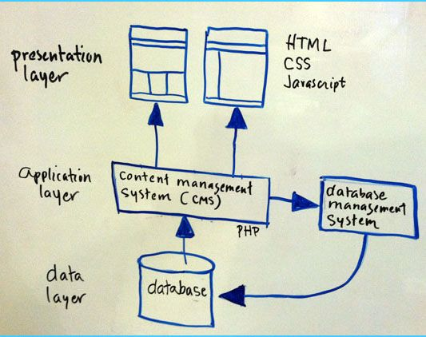
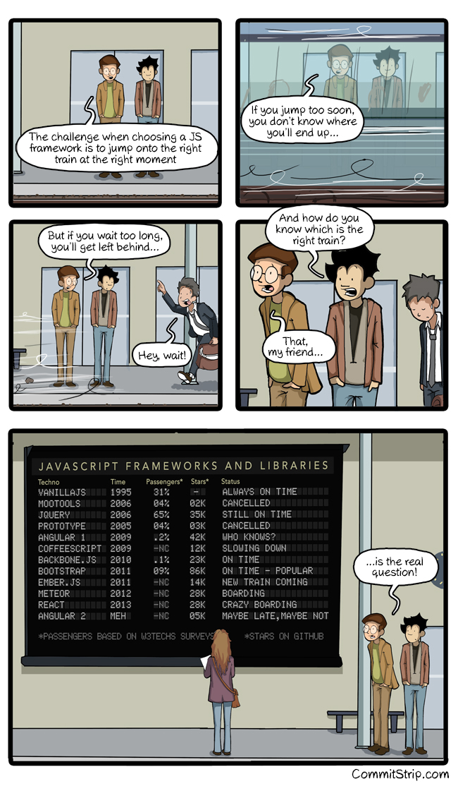

# Máster en Programación FullStack con JavaScript y Node.js
### JS, Node.js, Frontend, Backend, Firebase, Express, Patrones, HTML5_APIs, Asincronía, Websockets, Testing

## Clase 1

### Normas y demás
- Puntualidad
- Liquidos y comida
- Ubicación
- Cafeteria, cajeros, farmacias, etc...

### Importante
- Descansos
- Gestión del curso en GitHub
 - Comunicación fuera de clase
 - Repositorio común
 - Toda la teoría, prácticas y recursos

### metodología
- 3 Proyectos personales
- Participación en proyectos de grupo
- Participación en Guild 24 de Open Source Weekends (OSW)
- Prácticas y "deberes"
- Repasos, para afianzar lógica

### Temario

[Un master de 300h con mucho contenido](https://coggle.it/diagram/W5ZfeGRd293lprIt/t/master-js-y-node-de-fictizia)

### Simbología y niveles

Este master puede ser útil para diversos niveles (Básico, Medio y Avanzado).

Por definición todo es nivel básico, pero en partes del contenido se incluyen teoria y ejercicios para niveles superiores, para indicarlo usaremos:
- `Básico` :four_leaf_clover: o nada, primeros pasos en el mundo del desarollo web
- `Medio` :spades: buen nivel de programación y una expriencia media que domina los conceptos básicos y medios
- `Avanzado` :diamonds: gran nivel y experiencia que domina que domina los conceptos avanzados

### Sobre los profesores

**Bio:**
"#Maker, #IoT, #OpenSource | #JavaScript, #Node, #Python | Co-organizador de [@os_weekends](http://osweekends.com/) | Profe en [@fictiziaescuela](http://www.fictizia.com/profesores/) | Mentor en [@TetuanValley](https://twitter.com/tetuanvalley) | Autor de [#JavaScriptInspirate](https://leanpub.com/javascript-inspirate) | Freelance | xIBMer"

**Redes Sociales:**
- [Twitter](https://twitter.com/kom_256)
- [Github](https://github.com/UlisesGascon)
- [Linkedin](https://www.linkedin.com/in/ulisesgascon/)

**Bio:**
"A veces sueño que tengo que tomar decisiones con if else, o masticar con while. Entreprenú. Lio a gente en @os_weekends. Cuando me dejan, prestidigito un poco. Cuando no, hago música. Papá de @gamify_es."

**Redes Sociales:**
- [Twitter](https://twitter.com/codingcarlos)
- [Github](https://github.com/CodingCarlos)
- [Linkedin](https://www.linkedin.com/in/CodingCarlos/)

### Hablemos de la web
- [Evolution of the web](http://www.evolutionoftheweb.com/?hl=es)
- [Internet de los 90](http://theworldsworstwebsiteever.com/)
- [Internet Archive Wayback Machine - La máquina del tiempo](http://archive.org/web/)
  - [Google](http://web.archive.org/web/*/http://google.com)
    - [Prototipo - 1998](http://web.archive.org/web/19981111184551/http://google.com/)
    - [Beta - 1998](http://web.archive.org/web/19981202230410/http://www.google.com/)
    - [2000](http://web.archive.org/web/20001027222150/http://www.google.com/)
    - [2005](http://web.archive.org/web/20051114081503/http://www.google.com)
    - [2010](http://web.archive.org/web/20101130235215/http://www.google.com/)
    - [2015](http://web.archive.org/web/20151215000203/http://www.google.com/)
    - [Hoy](https://www.google.es)
  - [Amazon](http://web.archive.org/web/*/http://amazon.com)
    - [1998](http://web.archive.org/web/19981212012532/http://amazon.com/)
    - [2000](http://web.archive.org/web/20000229081105/http://www.amazon.com/exec/obidos/subst/home/home.html)
    - [2005](http://web.archive.org/web/20051126094753/http://www.amazon.com/exec/obidos/subst/home/home.html)
    - [2010](http://web.archive.org/web/20101126032341/http://www.amazon.com/)
    - [2015](http://web.archive.org/web/20151127000839/http://www.amazon.com/)
    - [Hoy](http://www.amazon.com/)
  - [Youtube](http://web.archive.org/web/*/http://youtube.com)
    - [2005](http://web.archive.org/web/20050428014715/http://www.youtube.com/)
    - [2010](http://web.archive.org/web/20100914234459/http://www.youtube.com/)
    - [2015](http://web.archive.org/web/20151115000036/https://www.youtube.com/)
    - [Hoy](https://www.youtube.com/)
  - [Facebook](http://web.archive.org/web/*/http://www.facebook.com)
    - [2005 (AboutFace)](http://web.archive.org/web/20050213040632/http://facebook.com/)
    - [2005](http://web.archive.org/web/20051020000116/http://www.facebook.com)
    - [2010](http://web.archive.org/web/20100110004754/http://www.facebook.com/)
    - [2015](http://web.archive.org/web/20150731235552/https://facebook.com/)
    - [Hoy](https://www.facebook.com)

### [El largo camino del desarrollador web](https://coggle.it/diagram/52e97f8c5a143de239005d1b/56212c4e4c505e0045c0d3bda59b77e5977c2c9bd40f3fd0b451bdcf8da4aa52)
- Front-End
- Back-End
- Full-Stack
- Dev Ops
- etc...

### Arquitectura de Internet 
**Navegación**

**Hosting**

**CMS (Back-End)**

**Ajax**

**CDN (Content Delivery Network)**

**Tracking**

**[W3C - World Wide Web Consortium](https://www.w3.org/)**

- [historia y logros](https://www.w3.org/2005/01/timelines/timeline-2500x998.png)

## Front-end
### HTML

  > HTML, sigla en inglés de HyperText Markup Language (lenguaje de marcas de hipertexto), hace referencia al lenguaje de marcado para la elaboración de páginas web. Es un estándar que sirve de referencia del software que conecta con la elaboración de páginas web en sus diferentes versiones, define una estructura básica y un código (denominado código HTML) para la definición de contenido de una página web, como texto, imágenes, videos, juegos, entre otros. Es un estándar a cargo del World Wide Web Consortium (W3C) o Consorcio WWW, organización dedicada a la estandarización de casi todas las tecnologías ligadas a la web, sobre todo en lo referente a su escritura e interpretación. Se considera el lenguaje web más importante siendo su invención crucial en la aparición, desarrollo y expansión de la World Wide Web (WWW). Es el estándar que se ha impuesto en la visualización de páginas web y es el que todos los navegadores actuales han adoptado.1

  > El lenguaje HTML basa su filosofía de desarrollo en la diferenciación. Para añadir un elemento externo a la página (imagen, vídeo, script, entre otros.), este no se incrusta directamente en el código de la página, sino que se hace una referencia a la ubicación de dicho elemento mediante texto. De este modo, la página web contiene solamente texto mientras que recae en el navegador web (interpretador del código) la tarea de unir todos los elementos y visualizar la página final. Al ser un estándar, HTML busca ser un lenguaje que permita que cualquier página web escrita en una determinada versión, pueda ser interpretada de la misma forma (estándar) por cualquier navegador web actualizado.[HTML Wikiwand](https://es.wikipedia.org/wiki/HTML)
- Versiones:
  	- HTML 1.0	(1991)
  	- HTML 2.0 (1995)
  	- HTML 3.2 (1997)
  	- HTML 4 (1997)
  	- HTML 4.01 (1999)
  	- HTML 5 (2014)

### CSS

  > Hoja de estilo en cascada o CSS (siglas en inglés de cascading style sheets) es un lenguaje usado para definir y crear la presentación de un documento estructurado escrito en HTML o XML2 (y por extensión en XHTML). El World Wide Web Consortium (W3C) es el encargado de formular la especificación de las hojas de estilo que servirán de estándar para los agentes de usuario o navegadores.
  > La idea que se encuentra detrás del desarrollo de CSS es separar la estructura de un documento de su presentación.[CSS Wikiwand](https://es.wikipedia.org/wiki/Hoja_de_estilos_en_cascada)
- Versiones:
    - Versión 1 (CSS1) en 1996
    - Versión 2 (CSS2) en 1998
    - Versión 2.1 (CSS2) en 2004
    - Versión 3 (CSS3) en 2011
- Ejemplos:
  - [El poder de CSS - CSSZenGarden](http://www.csszengarden.com/)
  - [Ejemplos CodePen](http://codepen.io/pens/3/) 
  

### JavaScript

> JavaScript (abreviado comúnmente JS) es un lenguaje de programación interpretado, dialecto del estándar ECMAScript. Se define como orientado a objetos, basado en prototipos, imperativo, débilmente tipado y dinámico.

> Se utiliza principalmente en su forma del lado del cliente (client-side), implementado como parte de un navegador web permitiendo mejoras en la interfaz de usuario y páginas web dinámicas aunque existe una forma de JavaScript del lado del servidor (Server-side JavaScript o SSJS). Su uso en aplicaciones externas a la web, por ejemplo en documentos PDF, aplicaciones de escritorio (mayoritariamente widgets) es también significativo. [JavaScript Wikiwand](https://www.wikiwand.com/es/JavaScript)

**Características**
- Multiparadigma
- Imperativo y estructurado
- Dinámico
	- Tipado dinámico
	- Objetual
	- Evaluación en tiempo de ejecución
- Funcional
	- Funciones de primera clase
- Prototípico	
	- Prototipos
	- Funciones constructoras
- Entorno de ejecución
- Funciones varídicas	
- Funciones como métodos
- Arrays y la definición literal de objetos
- Expresiones regulares

**[ECMA-262](https://www.wikiwand.com/es/ECMAScript)**
- Versiones:
	- Versión 1 (Junio de 1997)
	- Versión 2 (Junio de 1998)
	- Versión 3 (Diciembre de 1999)
	- Versión 3 (Abandonado)
	- Versión 5 (Diciembre de 2009)
	- Versión 5.1 (Diciembre de 2011)
	- Versión 6 (Junio de 2015)
	- Versión 7 (En desarrollo)

- **Compatibilidad:**
	- [ECMA6](https://kangax.github.io/compat-table/es6/)
	- [ECMA5](http://kangax.github.io/compat-table/es5/)
	- [Non-standard](http://kangax.github.io/compat-table/non-standard/)
	- [HTML5 & CSS3](http://fmbip.com/litmus/)
	- [Polyfill](https://www.wikiwand.com/en/Polyfill)

- **Compiladores**
	- [Coffeescript](http://coffeescript.org/)
	- [Typescript](http://www.typescriptlang.org/)
	- [Livescript](http://livescript.net/)

- **Librerías**
	- [underscore](http://underscorejs.org/)
	- [Jquery](https://jquery.com/)
	- [Microjs](http://microjs.com/#)
	- [Threejs](http://threejs.org/)
	- [D3.js](http://d3js.org/)
	- [Modernizr](https://modernizr.com/)
	- [Lodash](https://lodash.com/)
	- [mustache.js](https://github.com/janl/mustache.js)
	- [handlebars.js](http://handlebarsjs.com/)
	- [Firebase](http://firebase.com/)
	- [p5js](http://p5js.org/)

- **Frameworks (MV*)**
	- [Angular.js](https://angularjs.org/)
	- [Ember.js](http://emberjs.com/)
	- [Backbone.js](http://backbonejs.org/)
	- [KnockOut.js](http://knockoutjs.com/)
	- [React](http://facebook.github.io/react/)
	- [Meteor](https://www.meteor.com/)

## Back-end

### Node.js

> Node.js es un entorno en tiempo de ejecución multiplataforma, de código abierto, para la capa del servidor (pero no limitándose a ello) basado en el lenguaje de programación ECMAScript, asíncrono, con I/O de datos en una arquitectura orientada a eventos y basado en el motor V8 de Google. Fue creado con el enfoque de ser útil en la creación de programas de red altamente escalables, como por ejemplo, servidores web. Fue creado por Ryan Dahl en 2009 y su evolución está apadrinada por la empresa Joyent, que además tiene contratado a Dahl en plantilla - [Wikipedia](https://www.wikiwand.com/es/Node.js)

**Otra manera es posible**

**Puntos Fuertes**
- Asincronía (no bloqueo)
- Backend completo
- NPM (comunidad)
- Single thread (paralelismo)
- Librerías propias
- Utilidades
- Código abierto
- Basado en el V8 (escrito en C++) de Google
- Multiplataforma
- Orientado a Eventos
- **No se limita solo a servidores HTTP**

**Librerías interesantes**
- [Grunt](http://gruntjs.com/)
- [Gulp](http://gulpjs.com/)
- [Express](http://expressjs.com/es/)
- [Mongoose](http://mongoosejs.com/)
- [Socket.io](http://socket.io/)
- [Apache Cordova](http://cordova.apache.org/)
- [Async](https://www.npmjs.com/package/async)
- [Chalk](https://www.npmjs.com/package/chalk)
- [J5](http://johnny-five.io/)
- [GraphicsMagick](http://aheckmann.github.io/gm/)
- [Marked](https://github.com/chjj/marked)
- [Node-restify](https://github.com/restify/node-restify)
- [Webpack](https://github.com/webpack/webpack)
- [Morgan](https://github.com/expressjs/morgan)
- [Nodemailer](https://github.com/nodemailer/nodemailer)
- [Passportjs](http://passportjs.org/)
- [Cheerio](https://github.com/cheeriojs/cheerio)
- [X-ray](https://github.com/lapwinglabs/x-ray)
- [Bower](https://bower.io/)
- [PM2](http://pm2.keymetrics.io/)
- [Electron](http://electron.atom.io/)
- [Yeoman](http://yeoman.io/)
- [Babel](https://babeljs.io/)
- [Helmet](https://www.npmjs.com/package/helmet)
- [Faker](https://www.npmjs.com/package/faker)
- [Protractor](https://www.npmjs.com/package/protractor)
- [Nightwatch.js](http://nightwatchjs.org/)
- [Cypress.io](https://www.cypress.io/)

### Más Back-end
  
- **PHP**
  - [Laravel](https://laravel.com/) 
- **Python**
  - [Django](https://www.djangoproject.com/)
- **Ruby**
  - [Ruby on Rails](http://www.rubyonrails.org.es/)
- **Java**
  - [Spring](http://projects.spring.io/spring-framework/)
- etc...  

### NoBackend

- [Firebase](https://www.firebase.com/)
- [Parse](http://parseplatform.org/)
- [Iniciativa Nobackend](http://nobackend.org/)

### Stack
- LAMP:
  - Linux
  - Apache
  - MySQL
  - PHP
- MEAN:
  - MongoDB
  - Express
  - Angular
  - Node

### Bases de datos

- [Racionales](https://es.wikipedia.org/wiki/Base_de_datos_relacional)
  - [MySQL](https://es.wikipedia.org/wiki/MySQL)
  - [PostgreSQL](https://es.wikipedia.org/wiki/PostgreSQL)
  - [Oracle](https://es.wikipedia.org/wiki/Oracle)
  - [DB2](https://es.wikipedia.org/wiki/DB2)

- [NoSQL]()
  - Documentales([MongoDB](https://es.wikipedia.org/wiki/MongoDB))
  - Grafo([Neo4j](Neo4j))
  - Clave/valor ([Firebase](https://www.firebase.com/))
  - Orientadas a objetos ([ObjectDB](https://es.wikipedia.org/wiki/ObjectDB))
  - etc...

### Entorno de desarollo moderno

- **[JSON](https://es.wikipedia.org/wiki/JSON)**
- **[AJAX](https://es.wikipedia.org/wiki/AJAX)**
- **[APIs Rest](https://es.wikipedia.org/wiki/Representational_State_Transfer)**
- **[WEBSOCKET](https://es.wikipedia.org/wiki/WebSocket)**
- **[Platform as a service (PaaS)](https://en.wikipedia.org/wiki/Platform_as_a_service)**
- **[Programación funcional](https://es.wikipedia.org/wiki/Programaci%C3%B3n_funcional)**
- **[Test-driven development (TDD)](https://es.wikipedia.org/wiki/Desarrollo_guiado_por_pruebas)**
- **[Manifiesto por el Desarrollo Ágil de Software](http://agilemanifesto.org/iso/es/)**
- **[El estado del desarrollo Front-End en 2016 por Ashley Nolan](https://ashleynolan.co.uk/blog/frontend-tooling-survey-2016-results)**

### Desarrolladores de hoy

**JSDramas**
- [How one developer just broke Node, Babel and thousands of projects in 11 lines of JavaScript](http://www.theregister.co.uk/2016/03/23/npm_left_pad_chaos/)
- [A discussion about the breaking of the Internet](https://medium.com/@mproberts/a-discussion-about-the-breaking-of-the-internet-3d4d2a83aa4d#.r9oqkkuhb)
- [I’ve Just Liberated My Modules](https://medium.com/@azerbike/i-ve-just-liberated-my-modules-9045c06be67c#.mjp6u93c1)
- [Left-pad en GitHub](https://github.com/camwest/left-pad)
- [Is left-pad Indicative of a Fragile JavaScript Ecosystem?](http://developer.telerik.com/featured/left-pad-indicative-fragile-javascript-ecosystem/)
- [Overcoming JavaScript Fatigue](http://developer.telerik.com/topics/web-development/overcoming-javascript-fatigue/)
- [One developer just broke Node, Babel and thousands of projects in 11 lines of JavaScript](https://laravel-news.com/2016/03/one-developer-just-broke-node-babel-thousands-projects-11-lines-javascript/)
- [How 17 Lines of Code Took Down Silicon Valley’s Hottest Startups](http://www.huffingtonpost.com/ken-mazaika/how-17-lines-of-code-took_b_9532846.html)
- [Npm package author revokes his packages, breaking tons of builds](https://evertpot.com/npm-revoke-breaks-the-build/)
- [¿Y si el software Open Source desapareciera?](http://www.xataka.com/servicios/y-si-el-software-open-source-desapareciera)
- [El programador que borró 11 líneas de código y se cargó Internet](http://www.omicrono.com/2016/04/desaparicion-en-node-js-de-left-pad/)

**Cambios, cambios... y más cambios**

- [State of the Art JavaScript in 2016](https://medium.com/javascript-and-opinions/state-of-the-art-javascript-in-2016-ab67fc68eb0b#.8byumpq6f)
- [If Loving Computers is Wrong, I Don't Want to Be Right](http://blog.codinghorror.com/if-loving-computers-is-wrong-i-dont-want-to-be-right/)
- [Keeping Up and "Just In Time" Learning](http://blog.codinghorror.com/keeping-up-and-just-in-time-learning/)

**The Magpie Developer**
- [The Magpie Developer](http://blog.codinghorror.com/the-magpie-developer/)

**The Sad State of Web Development**
- [El estado del desarrollo Front-End en 2015 por Ashley Nolan](http://ashleynolan.co.uk/blog/frontend-tooling-survey-2015-results)
- [The Sad State of Web Development](https://medium.com/@wob/the-sad-state-of-web-development-1603a861d29f#.62up3vtl1)
- [A response to The Sad State of Web Development — Its not about Javascript really](https://www.reddit.com/r/programming/comments/40rwrk/a_response_to_the_sad_state_of_web_development/)

**Fatiga y tendencias**

- [A Study Plan To Cure JavaScript Fatigue](https://medium.freecodecamp.com/a-study-plan-to-cure-javascript-fatigue-8ad3a54f2eb1)
- [Top JavaScript Frameworks & Topics to Learn in 2017](https://medium.com/javascript-scene/top-javascript-frameworks-topics-to-learn-in-2017-700a397b711)
- [How it feels to learn JavaScript in 2016](https://hackernoon.com/how-it-feels-to-learn-javascript-in-2016-d3a717dd577f)
- [State of the Art JavaScript in 2016](https://medium.com/javascript-and-opinions/state-of-the-art-javascript-in-2016-ab67fc68eb0b)
- [JavaScript Fatigue Fatigue](https://medium.freecodecamp.com/javascript-fatigue-fatigue-66ffb619f6ce)
- [Want to learn JavaScript ?](https://medium.com/@_cmdv_/i-want-to-learn-javascript-in-2015-e96cd85ad225)
- [The Two Pillars of JavaScript](https://medium.com/javascript-scene/the-two-pillars-of-javascript-ee6f3281e7f3)
- [12 Books Every JavaScript Developer Should Read](https://medium.com/javascript-scene/12-books-every-javascript-developer-should-read-9da76157fb3)
- [Javascript Fatigue](https://medium.com/@ericclemmons/javascript-fatigue-48d4011b6fc4)
- [Modern JavaScript for Ancient Web Developers](https://trackchanges.postlight.com/modern-javascript-for-ancient-web-developers-58e7cae050f9)
- [Functional Programming for JavaScript People](https://medium.com/@chetcorcos/functional-programming-for-javascript-people-1915d8775504)
- [A Beginner’s JavaScript Study Plan](https://medium.freecodecamp.com/a-beginners-javascript-study-plan-27f1d698ea5e)

### Herramientas

- [Chrome Dev Tools](https://developer.chrome.com/devtools)
- [Can I use](http://caniuse.com/)
- [EsLint](http://eslint.org/demo/)
- [JSHint](http://jshint.com/)
- Editores
  - [Sublime Text](https://www.sublimetext.com/)
  - [Atom](https://atom.io/)
  - [Brakets](http://brackets.io/)
  - [Notepad++](https://notepad-plus-plus.org/)
  - [C9.io](https://c9.io/ulisesgascon)
  - [Visual Studio](https://www.visualstudio.com/es/?rr=https%3A%2F%2Fwww.google.es%2F)
  - [WebStorm](https://www.jetbrains.com/webstorm/)

### Documentación
  - [MDN - HTML](https://developer.mozilla.org/es/docs/Web/HTML)
  - [MDN - CSS](https://developer.mozilla.org/es/docs/Web/CSS)
  - [MDN - JS](https://developer.mozilla.org/es/docs/Web/JavaScript)
  - [devdocs - JS](http://devdocs.io/javascript/)
  - [devdocs - CSS](http://devdocs.io/css/)
  - [Nodejs Docs](https://nodejs.org/es/docs/)
  - [devdocs - Nodejs](http://devdocs.io/node/)
  - [Standard ECMA-262](http://ecma-international.org/publications/standards/Ecma-262.htm)
  - [Modern JavaScript Cheatsheet](https://github.com/mbeaudru/modern-js-cheatsheet)

### C9.io

**Características estrella**
- Code together in real time
- Share your IDE, your workspace, a preview, or your running app
- Replay all edits and see your code at any point in time

**Otras características**
- Preview in any browser
- Built-In Terminal
- Language Tools
- Debugger
- Split View
- Themes
- Run Panel
- Key Bindings Editor
- VIM/Emacs/Sublime Mode
- Built-In Image Editor

**Más**
- [Precios y planes](https://c9.io/pricing/webide)
- [Soporte](https://c9.io/support)
- [c9 en GitHub](https://github.com/c9)

## Comunidad

### Libros

- [JavaScript, ¡Inspírate!](https://leanpub.com/javascript-inspirate)
- [Eloquent JavaScript de Marijn Haverbeke](https://eloquentjavascript.net/)
- [JavaScript: The Good Parts de Douglas Crockford](http://shop.oreilly.com/product/9780596517748.do)
- [JavaScript Patterns de Stoyan Stefanov](http://shop.oreilly.com/product/9780596806767.do)
- [JavaScript Ninja de John Resig y Bear Bibeault (español)](https://www.amazon.es/JavaScript-Ninja-Anaya-Multimedia-Manning/dp/8441533970)
- [JavaScript. La Guía Definitiva de David Flanagan](https://www.casadellibro.com/libro-javascript-la-guia-definitiva-anaya-multimedia/9788441522022/1142519)
- [Código Limpio: Manual de estilo para el desarrollo ágil de software de Robert C. Martin (español)](https://www.amazon.es/C%C3%B3digo-Limpio-desarrollo-software-Programaci%C3%B3n/dp/8441532109)
- [Sams Teach Yourself Node.js in 24 Hours de George Ornbo](https://www.pearson.com/us/higher-education/program/Ornbo-Sams-Teach-Yourself-Node-js-in-24-Hours/PGM24237.html)
- [Node.js de George Ornbo (Español)](https://www.anayamultimedia.es/libro.php?id=3275163)
- [Learning JavaScript Design Pattern](http://addyosmani.com/resources/essentialjsdesignpatterns/book/) de Addy Osmani
- [You Don't Know Js (6 Book Series) de Kyle Simpson](https://www.amazon.com/You-Dont-Know-Js-Book/dp/B01AY9P0P6)

### Charlas recomendadas

**Otros/Inspiracionales**

- ["Code Stars" - Short Film](https://www.youtube.com/watch?v=dU1xS07N-FA)
- [The Code: Story of Linux documentary](https://www.youtube.com/watch?v=XMm0HsmOTFI)
- [Free software, free society: Richard Stallman at TEDxGeneva 2014](https://www.youtube.com/watch?v=Ag1AKIl_2GM)
- [Project Code Rush - The Beginnings of Netscape / Mozilla Documentary](https://www.youtube.com/watch?v=4Q7FTjhvZ7Y)
- [The Internet's Own Boy: The Story of Aaron Swartz](https://www.youtube.com/watch?v=3Q6Fzbgs_Lg)
- [Massimo Banzi: How Arduino is open-sourcing imagination | TED](https://www.ted.com/talks/massimo_banzi_how_arduino_is_open_sourcing_imagination)
- [Linus Torvals: The mind behind Linux | TED](https://www.ted.com/talks/linus_torvalds_the_mind_behind_linux)
- [William Kamkwamba: How I built a windmill | TED](https://www.ted.com/talks/william_kamkwamba_on_building_a_windmill)
- [Pia Mancini: How to upgrade democracy for the Internet era | TED](https://www.ted.com/talks/pia_mancini_how_to_upgrade_democracy_for_the_internet_era)
- [Christopher "Moot" Poole: The case for anonymity online | TED](https://www.ted.com/talks/christopher_m00t_poole_the_case_for_anonymity_online)
- [Pranav Mistry: The thrilling potential of SixthSense technology | TED](https://www.ted.com/talks/pranav_mistry_the_thrilling_potential_of_sixthsense_technology)
- [Steve Jobs: How to live before you die | TED](https://www.ted.com/talks/steve_jobs_how_to_live_before_you_die)
- [Thomas Suarez: A 12-year-old app developer | TED](https://www.ted.com/talks/thomas_suarez_a_12_year_old_app_developer)
- [Johnny Lee: Free or cheap Wii Remote hacks | TED](https://www.ted.com/talks/johnny_lee_demos_wii_remote_hacks)
- [Temple Grandin: The world needs all kinds of minds | TED](https://www.ted.com/talks/temple_grandin_the_world_needs_all_kinds_of_minds)
- [Neil Harbisson: I listen to color | TED](https://www.ted.com/talks/neil_harbisson_i_listen_to_color)
- [Mitch Resnick: Let's teach kids to code | TED](https://www.ted.com/talks/mitch_resnick_let_s_teach_kids_to_code)
- [Tim Berners-Lee: The year open data went worldwide | TED](https://www.ted.com/talks/tim_berners_lee_the_year_open_data_went_worldwide)
- [Jimmy Wales: The birth of Wikipedia | TED](https://www.ted.com/talks/jimmy_wales_on_the_birth_of_wikipedia)
- [Jennifer Pahlka: Coding a better government | TED](https://www.ted.com/talks/jennifer_pahlka_coding_a_better_government)
- [Charles Leadbeater: The era of open innovation | TED](https://www.ted.com/talks/charles_leadbeater_on_innovation)
- [Keren Elazari: hackers the internet's immune system | TED](https://www.ted.com/talks/keren_elazari_hackers_the_internet_s_immune_system)
- [Mikko Hyponnen: Fighting viruses, defending the net | TED](https://www.ted.com/talks/mikko_hypponen_fighting_viruses_defending_the_net)
- [Misha Glenny: Hire the hackers! | TED](https://www.ted.com/talks/misha_glenny_hire_the_hackers)
- [Ralph Langner: Cracking Stuxnet, a 21st-century cyber weapon | TED](https://www.ted.com/talks/ralph_langner_cracking_stuxnet_a_21st_century_cyberweapon)
- [Avi Rubin: All your devices can be hacked | TED](https://www.ted.com/talks/avi_rubin_all_your_devices_can_be_hacked)
- [Catherine Bracy: Why good hackers make good citizens | TED](https://www.ted.com/talks/catherine_bracy_why_good_hackers_make_good_citizens)
- [Todd Humphreys: How to fool a GPS | TED](https://www.ted.com/talks/todd_humphreys_how_to_fool_a_gps)
- [Guy-Philippe Goldstein: How cyberattacks threaten real-world peace | TED](https://www.ted.com/talks/guy_philippe_goldstein_how_cyberattacks_threaten_real_world_peace)
- [Marcin Jakubowski: Open-sourced blueprints for civilization | TED](https://www.ted.com/talks/marcin_jakubowski)
- [Michael Anti: Behind the Great Firewall of China | TED](https://www.ted.com/talks/michael_anti_behind_the_great_firewall_of_china)
- [James Lyne: Everyday cybercrime — and what you can do about it | TED](https://www.ted.com/talks/james_lyne_everyday_cybercrime_and_what_you_can_do_about_it)
- [Lorrie Faith Cranor: What’s wrong with your pa$$w0rd? | TED](https://www.ted.com/talks/lorrie_faith_cranor_what_s_wrong_with_your_pa_w0rd)
- [Jay Silver: Hack a banana, make a keyboard! | TED](https://www.ted.com/talks/jay_silver_hack_a_banana_make_a_keyboard)
- [Christopher Soghoian: How to avoid surveillance ... with the phone in your pocket | TED](https://www.ted.com/talks/christopher_soghoian_a_brief_history_of_phone_wiretapping_and_how_to_avoid_it)
- [Jaron Lanier: How we need to remake the internet | TED](https://www.ted.com/talks/jaron_lanier_how_we_need_to_remake_the_internet)
- [Roger McNamee: 6 ways to save the internet | TED](https://www.ted.com/talks/roger_mcnamee_six_ways_to_save_the_internet)
- [Nicholas Negroponte: Taking OLPC to Colombia | TED](https://www.ted.com/talks/nicholas_negroponte_takes_olpc_to_colombia)
- [How the mysterious dark net is going mainstream | Jamie Bartlett | TED](https://www.youtube.com/watch?v=pzN4WGPC4kc)

**CSS**
- [CSSconf EU 2017 | Guil Hernandez: Get Ready for the Future of CSS!](https://www.youtube.com/watch?v=UMwunYQGvhs)
- [Writing Efficient CSS - JSOxford](https://www.youtube.com/watch?v=yZUm5uK2zPI)
- [CSS Grid Changes Everything (About Web Layouts) - talk by Morten Rand-Hendriksen](https://www.youtube.com/watch?v=Qgyg-SRr-UQ)
- [Chen Hui Jing: How I Learn To CSS - CSSConf.Asia 2016](https://www.youtube.com/watch?v=gJA5sdyCWNQ)
- [CSSconf EU 2014 | Addy Osmani: CSS Performance Tooling](https://www.youtube.com/watch?v=FEs2jgZBaQA)
- [CSSconf EU 2015 | Lea Verou: The Missing Slice](https://www.youtube.com/watch?v=eVnUDTtOLE0)
- [CSSconf EU 2014 | Mathias Bynens: 3.14 Things I Didn't Know About CSS](https://www.youtube.com/watch?v=WjP7TEKB7Uo)

**JS**
- [Douglas Crockford: The JavaScript Programming Language](https://www.youtube.com/watch?v=v2ifWcnQs6M)
- [What the... JavaScript?](https://www.youtube.com/watch?v=2pL28CcEijU&t)
- [Making Badass Developers - Kathy Sierra (Serious Pony) keynote](https://www.youtube.com/watch?v=FKTxC9pl-WM)
- [The myth of the “Real JavaScript Developer” – Brenna O'Brien / Front-Trends 2016](https://www.youtube.com/watch?v=Xt5qpbiqw2g)
- [Computer, build me an app - Rich Harris - JSConf EU 2018](https://www.youtube.com/watch?v=qqt6YxAZoOc)

**Listados**
- [hellerve/programming-talks](https://github.com/hellerve/programming-talks)

### Developers Importantes a los que seguir...

- [Ashley Williams (@ag_dubs)](https://twitter.com/ag_dubs)
- [Lea Verou (@LeaVerou)](https://twitter.com/LeaVerou)
- [John Resig (@jeresig)](https://twitter.com/jeresig)
- [Paul Irish (@paul_irish)](https://twitter.com/paul_irish)
- [Karolina Szczur (@fox)](https://twitter.com/fox)
- [Addy Osmani (@addyosmani)](https://twitter.com/addyosmani)
- [David Walsh (@davidwalshblog)](https://twitter.com/davidwalshblog)
- [Mathias Bynens (@mathias)](https://twitter.com/mathias)
- [Felix Geisendorfer (@felixge)](https://twitter.com/felixge)
- [Natalie MacLees (@nataliemac)](https://twitter.com/nataliemac)
- [Sindre Sorhus (@sindresorhus)](https://twitter.com/sindresorhus)
- [Ben Nadel (@BenNadel)](https://twitter.com/BenNadel)
- [Rebecca Murphey (@rmurphey)](https://twitter.com/rmurphey)
- [Chris Heilmann (@codepo8)](https://twitter.com/codepo8)
- [Sarah Mei (@sarahmei)](https://twitter.com/sarahmei)
- [Brendan Eich(@BrendanEich)](https://twitter.com/BrendanEich)
- [Axel Rauschmayer (@rauschma)](https://twitter.com/rauschma)
- [Kyle Simpson (@getify)](https://twitter.com/getify)
- [Rachel Andrew (@rachelandrew)](https://twitter.com/rachelandrew)
- [JavaScript Daily (@JavaScriptDaily)](https://twitter.com/JavaScriptDaily)
- [Dan Abramov (@dan_abramov)](@https://twitter.com/dan_abramov)
- [Evan You (@youyuxi)](https://twitter.com/youyuxi)
- [Sarah Drasner (@sarah_edo)](https://twitter.com/sarah_edo)
- [Jen Simmons (@jensimmons)](https://twitter.com/jensimmons)
- [CSS Tricks (@Real_CSS_Tricks)](https://twitter.com/Real_CSS_Tricks)
- [Free Code Camp (@FreeCodeCamp)](https://twitter.com/FreeCodeCamp)

**Listados**
- [42 JavaScript experts to follow on Twitter](https://techbeacon.com/javascript-leaders-you-should-follow-twitter)
- [9 Influential JavaScript Developers You Should Follow](https://javascriptreport.com/9-influential-javascript-developers-you-should-follow/)
- [33 Developers you MUST Subscribe to as a JavaScript Junkie](https://code.tutsplus.com/articles/33-developers-you-must-subscribe-to-as-a-javascript-junkie--net-18151)
- [20 Developers to Follow on Twitter](https://codeburst.io/best-web-developers-to-follow-on-twitter-9318a3f6525a)
- [25 JS Developers You Must Follow On Twitter](http://blog.crossrider.com/post/28828010399/25-js-developers-you-must-follow-on-twitter)

### Blogs, posts, etc...

- [Reddit - JavaScript](https://www.reddit.com/r/javascript/)
- [Ponyfoo](https://ponyfoo.com/)
- [Ben Nadel](https://www.bennadel.com/)
- [David Wash](https://davidwalsh.name/)
- [Dailyjs](http://dailyjs.com/)
- [Sitepoint](https://www.sitepoint.com/javascript/)
- [Javascript.com](https://www.javascript.com/)
- [Brendan Eich](https://brendaneich.com/)
- [JavaScript Playground](http://javascriptplayground.com/)
- [Superhero.js](http://superherojs.com/)
- [JavaScript Jabber](https://devchat.tv/js-jabber)
- [Smashing Magazine](https://www.smashingmagazine.com/tag/javascript/)
- [Web Fundamentals, antes HTML5 Rocks!](https://developers.google.com/web/)

**Medium**
- [Medium | Javascript](https://medium.com/topic/javascript)
- [Medium | Programming](https://medium.com/tag/programming)
- [Medium | Technology](https://medium.com/tag/technology)
- [Medium | Learning to code](https://medium.com/tag/learning-to-code)
- [Medium | Nodejs](https://medium.com/tag/nodejs)
- [Medium | Expressjs](https://medium.com/tag/expressjs)
- [Medium | NPM](https://medium.com/tag/npm)
- [Medium | API](https://medium.com/tag/api)
- [Medium | CSS](https://medium.com/tag/css)
- [Medium | Frontend development](https://medium.com/tag/front-end-development)
- [Medium | Software development](https://medium.com/tag/software-development)
- [Medium | Web development](https://medium.com/tag/web-development)
- [Medium | Code](https://medium.com/tag/code)
- [Medium | Coding](https://medium.com/tag/coding)
- [Medium | Cybersecurity](https://medium.com/tag/cybersecurity)
- [Medium | Hacking](https://medium.com/tag/hacking)
- [Medium | Security](https://medium.com/tag/security)

### Youtubers, charlas, etc...

- [Google Developers](https://www.youtube.com/user/GoogleDevelopers/featured)
- [The Coding Train](https://www.youtube.com/user/shiffman)
- [Fun Fun Function](https://www.youtube.com/channel/UCO1cgjhGzsSYb1rsB4bFe4Q)
- [The Net Ninja](https://www.youtube.com/channel/UCW5YeuERMmlnqo4oq8vwUpg)
- [JSConf](https://www.youtube.com/user/jsconfeu)
- [Coding Tech](https://www.youtube.com/channel/UCtxCXg-UvSnTKPOzLH4wJaQ)
- [FreeCodeCamp](https://www.youtube.com/channel/UC8butISFwT-Wl7EV0hUK0BQ)
- [bnb/awesome-developer-streams](https://github.com/bnb/awesome-developer-streams#suz-hinton)

### Meetups y eventos

- [Open Source Weekends](http://osweekends.com/)
- [PyLadies Madrid](https://www.meetup.com/es-ES/PyLadiesMadrid/)
- [Makespace Madrid](http://makespacemadrid.org/)
- [Codenares](https://www.meetup.com/es-ES/codenares/)
- [HackMadrid %27](https://www.meetup.com/es-ES/HackMadrid-27/)
- [Madrid Haskell Users Group](https://www.meetup.com/es-ES/Haskell-MAD/)
- [RLadies Madrid](https://www.meetup.com/es-ES/rladies-madrid/)
- [Madrid Tech Alliance](https://twitter.com/madridtechall?lang=es)
- [Rust Madrid](https://twitter.com/rustmadrid?lang=es)
- [GDG Madrid](https://www.meetup.com/es-ES/GDGMadrid/)
- [BetaBeers eventos](https://betabeers.com/event/)
- [Betabeers](https://betabeers.com/)
- [MadridJS](http://www.meetup.com/es/madridjs/)
- [Nodejs](http://www.meetup.com/es/Node-js-Madrid/)
- [WordPress Madrid](http://www.meetup.com/es/WordPress-Madrid/)
- [Hackathon Todos Incluidos](http://www.meetup.com/es/Hackathon-Todos-Incluidos/)
- [Girls in Tech Spain](http://spain.girlsintech.org/)
- [Madriagil](http://www.meetup.com/es/madriagil/)
- [Hackathon Lovers](http://www.meetup.com/es/Hackathon-Lovers/)
- [HTML5 Spain](http://www.meetup.com/es/HTML5-Spain/)
- [API Addicts](http://www.meetup.com/es/ApiAddicts/)
- [ReactMad](http://www.meetup.com/es/ReactMad/)
- [Edupreneurs Madrid](http://www.meetup.com/es/edupreneursMAD/)
- [TypeScript Madrid](http://www.meetup.com/es/Typescript-Madrid/)
- [IoT Madrid](http://www.meetup.com/es/iotmadrid/)

### JavaScript en Acción

- **[The scraping machine](https://github.com/UlisesGascon/the-scraping-machine)**
  - Alto nivel de abstracción para el usuario final
  - Soporte como aplicación de terminal con [Vorpal](https://www.npmjs.com/package/vorpal)
  - Generación dinámica de scripts en varios lenguajes (JS, Python, etc...)
  - Gestión de procesos hijos de forma nativa
  - Instalación global como módulo de NPM

- **[Simple hangouts bot](https://github.com/UlisesGascon/simple-hangouts-bot)**
  - Aislamiento del core para mejorar la portabilidad usando patrones
  - XMPP Protocolo
  - Soporte de operaciones en terminal 
  - Soporte para la instalación como dependencia de NPM
  - Extensión de por API interna
  - Incorporación de servicios externos como Alchemy (Inteligencia Artificial como servicio)
  - Gestión de la asincronía
  - Array de objetos
  - Gestión de notificación y ayuda al usuario
  - Detección de eventos de Error y cierre del sistema

- **[GingerCode](https://github.com/GingerCode)**
  - Orientado a nuevos programadores
  - Pseudocódigo funcional
  - Alto nivel de abstracción
  - Isomórfico

- **[GoblinDB](GoblinDBRocks.github.io)**
  - Base de datos reactiva
  - Almacenamiento Asíncrono
  - Patrones de diseño (Namespace, Façade, etc...)
  - Ambush Functions, funciones Lambda a demanda
  - Soporte a Eventos

- **[OSWaldito](https://github.com/OSWeekends/OSWaldito)**
  - Orientado a IOT
  - Comunciación I2C
  - Movimiento controlado por WebSockets
  - Renderización en cliente de VR usando three.js
  - Stream de vídeo bajo demanda frame a frame
  - Uso del sintetizador de voz nativo de Chrome
  - Gestión de redes sociales

- **[Slack Canal Directo](https://github.com/OSWeekends/Slack-Canal-Directo)**
  - Orientado a la gestión de redes sociales
  - Escucha activamente conversaciones en Google Hangouts
  - Envía mensajes en Google Hangouts
  - Envía mensajes en Slack
  - Envía mensajes al azar clasificados por prioridad en Slack
  - Envía mensajes de Error y estado al administrador en Goolgle Hangouts
  - Puede ser desplegado en multiples entornos (Raspbian, Linux, OSX, Windows, C9...)
  - Permite desplegar multiples avatares y personalidades desde la configuración para comunicarse en Slack

- **[Know Your SNPs](https://github.com/OSWeekends/know-your-SNPs)**
  - Proyecto BioTecnológico
  - Analiza ADN
  - Permite buscar dentro del ADN ciertos patrones
  - No almacena datos
  - Futura migración a aplicación de escritorio
  - Formulario para realizar nuevas queries (desarrollo) sin tener que programar

- **[protoUnicorn](https://github.com/OSWeekends/protoUnicorn)**
  - Librería de utilidades para JavaScript
  - Utiliza los mejores métodos de librerias extendidas como Lodash o Underscore
  - Añade estos métodos a nuestro JavaScript mediante prototype

- **[Spotymix](https://github.com/OSWeekends/spoty-mix)**
  - Permite crear nuevas playlist
  - Fusiona canciones de diversas playlist
  - Permite juntar tus mejores canciones con las mejores canciones de otro amigo
  - Social Login integrado

- **[JSDayES golosinas IOT](https://github.com/UlisesGascon/JSDayES-golosinas-IOT)**
  - Orientado a IOT
  - Comunicación Serial
  - Gestión de dispositivos externos
  - No necesita HTTP

- **[Raspi - System Info to Firebase](https://github.com/UlisesGascon/raspberrypi-system-info-data-to-firebase)**
  - Partiendo de otro repositorio/proyecto. 
  - Monitorización del sistema
  - Uso de comandos de terminal
  - Gestión de procesos inestables
  - Integración con soluciones No-backend
  - Tiempo Real
  - No necesita HTTP
 
- **[IT Pulse](https://github.com/UlisesGascon/twitter-sentiments)**
  - Partiendo de otro repositorio/proyecto.
  - APIs de terceros
  - Stream directo de datos
  - Servidor Http
  - Tiempo Real y sincronía con WebSockets
  - Eventos
  - Evaluación semántica de la información
  - Sin Bases de datos

- **[MovieFire](https://github.com/UlisesGascon/Simple-API-REST-with-Firebase-and-IMBD)**
  - Integración con soluciones No-Backend
  - FrontEnd con Jade
  - BackEnd Flexible y dinámico
  - APIRest Cliente -> Servidor
  - BackEnd con Express
  - CORS y Ajax

- **[AireMadrid](https://github.com/UlisesGascon/Aire-Madrid)**
  - Arquitectura alternativa en versiones anteriores
  - Conversión y parseo a Json
  - Procesamiento de datos en bruto
  - APIRest
  - Operaciones cíclicas gestionadas por Pillarsjs
  - FrontEnd con Jade
  - BackEnd con Express
  - Documentación con JSDocs

- **[AireMAD](http://airemad.com/#/)**
  - Evolución de Aire Madrid
  - Scraping
  - Fuentes de datos Alternativas
  - Backend con Pillarsjs
  - Frontend con Angularjs
  - Permanencia de datos con GoblinDB
 
- **[Calidad del Aire con Firebase](https://github.com/UlisesGascon/Calidad-del-Aire-con-Firebase)**
  - Manejo de comunicación serial
  - Eventos y asincronía
  - IoT

- **[Curratelo](https://github.com/UlisesGascon/curratelo)**
  - APIs de terceros
  - Stream directo de datos
  - Servidor Http
  - Tiempo Real y sincronía con WebSockets
  - Automatización con Slack y Hangouts
