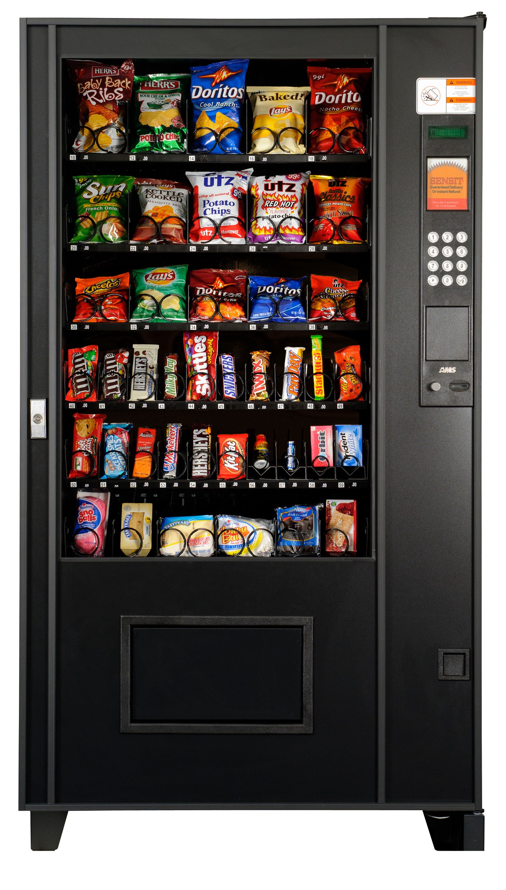

# Máster en Programación FullStack con JavaScript y Node.js
### JS, Node.js, Frontend, Backend, Firebase, Express, Patrones, HTML5_APIs, Asincronía, Websockets, Testing

## Clase 11

### Ejercicios



**Práctica 1** - Diseña un script para gestionar por consola una máquina expendedora

Características:
- Solo los usuarios registrados pueden usar la máquina
- El sistema funciona sin dinero real, en su lugar se usa un sistema de puntos
- Los usuarios disponen de unos puntos para gastar en la máquina que el departamento de personal asigna.
- La maquina no concederá creditos, solo trabaja en base a los puntos disponibles.
- Para agilizar la reposición de lo consumido... la maquina debe controlar en stock

**Paso 1** - Creamos los primeros objetos básicos:
- Maquina Expendedora (Objeto)
- Productos (Array)
- Clientes (Array)

```javascript
    //Solución aquí
```

**Paso 2** - Creamos los primeros perfiles en el Array de clientes:
- Propiedades:
    - Nombre
    - Usuario
    - Contraseña
    - Tipo usuario
    - Presupuesto

```javascript
    //Solución aquí
```

**Paso 3** - Creamos varios métodos para gestionar a los clientes y sus necesidades

- Metodos:
    - Consultar saldo de un cliente
        - Devolverá el saldo existente o *-1* en caso de error
        - Comprobaremos la contraseña y el usuario
    - Consultar gastos de un cliente
        - Devolverá un array o *false* en caso de error
        - Comprobaremos la contraseña y el usuario
    - Agregar un cliente
    - Eliminar un cliente

- Caracteristicas:
    - Evitaremos que se registren usuarios que ya existan
    - Evitaremos eliminar usuarios que no existan
    - Evitaremos dar de alta usuarios que no esten debidamente cumplimentados
    - Protegeremos las funciones de gestión de usuarios con la contraseña *ficticiaMola*

```javascript
    // Máquina expendedora:
    var maquinaExpendedora = {
        admin: {
            secreto: "ficticiaMola" // clave admin
        },
        herramientas: {
            esUsuario: function(usuario) {
                //Solución aquí
            }
        },
        gestionClientes: {
            agregar: function(clave, objeto) {
                //Solución aquí
            },
            eliminar: function(clave, usuario) {
                //Solución aquí
            },
            saldoTotal: function(clave, usuario) {
                //Solución aquí
            },
            gastoTotal: function(clave, usuario) {
                //Solución aquí
            }
        }
    };
    
    // Demo Producto:
    //Solución aquí
    
    // Demo Cliente:
    //Solución aquí
    
    // Testeando esUsuario:
    maquinaExpendedora.herramientas.esUsuario("ulises"); // true
    maquinaExpendedora.herramientas.esUsuario("yo mismo"); // false
    
    // Testeando agregar:
    maquinaExpendedora.gestionClientes.agregar(); // ERROR - Contraseña Erronea!
    maquinaExpendedora.gestionClientes.agregar("hola"); // ERROR - Contraseña Erronea!
    maquinaExpendedora.gestionClientes.agregar("ficticiaMola", {
        usuario: "Ulises"
    }); // ERROR - El usuario ya existe!
    maquinaExpendedora.gestionClientes.agregar("ficticiaMola", {
        usuario: "Ulises2",
        presupuesto: 1000
    }); // ERROR - Faltan datos! 
    maquinaExpendedora.gestionClientes.agregar("ficticiaMola", {
        usuario: "ulises2",
        presupuesto: 1000,
        tipo: "admin",
        pass: "pass2",
        nombre: "Ulises2"
    }); // usuario Agregado con exito
    
    // Testeando borrar:
    maquinaExpendedora.gestionClientes.eliminar(); // ERROR - Contraseña Erronea!
    maquinaExpendedora.gestionClientes.eliminar("ficticiaMola"); // ERROR - El usuario no existe!
    maquinaExpendedora.gestionClientes.eliminar("ficticiaMola", "Yo mismo"); // ERROR - El usuario no existe!
    maquinaExpendedora.gestionClientes.eliminar("ficticiaMola", "ulises2"); // Usuario Eliminado con exito
    
    // Testeando Saldo:
    maquinaExpendedora.gestionClientes.saldoTotal(); // -1
    maquinaExpendedora.gestionClientes.saldoTotal("pass", "ulises"); // 1000
    
    // Testrando Gasto:
    maquinaExpendedora.gestionClientes.gastoTotal(); // false
    maquinaExpendedora.gestionClientes.gastoTotal("pass", "ulises"); // []
```

**Paso 4** - Creamos varios métodos para gestionar a los productos y sus necesidades

- Creamos 5 productos que estarán disponibles a la venta 

- Métodos:
    - Consumir un producto (cliente)
        - Comprobaremos la contraseña y el usuario
        - Devolverá el producto o *-1* en caso de no existir o estar agotado
        - Actualizaremos el stock
        - Actualizaremos el saldo del cliente
    - Agregar un producto a la máquina (administración)
    - Eliminar un prodcutos de la máquina (administración)

- Caracteristicas:
    - Evitaremos agregar productos que ya existan
    - Evitaremos eliminar productos que no existan
    - Evitaremos agregar productos que no esten debidamente cumplimentados
    - Protegeremos las funciones de agregar y eliminar productos con la contraseña *ficticiaMola*

```javascript
// Máquina expendedora:
var maquinaExpendedora = {
    admin: {
        secreto: "fictiziaMola"
    },
    herramientas: {
        esUsuario: function(usuario) {
            //Solución aquí
        },
        esProducto: function(datos) {
            //Solución aquí
        }
    },
    gestionProducto: {
        agregar: function(clave, objeto) {
            //Solución aquí
        },
        eliminar: function(clave, objeto) {
            //Solución aquí
        }
    },
    gestionClientes: {
        comprar: function(clave, usuario, codigo) {
            //Solución aquí
        },
        agregar: function(clave, objeto) {
            //Solución aquí
        },
        eliminar: function(clave, usuario) {
            //Solución aquí
        },
        saldoTotal: function(clave, usuario) {
            //Solución aquí
        },
        gastoTotal: function(clave, usuario) {
            //Solución aquí
        }
    }
};

// Demo Producto:
var productos = [{
    nombre: "Risketos",
    codigo: "C1",
    stock: 100,
    disponibilidad: true,
    precio: 1
}, {
    nombre: "KitKat",
    codigo: "C2",
    stock: 4,
    disponibilidad: true,
    precio: 2
}, {
    nombre: "Chicles Orbit",
    codigo: "C3",
    stock: 6,
    disponibilidad: true,
    precio: 3
}, {
    nombre: "Pipas Solero",
    codigo: "C4",
    stock: 1,
    disponibilidad: true,
    precio: 4
}, {
    nombre: "Demonios de Fresa",
    codigo: "C5",
    stock: 10,
    disponibilidad: true,
    precio: 5
}];

// Demo Cliente:
var clientes = [{
    // admin
    nombre: "Ulises Gascón",
    usuario: "ulises",
    pass: "pass",
    tipo: "admin",
    presupuesto: 1000,
    gasto: []
}, {
    nombre: "Alejandro Reyes",
    usuario: "alejandro",
    pass: "pass2",
    tipo: "usuario",
    presupuesto: 100,
    gasto: []
}];

// Acortadores:

var comprar = maquinaExpendedora.gestionClientes.comprar;
var saldo = maquinaExpendedora.gestionClientes.saldoTotal;

// Testeando esUsuario:
maquinaExpendedora.herramientas.esUsuario("ulises"); // true
maquinaExpendedora.herramientas.esUsuario("yo mismo"); // false

// Testeando agregar:
maquinaExpendedora.gestionClientes.agregar(); // ERROR - Contraseña Erronea!
maquinaExpendedora.gestionClientes.agregar("hola"); // ERROR - Contraseña Erronea!
maquinaExpendedora.gestionClientes.agregar("fictiziaMola", {
    usuario: "ulises"
}); // ERROR - El usuario ya existe!
maquinaExpendedora.gestionClientes.agregar("fictiziaMola", {
    usuario: "ulises2",
    presupuesto: 1000
}); // ERROR - Faltan datos! 
maquinaExpendedora.gestionClientes.agregar("fictiziaMola", {
    usuario: "ulises2",
    presupuesto: 1000,
    tipo: "admin",
    pass: "pass2",
    nombre: "Ulises2"
}); // usuario Agregado con exito

// Testeando borrar:
maquinaExpendedora.gestionClientes.eliminar(); // ERROR - Contraseña Erronea!
maquinaExpendedora.gestionClientes.eliminar("fictiziaMola"); // ERROR - El usuario no existe!
maquinaExpendedora.gestionClientes.eliminar("fictiziaMola", "Yo mismo"); // ERROR - El usuario no existe!
maquinaExpendedora.gestionClientes.eliminar("fictiziaMola", "ulises2"); // Usuario Eliminado con exito

// Testeando Saldo:
maquinaExpendedora.gestionClientes.saldoTotal(); // -1
maquinaExpendedora.gestionClientes.saldoTotal("pass", "ulises"); // 1000

// Testeando Gasto:
maquinaExpendedora.gestionClientes.gastoTotal(); // false
maquinaExpendedora.gestionClientes.gastoTotal("pass", "ulises"); // []


// Testeando esProducto:
maquinaExpendedora.herramientas.esProducto() // -1
maquinaExpendedora.herramientas.esProducto({
        codigo: "C10"
    }) // false
maquinaExpendedora.herramientas.esProducto({
        codigo: "C2"
    }) // true
maquinaExpendedora.herramientas.esProducto({
        producto: "Inventado"
    }) // false
maquinaExpendedora.herramientas.esProducto({
        producto: "Risketos"
    }) // true

// Testeando agregar producto:
maquinaExpendedora.gestionProducto.agregar() // ERROR - Contraseña Erronea!
maquinaExpendedora.gestionProducto.agregar("fictiziaMola", {
        nombre: "Chetos"
    }) // ERROR - Faltan datos!
maquinaExpendedora.gestionProducto.agregar("fictiziaMola", {
        nombre: "Chetos",
        codigo: "C6",
        precio: 6,
        stock: 5,
        disponibilidad: true
    }) // Producto Agregado con exito


// Testrando eliminar producto:
maquinaExpendedora.gestionProducto.eliminar() // ERROR - Contraseña Erronea!
maquinaExpendedora.gestionProducto.eliminar("fictiziaMola", {
        nombre: "inventado"
    }) // ERROR - El producto no existe!
maquinaExpendedora.gestionProducto.eliminar("fictiziaMola", {
    nombre: "Chetos"
}); // Producto Eliminado con exito


// Testeando Comprar producto:
comprar() // ERROR - Contraseña Errónea!
comprar("pass", "Eduardo"); // ERROR - El usuario no existe!
comprar("pass6", "ulises"); // ERROR - Contraseña Incorrecta!
comprar("pass", "ulises", "A1"); // El producto no existe!
comprar("pass", "ulises", "C1");
// Saldo Restante: 999
// Gracias por comprar... que tenga un buen día!
```

**Paso 5** - (`Nivel Medio` :spades:) Ahora podemos agregar los métodos para agregar, retirar y resetear saldo de los usuarios.

- Importante:
	- Los saldos jamas pueden ser negativos.

```javascript
    // Máquina expendedora:
    var maquinaExpendedora = {
        admin: {
            secreto: "fictiziaMola"
        },
        herramientas: {
            esUsuario: function(usuario) {
                //Solución aquí
            },
            esProducto: function(datos){
                //Solución aquí
            }
        },
        gestionProducto: {
            agregar: function(clave, objeto){
                //Solución aquí
            },
            eliminar: function(clave, objeto){
               //Solución aquí
            }
        },
        gestionClientes: {
            agregarSaldo: function (clave, usuario, cantidad) {
                //Solución aquí
            },
            retirarSaldo: function (clave, usuario, cantidad) {
                //Solución aquí
            },
            resetearSaldo:  function (clave, usuario) {
                //Solución aquí
            },
            comprar: function(clave, usuario, codigo){
                //Solución aquí
            },
            agregar: function(clave, objeto) {
               //Solución aquí
            },
            eliminar: function(clave, usuario) {
               //Solución aquí
            },
            saldoTotal: function(clave, usuario) {
               //Solución aquí
            },
            gastoTotal: function(clave, usuario) {
                //Solución aquí
            }
        }
    };
    
    // Demo Producto:
    var productos = [{
            nombre: "Risketos",
            codigo: "C1",
            stock: 100,
            disponibilidad: true,
            precio: 1
        },{
            nombre: "KitKat",
            codigo: "C2",
            stock: 4,
            disponibilidad: true,
            precio: 2
        },{
            nombre: "Chicles Orbit",
            codigo: "C3",
            stock: 6,
            disponibilidad: true,
            precio: 3
        },{
            nombre: "Pipas Solero",
            codigo: "C4",
            stock: 1,
            disponibilidad: true,
            precio: 4
        },{
            nombre: "Demonios de Fresa",
            codigo: "C5",
            stock: 10,
            disponibilidad: true,
            precio: 5
        }];
    
    // Demo Cliente:
    var clientes = [{
        // admin
        nombre: "Ulises Gascón",
        usuario: "ulises",
        pass: "pass",
        tipo: "admin",
        presupuesto: 1000,
        gasto: []
    }, {
        nombre: "Alejandroreyes",
        usuario: "alejandro",
        pass: "pass2",
        tipo: "usuario",
        presupuesto: 100,
        gasto: []
    }];
    
    // Acortadores:
    
    var comprar = maquinaExpendedora.gestionClientes.comprar;
    var saldo = maquinaExpendedora.gestionClientes.saldoTotal;
    
    // Testeando esUsuario:
    maquinaExpendedora.herramientas.esUsuario("ulises"); // true
    maquinaExpendedora.herramientas.esUsuario("yo mismo"); // false
    
    // Testeando agregar:
    maquinaExpendedora.gestionClientes.agregar(); // ERROR - Contraseña Erronea!
    maquinaExpendedora.gestionClientes.agregar("hola"); // ERROR - Contraseña Erronea!
    maquinaExpendedora.gestionClientes.agregar("fictiziaMola", {
        usuario: "ulises"
    }); // ERROR - El usuario ya existe!
    maquinaExpendedora.gestionClientes.agregar("fictiziaMola", {
        usuario: "ulises2",
        presupuesto: 1000
    }); // ERROR - Faltan datos! 
    maquinaExpendedora.gestionClientes.agregar("fictiziaMola", {
        usuario: "ulises2",
        presupuesto: 1000,
        tipo: "admin",
        pass: "pass2",
        nombre: "Ulises2"
    }); // usuario Agregado con exito
    
    // Testeando borrar:
    maquinaExpendedora.gestionClientes.eliminar(); // ERROR - Contraseña Erronea!
    maquinaExpendedora.gestionClientes.eliminar("fictiziaMola"); // ERROR - El usuario no existe!
    maquinaExpendedora.gestionClientes.eliminar("fictiziaMola", "Yo mismo"); // ERROR - El usuario no existe!
    maquinaExpendedora.gestionClientes.eliminar("fictiziaMola", "ulises2"); // Usuario Eliminado con exito
    
    // Testeando Saldo:
    maquinaExpendedora.gestionClientes.saldoTotal(); // -1
    maquinaExpendedora.gestionClientes.saldoTotal("pass", "ulises"); // 1000
    
    // Testeando Gasto:
    maquinaExpendedora.gestionClientes.gastoTotal(); // false
    maquinaExpendedora.gestionClientes.gastoTotal("pass", "ulises"); // []
    
    
    // Testeando esProducto:
    maquinaExpendedora.herramientas.esProducto() // -1
    maquinaExpendedora.herramientas.esProducto({codigo: "C10"}) // false
    maquinaExpendedora.herramientas.esProducto({codigo: "C2"}) // true
    maquinaExpendedora.herramientas.esProducto({producto: "Inventado"}) // false
    maquinaExpendedora.herramientas.esProducto({producto: "Risketos"}) // true
    
    // Testeando agregar producto:
    maquinaExpendedora.gestionProducto.agregar() // ERROR - Contraseña Erronea!
    maquinaExpendedora.gestionProducto.agregar("fictiziaMola", {nombre: "Chetos"}) // ERROR - Faltan datos!
    maquinaExpendedora.gestionProducto.agregar("fictiziaMola", {nombre: "Chetos", codigo: "C6", precio: 6, stock: 5, disponibilidad: true}) // Producto Agregado con exito
    
    
    // Testrando eliminar producto:
    maquinaExpendedora.gestionProducto.eliminar() // ERROR - Contraseña Erronea!
    maquinaExpendedora.gestionProducto.eliminar("fictiziaMola", {nombre: "inventado"}) // ERROR - El producto no existe!
    maquinaExpendedora.gestionProducto.eliminar("fictiziaMola", {nombre: "Chetos"}); // Producto Eliminado con exito
    
    
    // Testeando Comprar producto:
    comprar() // ERROR - Contraseña Errónea!
    comprar("pass", "Eduardo"); // ERROR - El usuario no existe!
    comprar("pass6", "ulises"); // ERROR - Contraseña Incorrecta!
    comprar("pass", "ulises", "A1"); // El producto no existe!
    comprar("pass", "ulises", "C1"); 
    // Saldo Restante: 999
    // Gracias por comprar... que tenga un buen día!
    
    // Testeando Retirar dinero de un usuario:
    maquinaExpendedora.gestionClientes.retirarSaldo(); // ERROR - Contraseña Erronea!
    maquinaExpendedora.gestionClientes.retirarSaldo("fictiziaMola", "Yo Mismo"); // ERROR - El usuario no existe!
    maquinaExpendedora.gestionClientes.retirarSaldo("fictiziaMola", "ulises", 100000); /* 
    ERROR - Saldo insuficiente
    Diferencia:  -99001
    */
    
    maquinaExpendedora.gestionClientes.retirarSaldo("fictiziaMola", "ulises");/* 
    Usuario actualizado con exito
    Saldo actual de ulises es de 999
    */
    maquinaExpendedora.gestionClientes.retirarSaldo("fictiziaMola", "ulises", 10);/* 
    Usuario actualizado con exito
    Saldo actual de ulises es de 989
    */
    
    // Testeando Resetear el dinero de un usuario:
    maquinaExpendedora.gestionClientes.resetearSaldo(); // ERROR - Contraseña Erronea!
    maquinaExpendedora.gestionClientes.resetearSaldo("fictiziaMola"); // ERROR - El usuario no existe!
    maquinaExpendedora.gestionClientes.resetearSaldo("fictiziaMola", "ulises"); /* 
    Usuario actualizado con exito
    Saldo actual de ulises es de 0
    */
    
    // Testeando Añadir dinero a un usuario:
    maquinaExpendedora.gestionClientes.agregarSaldo() // ERROR - Contraseña Erronea!
    maquinaExpendedora.gestionClientes.agregarSaldo("fictiziaMola", "Yo Mismo"); // ERROR - El usuario no existe!
    maquinaExpendedora.gestionClientes.agregarSaldo("fictiziaMola", "ulises"); /*
    Usuario actualizado con exito
     Saldo actual de ulises es de 0
     */
    
    maquinaExpendedora.gestionClientes.agregarSaldo("fictiziaMola", "ulises", 1000); /*
    Usuario actualizado con exito
    Saldo actual de ulises es de 1000
     */
```

**Paso 6** - (`Nivel Avanzado` :diamonds:) Ahora podemos agregar el método para saber la disponibilidad de stock

- Importante:
	- Es necesaria clave (adminsitrador)
	- Debemos saber las existencias
	- Debemos saber que productos estan disponibles y cuales no.
	- Debemos incluir el código y el nombre
	- Cuando se imprima el informe... es necesario incluir la fecha.

```javascript
/*
----
Ejemplo de Informe
----

************************
En total tenemos 6 productos
----------------------------
Nombre: Risketos
Código: C1
Stock: 100
Disponibilidad: true
----------------------------
Nombre: KitKat
Código: C2
Stock: 4
Disponibilidad: true
----------------------------
Nombre: Chicles Orbit
Código: C3
Stock: 6
Disponibilidad: true
----------------------------
Nombre: Pipas Solero
Código: C4
Stock: 1
Disponibilidad: true
----------------------------
Nombre: Demonios de Fresa
Código: C5
Stock: 10
Disponibilidad: true
----------------------------
Nombre: Chetos
Código: C6
Stock: 5
Disponibilidad: true
************************

 */
```

```javascript
    // Máquina expendedora:
    var maquinaExpendedora = {
        admin: {
            secreto: "fictiziaMola"
        },
        herramientas: {
            esUsuario: function(usuario) {
                //Solución aquí
            },
            esProducto: function(datos){
                //Solución aquí
            }
        },
        gestionProducto: {
            controlStock: function(clave){
                //Solución aquí           
            },
            agregar: function(clave, objeto){
                //Solución aquí
            },
            eliminar: function(clave, objeto){
                //Solución aquí
            }
        },
        gestionClientes: {
            agregarSaldo: function (clave, usuario, cantidad) {
              //Solución aquí
            },
            retirarSaldo: function (clave, usuario, cantidad) {
                //Solución aquí
            },
            resetearSaldo:  function (clave, usuario) {
                //Solución aquí
            },
            comprar: function(clave, usuario, codigo){
                //Solución aquí           
            },
            agregar: function(clave, objeto) {
               //Solución aquí
            },
            eliminar: function(clave, usuario) {
               //Solución aquí
            },
            saldoTotal: function(clave, usuario) {
                //Solución aquí
            },
            gastoTotal: function(clave, usuario) {
                //Solución aquí
            }
        }
    };
    
    // Demo Producto:
    var productos = [{
            nombre: "Risketos",
            codigo: "C1",
            stock: 100,
            disponibilidad: true,
            precio: 1
        },{
            nombre: "KitKat",
            codigo: "C2",
            stock: 4,
            disponibilidad: true,
            precio: 2
        },{
            nombre: "Chicles Orbit",
            codigo: "C3",
            stock: 6,
            disponibilidad: true,
            precio: 3
        },{
            nombre: "Pipas Solero",
            codigo: "C4",
            stock: 1,
            disponibilidad: true,
            precio: 4
        },{
            nombre: "Demonios de Fresa",
            codigo: "C5",
            stock: 10,
            disponibilidad: true,
            precio: 5
        }];
    
    // Demo Cliente:
    var clientes = [{
        // admin
        nombre: "Ulises Gascón",
        usuario: "ulises",
        pass: "pass",
        tipo: "admin",
        presupuesto: 1000,
        gasto: []
    }, {
        nombre: "Alejandro Reyes",
        usuario: "alejandro",
        pass: "pass2",
        tipo: "usuario",
        presupuesto: 100,
        gasto: []
    }];
    
    // Acortadores:
    
    var comprar = maquinaExpendedora.gestionClientes.comprar;
    var saldo = maquinaExpendedora.gestionClientes.saldoTotal;
    
    // Testeando esUsuario:
    maquinaExpendedora.herramientas.esUsuario("ulises"); // true
    maquinaExpendedora.herramientas.esUsuario("yo mismo"); // false
    
    // Testeando agregar:
    maquinaExpendedora.gestionClientes.agregar(); // ERROR - Contraseña Erronea!
    maquinaExpendedora.gestionClientes.agregar("hola"); // ERROR - Contraseña Erronea!
    maquinaExpendedora.gestionClientes.agregar("fictiziaMola", {
        usuario: "ulises"
    }); // ERROR - El usuario ya existe!
    maquinaExpendedora.gestionClientes.agregar("fictiziaMola", {
        usuario: "ulises2",
        presupuesto: 1000
    }); // ERROR - Faltan datos! 
    maquinaExpendedora.gestionClientes.agregar("fictiziaMola", {
        usuario: "ulises2",
        presupuesto: 1000,
        tipo: "admin",
        pass: "pass2",
        nombre: "Ulises2"
    }); // usuario Agregado con exito
    
    // Testeando borrar:
    maquinaExpendedora.gestionClientes.eliminar(); // ERROR - Contraseña Erronea!
    maquinaExpendedora.gestionClientes.eliminar("fictiziaMola"); // ERROR - El usuario no existe!
    maquinaExpendedora.gestionClientes.eliminar("fictiziaMola", "Yo mismo"); // ERROR - El usuario no existe!
    maquinaExpendedora.gestionClientes.eliminar("fictiziaMola", "ulises2"); // Usuario Eliminado con exito
    
    // Testeando Saldo:
    maquinaExpendedora.gestionClientes.saldoTotal(); // -1
    maquinaExpendedora.gestionClientes.saldoTotal("pass", "ulises"); // 1000
    
    // Testeando Gasto:
    maquinaExpendedora.gestionClientes.gastoTotal(); // false
    maquinaExpendedora.gestionClientes.gastoTotal("pass", "ulises"); // []
    
    
    // Testeando esProducto:
    maquinaExpendedora.herramientas.esProducto() // -1
    maquinaExpendedora.herramientas.esProducto({codigo: "C10"}) // false
    maquinaExpendedora.herramientas.esProducto({codigo: "C2"}) // true
    maquinaExpendedora.herramientas.esProducto({producto: "Inventado"}) // false
    maquinaExpendedora.herramientas.esProducto({producto: "Risketos"}) // true
    
    // Testeando agregar producto:
    maquinaExpendedora.gestionProducto.agregar() // ERROR - Contraseña Erronea!
    maquinaExpendedora.gestionProducto.agregar("fictiziaMola", {nombre: "Chetos"}) // ERROR - Faltan datos!
    maquinaExpendedora.gestionProducto.agregar("fictiziaMola", {nombre: "Chetos", codigo: "C6", precio: 6, stock: 5, disponibilidad: true}) // Producto Agregado con exito
    
    
    // Testrando eliminar producto:
    maquinaExpendedora.gestionProducto.eliminar() // ERROR - Contraseña Erronea!
    maquinaExpendedora.gestionProducto.eliminar("fictiziaMola", {nombre: "inventado"}) // ERROR - El producto no existe!
    maquinaExpendedora.gestionProducto.eliminar("fictiziaMola", {nombre: "Chetos"}); // Producto Eliminado con exito
    
    
    // Testeando Comprar producto:
    comprar() // ERROR - Contraseña Errónea!
    comprar("pass", "Eduardo"); // ERROR - El usuario no existe!
    comprar("pass6", "ulises"); // ERROR - Contraseña Incorrecta!
    comprar("pass", "ulises", "A1"); // El producto no existe!
    comprar("pass", "ulises", "C1"); 
    // Saldo Restante: 999
    // Gracias por comprar... que tenga un buen día!
    
    // Testeando Retirar dinero de un usuario:
    maquinaExpendedora.gestionClientes.retirarSaldo(); // ERROR - Contraseña Erronea!
    maquinaExpendedora.gestionClientes.retirarSaldo("fictiziaMola", "Yo Mismo"); // ERROR - El usuario no existe!
    maquinaExpendedora.gestionClientes.retirarSaldo("fictiziaMola", "ulises", 100000); /* 
    ERROR - Saldo insuficiente
    Diferencia:  -99001
    */
    
    maquinaExpendedora.gestionClientes.retirarSaldo("fictiziaMola", "ulises");/* 
    Usuario actualizado con exito
    Saldo actual de ulises es de 999
    */
    maquinaExpendedora.gestionClientes.retirarSaldo("fictiziaMola", "ulises", 10);/* 
    Usuario actualizado con exito
    Saldo actual de ulises es de 989
    */
    
    // Testeando Resetear el dinero de un usuario:
    maquinaExpendedora.gestionClientes.resetearSaldo(); // ERROR - Contraseña Erronea!
    maquinaExpendedora.gestionClientes.resetearSaldo("fictiziaMola"); // ERROR - El usuario no existe!
    maquinaExpendedora.gestionClientes.resetearSaldo("fictiziaMola", "ulises"); /* 
    Usuario actualizado con exito
    Saldo actual de ulises es de 0
    */
    
    // Testeando Añadir dinero a un usuario:
    maquinaExpendedora.gestionClientes.agregarSaldo() // ERROR - Contraseña Erronea!
    maquinaExpendedora.gestionClientes.agregarSaldo("fictiziaMola", "Yo Mismo"); // ERROR - El usuario no existe!
    maquinaExpendedora.gestionClientes.agregarSaldo("fictiziaMola", "ulises"); /*
    Usuario actualizado con exito
     Saldo actual de ulises es de 0
     */
    
    maquinaExpendedora.gestionClientes.agregarSaldo("fictiziaMola", "ulises", 1000); /*
    Usuario actualizado con exito
    Saldo actual de ulises es de 1000
     */
    
    maquinaExpendedora.gestionProducto.controlStock();  // ERROR - Contraseña Erronea! 
    maquinaExpendedora.gestionProducto.controlStock("fictiziaMola");
    /*
    
    ************************
    En total tenemos 6 productos
    ----------------------------
    Nombre: Risketos
    Código: C1
    Stock: 100
    Disponibilidad: true
    ----------------------------
    Nombre: KitKat
    Código: C2
    Stock: 4
    Disponibilidad: true
    ----------------------------
    Nombre: Chicles Orbit
    Código: C3
    Stock: 6
    Disponibilidad: true
    ----------------------------
    Nombre: Pipas Solero
    Código: C4
    Stock: 1
    Disponibilidad: true
    ----------------------------
    Nombre: Demonios de Fresa
    Código: C5
    Stock: 10
    Disponibilidad: true
    ----------------------------
    Nombre: Chetos
    Código: C6
    Stock: 5
    Disponibilidad: true
    ************************
    
     */
    
    productos = [];
    maquinaExpendedora.gestionProducto.controlStock("fictiziaMola");
    /*
    ************************
    En total tenemos 0 productos
    --- no hay productos en la maquina ---
    ************************
    */

```
