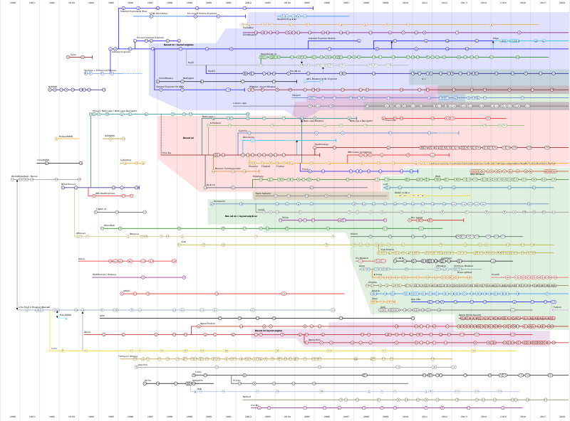

# Máster en Programación FullStack con JavaScript y Node.js
### JS, Node.js, Frontend, Backend, Firebase, Express, Patrones, HTML5_APIs, Asincronía, Websockets, Testing

## Clase 24

### Los Navegadores


### Los Navegadores: Historia


**Evolución**
[](https://en.wikipedia.org/wiki/History_of_the_web_browser#/media/File:Timeline_of_web_browsers.svg)


**Recursos**
- [:tv: Project Code Rush - The Beginnings of Netscape / Mozilla Documentary](https://www.youtube.com/watch?v=4Q7FTjhvZ7Y)
- [:tv: Download:The True Story of the Internet: La Guerra de los Navegadores Subtitulada](https://www.youtube.com/watch?v=zpm0tAixurg)
- [Browser Wars: La historia de la guerra de navegadores y la historia de los userAgents](https://www.emezeta.com/articulos/browser-wars-la-historia-de-la-guerra-de-navegadores)
- [Wikipedia | Guerra de navegadores](https://es.wikipedia.org/wiki/Guerra_de_navegadores)
- [PC Mag | Browsers: A Brief History](https://www.pcmag.com/feature/262125/browsers-a-brief-history)
- [The Telegraph | Web browsers: a brief history](https://www.telegraph.co.uk/technology/microsoft/11577364/Web-browsers-a-brief-history.html)
- [A Brief History of Web Browsers and How They Work](https://crossbrowsertesting.com/blog/test-automation/history-of-web-browsers/)
- [Wikipedia | History of the web browser](https://en.wikipedia.org/wiki/History_of_the_web_browser)

### Los Navegadores: Motores actuales


**Browser Engine**
- Activos	
	- [Blink (Chrome/Opera)](https://en.wikipedia.org/wiki/Blink_(web_engine)) 
	- [EdgeHTML](https://en.wikipedia.org/wiki/EdgeHTML)
	- [Gecko (Firefox)](https://en.wikipedia.org/wiki/Gecko_(software))
	- [Goanna](https://en.wikipedia.org/wiki/Goanna_(software))
	- [Servo](https://en.wikipedia.org/wiki/Servo_(software))
	- [WebKit (Safari)](https://en.wikipedia.org/wiki/WebKit)
- Discontinuados	
	- [KHTML](https://en.wikipedia.org/wiki/KHTML) 
	- [Mariner](https://en.wikipedia.org/wiki/Mariner_(browser_engine))
	- [Presto](https://en.wikipedia.org/wiki/Presto_(browser_engine))
	- [Tasman](https://en.wikipedia.org/wiki/Tasman_(layout_engine))
	- [Tkhtml](https://en.wikipedia.org/wiki/Tkhtml)
	- [Trident](https://en.wikipedia.org/wiki/Trident_(software))


### Los Navegadores: Interpretes de JS


**El Motor JavaScript (JavaScript Engine)**
- [V8 Engine de Google](https://github.com/v8/v8)
- [Chakra de Microsoft](https://github.com/Microsoft/ChakraCore)
- [SpiderMonkey de Mozilla](https://developer.mozilla.org/en-US/docs/Mozilla/Projects/SpiderMonkey)
- [JavaScriptCore de Apple](https://en.wikipedia.org/wiki/JavaScriptCore)
- [Carakan de Opera (Inactivo)](https://dev.opera.com/blog/carakan/)
- [Comparativa de Motores](https://en.wikipedia.org/wiki/Comparison_of_JavaScript_engines)

**Recursos**
- [Introducing: Goanna](https://forum.palemoon.org/viewtopic.php?f=1&t=8607&sid=ba5882946848eb6d4ac7241f6bab2e34)
- [MDN | Gecko](https://developer.mozilla.org/es/docs/Gecko)

### Los Navegadores: Funcionamiento

**Arquitectura a alto nivel**


**Afinando los detalles**


**[Philip Robers es un genio!](http://latentflip.com/loupe/)**


**Recursos**
- [How JavaScript works in browser and node?](https://itnext.io/how-javascript-works-in-browser-and-node-ab7d0d09ac2f)
- [HTML5 Rocks! | How Browsers Work: Behind the scenes of modern web browsers](https://www.html5rocks.com/en/tutorials/internals/howbrowserswork/#The_parsing_algorithm)
- [Philip Roberts: What the heck is the event loop anyway? | JSConf EU](https://www.youtube.com/watch?v=8aGhZQkoFbQ)
- [Behind the scenes of modern web browsers](http://taligarsiel.com/Projects/howbrowserswork1.htm)
- [Does JavaScript use stack or heap for memory allocation or both?](https://hashnode.com/post/does-javascript-use-stack-or-heap-for-memory-allocation-or-both-cj5jl90xl01nh1twuv8ug0bjk)
- [How JavaScript works: the rendering engine and tips to optimize its performance](https://blog.sessionstack.com/how-javascript-works-the-rendering-engine-and-tips-to-optimize-its-performance-7b95553baeda)
- [An overview of the engine, the runtime, and the call stack](https://blog.sessionstack.com/how-does-javascript-actually-work-part-1-b0bacc073cf)
- [Inside Google’s V8 engine + 5 tips on how to write optimized code](https://blog.sessionstack.com/how-javascript-works-inside-the-v8-engine-5-tips-on-how-to-write-optimized-code-ac089e62b12e)
- [Memory management + how to handle 4 common memory leaks](https://blog.sessionstack.com/how-javascript-works-memory-management-how-to-handle-4-common-memory-leaks-3f28b94cfbec)
- [The event loop and the rise of Async programming + 5 ways to better coding with async/await](https://blog.sessionstack.com/how-javascript-works-event-loop-and-the-rise-of-async-programming-5-ways-to-better-coding-with-2f077c4438b5)


## Hablemos de JavaScript y más allá...


**Recursos**
- [:tv: Douglas Crockford: The JavaScript Programming Language](https://www.youtube.com/watch?v=v2ifWcnQs6M)
- [:tv: The Post JavaScript Apocalypse - Douglas Crockford](https://www.youtube.com/watch?v=NPB34lDZj3E)
- [:tv: dotJS 2012 - Brian Leroux - WTFJS](https://www.youtube.com/watch?v=et8xNAc2ic8)
- [:tv: What the... JavaScript?](https://www.youtube.com/watch?v=2pL28CcEijU)


### Las funciones en JS: Funciones anónimas autoejecutadas (IIFE)

```javascript
// Classic
(function(){})();
 
// Crockford's favorite
(function(){}());
 
// Unary versions
+function(){}();
 
// Facebook version
!function(){}();
 
// Crazy version
!1%-+~function(){}();
```

**Recursos**
- [Immediately-Invoked Function Expression (IIFE)](http://benalman.com/news/2010/11/immediately-invoked-function-expression/)
- [Funciones autoejecutables en Javascript](http://www.etnassoft.com/2011/03/14/funciones-autoejecutables-en-javascript/)

### Las funciones en JS: Funciones variádicas
- La gestión de argumentos es muy pocos restrictiva
- EL úmero de argumentos es variable, por defecto su valor es siempre `undefined`
- `arguments` no es un array y tendremos que manejarlo con cuidado o convertirlo usando `prototype`

```javascript
function func(arg1, arg2, arg3) { 
	console.log("arg1:", arg1)
	console.log("arg2:", arg2)
	console.log("arg3:", arg3)
	console.log("Arguments:" arguments)
	console.log("Arguments eres una Array?", Array.isArray(arguments))
}
func(2); //arg1: 2 
		 //arg2: undefined
		 //arg3: undefined
```

**Recursos**
- [Bitácora del desarrollador: ¿Qué son las funciones variádicas?](https://jherax.wordpress.com/2014/07/06/javascript-funciones-variadicas/)

### Las funciones en JS: Ciudadanos de primera clase

```javascript
function func() {}
var func = function (){}
var obj = {
	func(){}
}
var func = new Function('arg1', 'arg2', 'console.log(arg1, arg2)');
```

### Las funciones en JS: Comportamiento de objetos

```javascript
function func() {console.log("Soy una función", typeof(func))}
func.metodo = function() {console.log("Soy un método", typeof(func.metodo))}
func.propiedad = "Dato almacenado..."
console.log("Tengo propiedades", typeof(func.propiedad)) //Tengo propiedades string
func.metodo() //Soy un método function
func() //Soy una función function
```

### Las funciones en JS: Entidades de orden superior

```javascript
function funcAsincrona (dato, callback)  {
    return callback(dato+5);
}

funcAsincrona(5, data => console.log) //10
```

```javascript
function funcEspecial () {
	console.log("Una sola vez...")
    return function () {
        console.log("Muchas veces...")
    }
}

var nuevaFunc = funcEspecial(); //Una sola vez...
nuevaFunc(); //Muchas veces...
nuevaFunc(); //Muchas veces...
```

**Recursos**
- [Higher-Order Functions in JavaScript](https://www.sitepoint.com/higher-order-functions-javascript/)

### Las funciones en JS: Recursión
**Partes**
- Caso base: *es el caso más simple y determina la salida de la función*
- Caso recursivo: *vamos reduciendo la causistica y llamando a la propia función*

**Ejemplo**
```javascript
// Sin recursión
let counter = 100;
while(counter > 0) {
    console.log(counter--);
}

// Con recursión
const cuentaAtras = function(value) {
    if (value > 0) {
        console.log("Valor actual:", value);
        cuentaAtras(value - 1);
    } else {
        console.log("Fin de la historia:", value);
    }
};
cuentaAtras(100);
```

**Recursos**
- [Recursion in Functional JavaScript](https://www.sitepoint.com/recursion-functional-javascript/)
- [JS-Challenges/recursion-prompts](https://github.com/JS-Challenges/recursion-prompts)
- [Understanding Recursion in JavaScript](https://medium.com/@zfrisch/understanding-recursion-in-javascript-992e96449e03)
- [Recursion in JavaScript](https://medium.freecodecamp.org/recursion-in-javascript-1608032c7a1f)
- [Learn and Understand Recursion in JavaScript](https://codeburst.io/learn-and-understand-recursion-in-javascript-b588218e87ea)
- [Stackoverflow | Calling a javascript function recursively](https://stackoverflow.com/questions/7065120/calling-a-javascript-function-recursively)
- [Programming with JS: Recursion](https://hackernoon.com/programming-with-js-recursion-31371e2bf808)
- [¿Qué es la recursividad o recursión? - Un ejemplo con JavaScript](https://www.campusmvp.es/recursos/post/Que-es-la-recursividad-o-recursion-Un-ejemplo-con-JavaScript.aspx)
- [Understanding Recursion in JavaScript with Confidence](https://www.thecodingdelight.com/understanding-recursion-javascript/)

### Las funciones en JS: Los ambitos

**Global**
```javascript
const global = "Dato global";
function func() {
    console.log(global);
}
func(); // Dato global
```

**Local clásico**
```javascript
function func() {
    const local = 5;
}
console.log(local); // undefined.
```

**Local con ES6**
- Usando `var` el scope se define por la función donde se declaró, `function-level scope`
- Usando `let` y `const` el scope también se define en `if`, `while`, `for` o `switch`, `block-level scope`.

```javascript
var uno = 1;
var diez = 10;
 
if (uno === 1) {
  let uno = 3; // El alcance es dentro del bloque if
  var diez = 5; // El alcance es dentro de la función
 
  console.log(uno);  // 3
  console.log(diez);  // 5
} 
 
console.log(uno); // 1
console.log(diez); // 5
```


### Las funciones en JS: Closures


> Un closure o clausura es la combinación de una función y el ámbito léxico en el que se declaró dicha función. Es decir los closures o clausuras son funciones que manejan variables independientes. **En otras palabras, la función definida en el closure "recuerda" el ámbito en el que se ha creado**. [MDN](https://developer.mozilla.org/es/docs/Web/JavaScript/Closures)

**Claves**
- Simplemente: la función definida en el closure "recuerda" el ámbito en el que se ha creado
- En resumen nos permite encapsular código pero con acceso a su contexto
- Todo ese contexto que recuerda ataca a la memoria RAM
- No debemos abusar de este hack por temas de rendimiento
- Es muy útil para emular métodos privados entre otras cosas

**Ejemplo clásico**
```javascript
function creaSumador(x) {
  return function(y) {
    return x + y;
  };
}

var suma5 = creaSumador(5);
var suma10 = creaSumador(10);

console.log(suma5(2));  // muestra 7
console.log(suma10(2)); // muestra 12 
```

**Ejemplo aplicado**
```javascript
function makeSizer(size) {
  return function() {
    document.body.style.fontSize = size + 'px';
  };
}

var size12 = makeSizer(12);
var size14 = makeSizer(14);
var size16 = makeSizer(16);
```

**Ejemplo ES5.1 vs ES6**
```javascript
//ES5
(function () {
	if(true) {
		var ifScope = "data"
	}
    for(var forScope = 0; forScope < 3; forScope += 1) {
        console.log(forScope);
    }
    console.log("forScope ?", forScope);	// 3
    console.log("ifScope ?", ifScope);		// data
}());

// ES6
(function () {
	if(true) {
		let ifScope = "data"
	}
    for(let forScope = 0; forScope < 3; forScope += 1) {
        console.log(forScope);
    }
    console.log("forScope ?", forScope);	// Uncaught ReferenceError: forScope is not defined
    console.log("ifScope ?", ifScope);		// Uncaught ReferenceError: ifScope is not defined
}());
```


**Recursos**
- [JavaScript Closures Demystified](https://www.sitepoint.com/javascript-closures-demystified/)
- [MDN | Closures](https://developer.mozilla.org/es/docs/Web/JavaScript/Closures)
- [JavaScript Closure y su funcionamiento](https://www.arquitecturajava.com/javascript-closure-funcionamiento/)
- [Stackoverflow | How do JavaScript closures work?](https://stackoverflow.com/questions/111102/how-do-javascript-closures-work)
- [Understand JavaScript Closures With Ease](http://javascriptissexy.com/understand-javascript-closures-with-ease/)
- [Understanding JavaScript Closures: A Practical Approach](https://scotch.io/tutorials/understanding-javascript-closures-a-practical-approach)
- [Understanding JavaScript: Closures](https://hackernoon.com/understanding-javascript-closures-4188edf5ea1b)
- [Understanding JavaScript Closures](https://codeburst.io/understanding-javascript-closures-da6aab330302)
- [Closures en JavaScript (ES5)](https://jherax.wordpress.com/2015/02/13/javascript-closures/)
- [JavaScript. ¿Para qué sirven los closures?](https://charlascylon.com/2013-11-19-javascript-para-que-sirven-los-closures)
- [Closures in Javascript for beginners](https://tech.io/playgrounds/6516/closures-in-javascript-for-beginners)
- [CSS-Tricks | JavaScript Scope and Closures](https://css-tricks.com/javascript-scope-closures/)
- [Entendiendo closures en JavaScript](https://medium.com/entendiendo-javascript/entendiendo-closures-en-javascript-8fb9a284964e)
- [I never understood JavaScript closures](https://medium.com/entendiendo-javascript/entendiendo-closures-en-javascript-8fb9a284964e)
- [Definiendo conceptos: Closure y Scope en JavaScript](https://medium.com/@sergiodxa/definiendo-conceptos-closure-y-scope-en-javascript-9081f1e113e6)

### Conceptos: Hoisting (elevamiento)

- Antes de ejecutar el código, las variables se mueven al inicio del contexto de ejecución
- Declarar una variable en cualquier parte es lo mismo que declararla al inicio
- Las variables pueden usarse antes de ser declaradas

```javascript
console.log("fn1", fn1()); // Uncaught TypeError: fn1 is not a function
console.log("fn2", fn2()); // 2
 
//function expression
var fn1 = function() { return 1; };
 
//function declaration
function fn2() { return 2; }

console.log("fn1", fn1()); // 1
console.log("fn2", fn2()); // 2
```

**Recursos**
- [Understanding Hoisting in JavaScript](https://scotch.io/tutorials/understanding-hoisting-in-javascript)
- [Bitácora del desarrollador: Hoisting en JavaScript](https://jherax.wordpress.com/2014/07/04/javascript-hoisting/)
- [JavaScript Scoping and Hoisting](http://www.adequatelygood.com/JavaScript-Scoping-and-Hoisting.html)
- [JavaScript Hoisting Explained](https://code.tutsplus.com/tutorials/javascript-hoisting-explained--net-15092)
- [Diferencia entre let y var en ES6 y TypeScript](https://victorroblesweb.es/2016/08/27/diferencia-let-var-es6-typescript/)


### Conceptos: Programación defensiva


> La programación defensiva (defensive programming en inglés) es una forma de diseño defensivo aplicada al diseño de software que busca garantizar el comportamiento de todo elemento de una aplicación ante cualquier situación de uso por incorrecta o imprevisible que ésta pueda parecer. En general, esto supone multiplicar las comprobaciones que se realizan en todos los módulos programados, con la consiguiente penalización en carga de procesador, tiempo y aumento en la complejidad del código. Las técnicas de programación defensiva se utilizan especialmente en componentes críticos cuyo mal funcionamiento, ya sea por descuido o por ataque malicioso, podría acarrear consecuencias graves o daños catastróficos. [Wikipedia](https://es.wikipedia.org/wiki/Programaci%C3%B3n_defensiva)

**Recursos**
- [Wikipedia | Programación defensiva](https://es.wikipedia.org/wiki/Programaci%C3%B3n_defensiva)
- [The Art of Defensive Programming](https://medium.com/web-engineering-vox/the-art-of-defensive-programming-6789a9743ed4)
- [Defensive Programming In JavaScript](https://speakerdeck.com/byrichardpowell/defensive-programming-in-javascript)
- [Defensive coding examples](https://glebbahmutov.com/blog/defensive-coding-examples/)
- [Defensive JavaScript? Yes, Please!](https://blog.javascripting.com/2015/03/18/defensive-javascript/)
- [Defensive programming: the good, the bad and the ugly](https://enterprisecraftsmanship.com/2016/04/27/defensive-programming-the-good-the-bad-and-the-ugly/)
- [What is “Defensive Programming”?](http://scottdorman.github.io/2008/07/04/what-is-ldquodefensive-programmingrdquo/)
- [An In-Depth Look at Defensive Programming](https://www.zuehlke.com/blog/an-in-depth-look-at-defensive-programming/)

### Conceptos: Lenguaje de programación dinámico

> Un lenguaje de programación dinámico es un lenguaje de programación en el que las operaciones realizadas en tiempo de compilación pueden realizarse en tiempo de ejecución. Por ejemplo, en JavaScript es posible cambiar el tipo de una variable o agregar nuevas propiedades o métodos a un objeto mientras el programa está en ejecución. [MDN](https://developer.mozilla.org/es/docs/Glossary/Dynamic_programming_language)

**Recursos**
- [MDN | Lenguaje de programación dinámico](https://developer.mozilla.org/es/docs/Glossary/Dynamic_programming_language)


### Conceptos: duck typing


> Si parece un pato, nada como un pato, y grazna como un pato, entonces probablemente sea un pato.

**Conceptos**
- Podemos saber si un objeto es una instancia de otra por las propiedades que hereda o no...
- `typeof` es muy limitado para saber que es algo, especialmento con objetos
- `Instanceof` es útil cuando evaluamos nuestras propias construcciones

**El problema de `typeof`**
```javascript
//@see: http://www.etnassoft.com/2011/02/07/duck-typing-en-javascript-chequeando-los-tipos-de-datos/
console.log( typeof new String( 'Fictizia' ) );				//object
console.log( typeof new Number( 1 ) );							//object
console.log( typeof [ "platano", true, "coche", 4 ] );			//object
console.log( typeof new Array( "platano", true, "coche", 4 ) ); //object
```

**El problema de `instanceof`**
```javascript
// @see: http://www.etnassoft.com/2011/02/07/duck-typing-en-javascript-chequeando-los-tipos-de-datos/
// construciones propias:
function constructor(){}
function otro_constructor(){}
constructor.prototype = otro_constructor;
console.log( new constructor() instanceof constructor );			// true
console.log( new otro_constructor() instanceof otro_constructor );	// true
console.log( new otro_constructor() instanceof constructor );		// false

// construciones del lenguaje:
console.log( new String( 'Fictizia' ) instanceof String );			// true
console.log( new String( 'Fictizia' ) instanceof Object );			// true
console.log( 'Fictizia' instanceof String );						// false
console.log( 'Fictizia' instanceof Object );						// false
console.log( new Array( 1, true, "banana" ) instanceof Array ); 	// true
console.log( new Array( 1, true, "banana" ) instanceof Object );	// true
console.log( [ 1, true, "banana" ] instanceof Array );				// true
console.log( [ 1, true, "banana" ] instanceof Object ); 			// true
```

**Entendiendo la validación**
```javascript
// https://github.com/jashkenas/underscore/blob/master/underscore.js#L1315
function isArray( obj ){
  return toString.call( obj ) === '[object Array]';
}

// Aproximación como Duck Typing
function isArray( obj ){
  return obj && typeof obj === "object" && "push" in obj;
}

//@see: http://www.etnassoft.com/2011/02/07/duck-typing-en-javascript-chequeando-los-tipos-de-datos/
// Aproximación como Duck Typing en modo paranoico
function isArray( obj ){
  return obj &&
  typeof obj === "object" &&
  "splice" in obj &&
  "join" in obj &&
  "push" in obj;
}
```

**Recursos**
- [Wikipedia | Test del pato](https://es.wikipedia.org/wiki/Test_del_pato)
- [Wikipedia | Duck Typing](https://es.wikipedia.org/wiki/Duck_typing)
- [Duck Typing en Javascript Chequeando los tipos de datos](http://www.etnassoft.com/2011/02/07/duck-typing-en-javascript-chequeando-los-tipos-de-datos/)
- [`instanceof` considered harmful (or how to write a robust `isArray`)](http://perfectionkills.com/instanceof-considered-harmful-or-how-to-write-a-robust-isarray/)
- [All about types in Javascript – Type detection](https://www.united-coders.com/matthias-reuter/all-about-types-part-4/)
- [Stackoverflow | Duck Typing in Javascript](https://stackoverflow.com/questions/3379529/duck-typing-in-javascript)
- [JavaScript and Duck Typing](https://medium.com/front-end-hacking/javascript-and-duck-typing-7d0f908e2238)
- [Duck Typing in JavaScript](https://www.htmlgoodies.com/beyond/javascript/duck-typing-in-javascript.html)
- [Using Duck Typing to Avoid Conditionals in JavaScript](http://adripofjavascript.com/blog/drips/using-duck-typing-to-avoid-conditionals-in-javascript.html)
- [branneman/javascript-duck-typing.js](https://gist.github.com/branneman/9dfc8ed59ea0814d6415)

### Conceptos: weak typing (Tipado Blando)
- JavaScript permite cambiar los tipos de datos de las variables de forma mas o menos automatica (sumar cadena a un numero..)
- Ofrece mucha flexibilidad pero también hace el codigo potencialmente inestable
- Es importnate tener controlado esto cuando manejamos datos externos (Ajax/JSON)

**Ejemplo**

```javascript
var txt = "Cadena";
var num = 100;
var bol = false;
var otroNum = "10"

console.log(typeof(txt))	 //string
console.log(typeof(num))	 //number
console.log(typeof(bol))	 //boolean
console.log(typeof(otroNum)) //string
```

**Problema Típico: Ajax/Json**
- Inconsistencia de datos
- Inconsistencia en el tipo de datos
```javascript
[
    {
        'id': 1,
        'name': 'Dr. Evil',
        'role': 'Evil Boss',
        'external_agency': false,
        'security_level': 5
        'started_at': 'unknown'
    }, {
        'id': "N1001",
        'name': 'Mr. Hacker',
        'role': 501,
        'security_level': "TOP SECRET"
        'external_agency': "Evil Mega Corp",
        'started_at': 125869547
    }
];
```

**Solución (Programación defensiva) con tipos primarios**
```javascript
// @see: http://www.etnassoft.com/2016/10/17/tipado-seguro-en-javascript/
//Closure
var typeOf = ( type ) => ( x ) => {
    if ( typeof x === type ) return x;
    throw new TypeError( "Error: " + type + " expected, " + typeof x + " given." );
};
 
var str = typeOf( 'string' );

// Correct
console.info( str( 'Hello World' ) ); // Hello World
// Error / Exception
console.info( str( 123 ) ); // Error: string expected, number given

/* --- Ejemplo Real ---*/
function sum ( x, y ) {
    return num( x ) + num( y );
}
 
console.info( sum( 2, 4 ) ); // 6
console.info( sum( 2, '3' ) ); // Error: number expected, string given
```

**Solución (Programación defensiva) con Objetos**

```javascript
//@see: http://www.etnassoft.com/2016/10/17/tipado-seguro-en-javascript/
const objectTypeOf = name => obj => {
    let toType = ( {} ).toString.call( obj ).match( /\s([a-z|A-Z]+)/ )[ 1 ].toLowerCase();
    if ( toType === name ) return obj;
 
    throw new TypeError( "Error: " + name + " expected, " + toType + " given." );
}
 
const obj = objectTypeOf( 'object' ),
    arr = objectTypeOf( 'array' ),
    date = objectTypeOf( 'date' );
    
// Correct
console.info( obj( {} ) ); // Object {}
console.info( arr( [] ) ); // []
console.info( date( new Date() ) ); // Date { ... }
 
// Error / Exception
console.info( obj( [] ) ); // Error: object expected, array given.
console.info( arr( {} ) ); // Error: array expected, object given.
console.info( date( '13/11/2016' ) ); // Error: date expected, string given.

/* --- Ejemplo Real ---*/

const map = function( fn, a ) {
    return arr( a ).map( func( fn ) );
}
 
map( String.toUpperCase, [ 'foo', 'bar' ] ); // [ 'FOO', 'BAR' ]
map( String.toUpperCase, 'Hello World' ); // Error: array expected, string given
```


**Recursos**
- [Tipado seguro en Javascript](http://www.etnassoft.com/2011/01/27/tipado-blando-en-javascript/)
- [The Shocking Secret About Static Types](https://medium.com/javascript-scene/the-shocking-secret-about-static-types-514d39bf30a3)
- [JavaScript’s type system](http://2ality.com/2013/09/types.html)
- [Reddit | How do you deal with weak typing?](https://www.reddit.com/r/javascript/comments/8810ci/how_do_you_deal_with_weak_typing/)
- [Quora | How is Javascript typed?](https://www.quora.com/How-is-Javascript-typed)
- [Understanding Loose Typing in JavaScript](https://dzone.com/articles/understanding-loose-typing-jav)
- [Introducing Type Safety To Your JavaScript Project? Think Again](https://medium.freecodecamp.org/stop-bringing-strong-typing-to-javascript-4da0666cba6e)
- [Wikipedia | Strong and weak typing](https://en.wikipedia.org/wiki/Strong_and_weak_typing)
- [Strong and weak typing](https://www.destroyallsoftware.com/compendium/strong-and-weak-typing?share_key=6b0dd1ec18ab6102)


### Conceptos: Coercion (Coerción/Imposición/Condicionamiento a la fuerza)

**Importante**
- Se fuerza a que un elemento cambie su comportamiento y se comporte como otro de forma temporal
- [Es dificil recordar todas las reglas](https://delapouite.com/ramblings/javascript-coercion-rules.html)
- Jugar con esto es complejo y peligroso, deberias de evitarlo de forma consciente
- Javascript hace mucho juego de coerción por debajo y es necesario controlarlo
- La coercion SOLO aplica a los Tipos primitivos (Primitive Types): `Boolean`, `Number`, `String`, `Null`, `Undefined`, `Symbol`.
- La coercion JAMAS aplica en Objetos ni funciones, a excepción de `null` porque `object == object` siempre es false

**Coerción implicita vs. Explicita**
- Explicita es cuando lo gestionamos directaente `Boolean()`, `Number()`, `String()`, `parseloat()`, etc...
- Implicita es cuando delegamos esa conversion con operadores como `+`, `==`, `!=`, `-`, etc...
- `===` NO implica una coerción de tipos ya que valida por tipo primero (comparación estricta)

**Solo existen tres tipos de coerciones**
- `+dato` y `-dato` fuerza la coercion a número
- `algo + string` o `algo - string` fuerza a coerción de cadena
- `!value`, `if(value)` fuerzan a la coerción boolena, `Boolean(x)`

**Ámbitos del Juego**
- `cualquier cosa -> boolean`
- `numbero -> string`
- `string -> number`
- `boolean -> number`
- `null or undefined -> number`
- `null or undefined -> string`

**Lógica aceptable**
- Una cadena que no pueda representar un número será `NaN`
- Todo es True, a excepción de las cosas sin valor real (`0`, `-0`, `false`, `null`, `undefined`, `""`)
- Undefined es NaN, `isNaN(undefined)`

```javascript
//Un clasico
Array(16).join( 'hero'-1) + "Batman";
// NaNNaNNaNNaNNaNNaNNaNNaNNaNNaNNaNNaNNaNNaNNaNBatman

//@see: https://wtfjs.com/
//@see: https://github.com/getify/You-Dont-Know-JS/blob/master/types%20%26%20grammar/ch4.md#edge-cases
console.log('+true:', +true);									//1
console.log('-true:', -true);									//-1
console.log('true + false:', true + false); 					// 1
console.log('12 / "6":', 12 / "6"); 							// 2
console.log('"number" + 15 + 3:', "number" + 15 + 3);			//number153
console.log('15 + 3 + "number":', 15 + 3 + "number");			//18number
console.log('[1] > null:', [1] > null); 						//true
console.log('"foo" + + "bar":', "foo" + + "bar");				//fooNaN
console.log('"true" == true:', "true" == true); 				//false
console.log('false == "false":', false == "false"); 			//false
console.log('null == "":', null == ""); 						//false
console.log('!!"false" == !!"true":', !!"false" == !!"true");	//true
console.log('["x"] == "x":', ["x"] == "x");						//true
console.log('[] + null + 1:', [] + null + 1);					//null1
console.log('[1,2,3] == [1,2,3]:', [1,2,3] == [1,2,3]);			//false
console.log('{}+[]+{}+[1]:', {}+[]+{}+[1]);						//[object Object][object Object]1
console.log('!+[]+[]+![]:', !+[]+[]+![]);						//truefalse
console.log('new Date(0) - 0:', new Date(0) - 0);				//0
console.log('new Date(0) + 0:',new Date(0) + 0);				//Thu Jan 01 1970 01:00:00 GMT+0100 (hora estándar de Europa central)0
```


**Un buen esquema estructural**


**Recursos**
- [Coerción de datos en Javascript](http://www.etnassoft.com/2011/04/06/coercion-de-datos-en-javascript/)
- [Coercion en JavaScript](https://jherax.wordpress.com/2014/07/05/javascript-coercion/)
- [Understanding JS: Coercion](https://hackernoon.com/understanding-js-coercion-ff5684475bfc)
- [JavaScript type coercion explained](https://medium.freecodecamp.org/js-type-coercion-explained-27ba3d9a2839)
- [What exactly is Type Coercion in Javascript?](https://stackoverflow.com/questions/19915688/what-exactly-is-type-coercion-in-javascript)
- [Understanding Javascript Coercion in 5 Easy Steps](https://medium.com/@ashbygreg/understanding-javascript-coercion-in-5-easy-steps-347f9f1a4e36)
- [You Don't Know JS: Types & Grammar. Chapter 4: Coercion](https://github.com/getify/You-Dont-Know-JS/blob/master/types%20%26%20grammar/ch4.md#edge-cases)


### This: Lo básico


**Importante**
- `this` es uno de los conceptos peor entendidos y más odiados
- `this` se establece en tiempo de ejecución
- `this` es dinámico y varia constantemente
- `this` es una de las herramientas más potentes del lenguaje
- `this` es extensamente usando en la Programación Orientada a Objetos (POO) en JavaScript

**Dominando los Contextos de `this`**
- Window:
```javascript
console.log( this === window );
 
function prueba(){
  console.log( this === window);
}
 
prueba();
```

- Otro Contexto:
```javascript
var usuario = {
  nombre : 'Yo',
  apellido : 'Mismo',
  nombreCompleto : this.nombre + this.apellido,
  metodoNombre: function(){
    return this.nombre + " " + this.apellido
  },
  valorThis: function (){
    console.log(this);
  }
}

console.log(usuario.nombreCompleto); // ERROR - Undefined  -> this=window
console.log(usuario.metodoNombre()); // this=usuario
usuario.valorThis(); // this=usuario
```

**Recursos**
- [Entendiendo de verdad `this` en Javacript con Jorge Barrachina](https://www.youtube.com/watch?v=gr0FdCcsvCw)
- [MDN | This](https://developer.mozilla.org/es/docs/Web/JavaScript/Referencia/Operadores/this)
- [La palabra clave this en JavaScript](http://xurxodeveloper.blogspot.com/2014/06/la-palabra-clave-this-en-javascript.html)
- [Entendiendo el significado de ‘this’ en JavaScript](https://dreyacosta.com/entendiendo-el-significado-de-this-en-javascript/)
- [La palabra this y el contexto en Javascript](https://desarrolloweb.com/articulos/palabra-this-contexto-javascript.html)
- [Why THIS is so powerful in JavaScript](https://medium.com/@kristyburge/why-this-is-so-powerful-in-javascript-34116f1ca5f2)

### This: `_self`, un salvavidas

**Usando `this` correctamente**
```javascript
var objeto = {
    valor: 0,
    incrementar: function(incremento){
       this.valor += incremento;
    }
};

objeto.incrementar(6);
console.log("objeto.valor:", objeto.valor) //6
```


**Empiezan los problemas con `this` por el scope**
```javascript
var objeto = {
    valor: 0,
    incrementar: function(incremento){
       function otraFuncion(unValor){
           this.valor += unValor;
       }
       otraFuncion(incremento);
    }
};

objeto.incrementar(6);
console.log("objeto.valor:", objeto.valor) //0!!
```

**`_self` al rescate**
```javascript
var objeto = {
    valor: 0,
    incrementar: function(incremento){
       var _self = this;
       function otraFuncion(unValor){
           _self.valor += unValor;
       }
       otraFuncion(incremento);
    }
};

objeto.incrementar(6);
console.log("objeto.valor:", objeto.valor) //6
```

**Recursos**
- [Por qué hacemos self = this en JS?](http://javierholguera.com/2015/01/01/por-que-hacemos-self-this-en-js/)


### This: Modificadores de contexto
- Nos permite hacer un código muy modular
- Nos permite crear mucho código reutilizable
- Existen tres formas de modificar el contexto
	- `call()` Nos devuelve la ejecución con el contexto cambiado (this), *[documentación](https://developer.mozilla.org/es/docs/Web/JavaScript/Referencia/Objetos_globales/Function/call)*
	- `apply()` Nos devuelve la ejecución con el contexto cambiado (this), *[documentación](https://developer.mozilla.org/es/docs/Web/JavaScript/Referencia/Objetos_globales/Function/apply)*
	- `bind()` Nos devuelve una nueva funcion con el contexto modificado (this), *[documentación](https://developer.mozilla.org/es/docs/Web/JavaScript/Referencia/Objetos_globales/Function/bind)*
	- `call()` y `apply()` se diferencian por como se pasan los argumentos a la función que modificamos

**Ejemplo Sencillo**
```javascript
var objeto = {
  multiplicador: 2,
  sumatorio: function(num1, num2){
     return (num1 + num2) * this.multiplicador;
  }
};

var objeto_de_cambio = {
  multiplicador: 5
};

var resultado = objeto.sumatorio(2,2);
console.log(resultado); // 8


/* -- Tres formas de lograr lo mismo -- */

var resultado_call = objeto.sumatorio.call(objeto_de_cambio, 5, 5);
var resultado_apply = objeto.sumatorio.apply(objeto_de_cambio, [5,5]);
var cambiandoFuncion = objeto.sumatorio.bind(objeto_de_cambio);

console.log(resultado_call); // 50
console.log(resultado_apply); // 50
console.log(cambiandoFuncion(5, 5)); // 50
```


**Ejemplo más real**

```javascript
var usuarios = [{
  nombre: "Yo",
  apellido: "Mismo",
  user: "me"
}, {
  nombre: "Doctor",
  apellido: "Maligno",
  user: "MrEvil"
}];
 
function nombreCompleto (){
	console.log( this.nombre + ' ' + this.apellido + ' (@'+this.user+')' );
}

function premium (isPremium, until) {
	var user = '@'+this.user;
	console.log( isPremium ? user + " es premium hasta "+ until : user + " NO es premium");
}


nombreCompleto() //Error (window...)		// undefined undefined (@undefined)
nombreCompleto.apply(usuarios[1])			// Doctor Maligno (@MrEvil)

premium.apply(usuarios[1], [true, 'Mayo'])	// @MrEvil es premium hasta Mayo
premium.call(usuarios[0], true, 'Enero')	// @me es premium hasta Enero
premium.call(usuarios[0], false)			// @me NO es premium
```


### Protype:


**Las claves**
- Puede ser complejo de entender si vienes de lenguajes Orientados a Objetos
- Todo es prototype de algo, incluido el propio core de JavaScript
- Nunca debes modificar metodos de objetos nativos
- La modificación del prototipo se extiende a todo el sistema

**Uso de prototype**
```javascript
var elementosDom = document.querySelectorAll('div');
var elementos = Array.prototype.slice.call(elementosDom);
```

**Extensión de objetos nativos**
```javascript
var amigosOriginales = ["Charlie", "Marco", "Oscar"];
amigosOriginales.coincidencias("Jose"); //amigosOriginales.coincidencias is not a function

Array.prototype.coincidencias = function(palabra) {
    var coincidencias = 0;
    //
    for (var i=0; i<this.length; i++) {
        if (this[i] == palabra) {
            coincidencias++;
        }
    }
    console.warn("Se encontraron "+coincidencias+" coincidencia(s) de la palabra");
};

var amigos = ["Charlie", "Marco", "Luis", "Jose", "Miguel", "Jose", "Luis", "Oscar"];
amigos.coincidencias("Jose");			// Se encontraron 2 coincidencia(s) de la palabra
amigosOriginales.coincidencias("Jose"); // Se encontraron 0 coincidencia(s) de la palabra
```


**Recursos**
- [Wikipedia | Programación basada en prototipos](https://es.wikipedia.org/wiki/Programaci%C3%B3n_basada_en_prototipos)
- [MDN | Herencia y la cadena de prototipos](https://developer.mozilla.org/es/docs/Web/JavaScript/Herencia_y_la_cadena_de_protipos)
- [MDN | Inheritance in JavaScript](https://developer.mozilla.org/en-US/docs/Learn/JavaScript/Objects/Inheritance)
- [Decoding the Prototypal Inheritance in JavaScript: Everything you need to know!](https://medium.com/@Gaurav.Chaudhary/decoding-the-prototypal-inheritance-in-javascript-everything-you-need-to-know-9c56bfc32129)
- [Javascript inheritance behind the scene __proto__, [[prototype]] and prototype](https://hackernoon.com/understand-nodejs-javascript-object-inheritance-proto-prototype-class-9bd951700b29)
- [Stackoverflow | __proto__ VS. prototype in JavaScript](https://stackoverflow.com/questions/9959727/proto-vs-prototype-in-javascript)
- [JavaScript Prototype Explained By Examples](http://www.javascripttutorial.net/javascript-prototype/)
- [Quora | What is the difference between "__proto__" and "prototype"?](https://www.quora.com/What-is-the-difference-between-__proto__-and-prototype)
- [JavaScript's Pseudo Classical Inheritance diagram](http://kenneth-kin-lum.blogspot.com/2012/10/javascripts-pseudo-classical.html)
- [Master the JavaScript Interview: What’s the Difference Between Class & Prototypal Inheritance?](https://medium.com/javascript-scene/master-the-javascript-interview-what-s-the-difference-between-class-prototypal-inheritance-e4cd0a7562e9)
- [Prototypal inheritance](https://javascript.info/prototype-inheritance)
- [Understanding JavaScript: Prototype and Inheritance](https://hackernoon.com/understanding-javascript-prototype-and-inheritance-d55a9a23bde2)
- [Demystifying ES6 Classes And Prototypal Inheritance](https://scotch.io/tutorials/demystifying-es6-classes-and-prototypal-inheritance)
- [A Definitive Guide to JavaScript Prototypes](https://hackernoon.com/a-definitive-guide-to-javascript-prototypes-2c263788021e)

### Objetos: ¿Los punteros son amor?

**Importante saber**
- La variables primitivas (Undefined, Null, Boolean, Number y String) se copian por valor.
- Los objetos se copian por referencia (shallow copy), no es una copia real.. solo otra forma de llamarlo
- Para clonar objetos, necesitaremos hacer una recreación completa (deep copy) desde cero.


**El problema de los punteros**
```javascript
var primitivo1 = "BANANA";
var primitivo2 = primitivo1;
primitivo2 = "MANDARINA";
console.log(primitivo1); //"BANANA"
console.log(primitivo2); //"MANDARINA"

// ¯\_(ツ)_/¯
var array1 = [1, 2, 3];
var array2 = array1;
array2.push("MANDARINA");
console.log(array1); //[1, 2, 3, "MANDARINA"]
console.log(array2); //[1, 2, 3, "MANDARINA"]
```

**El problema de las estructuras circulares**
```javascript
var kom256 = {
    nombre: "Ulises",
    rol: "profesor",
    curso: "Master de JS y Node",
    amigos: []
};
 
var codingCarlos = {
    nombre: "Carlos",
    rol: "profesor",
    curso: "Master de JS y Node",
    amigos: []
};
var josheriff = {
	nombre: "José Manuel",
    rol: "profesor",
    curso: "Curso de JS",
    amigos: []
}
 
codingCarlos.amigos = [kom256, josheriff];
kom256.amigos = [codingCarlos, josheriff];
josheriff.amigos = [kom256, codingCarlos];
```

**Posibles Soluciones**
- Iterando propiedades con bucles, las propiedades de tipo objeto sera copiadas por referencia
- `JSON.parse` ignora funciones y objetos con estructuras circulares
- En ES6 con `Object.assign()`, spread operator(...), etc...
- Librerias: [`$.extend`](http://api.jquery.com/jquery.extend/), [`_.CloneDeep`](https://lodash.com/docs/4.17.10#cloneDeep), [`_.Clone`](https://lodash.com/docs/4.17.10#clone)

```javascript
var array1 = [1, 2, 3];
var array2 = JSON.parse(JSON.stringify(array1));
array2.push("MANDARINA");
console.log(array1); //[1, 2, 3]
console.log(array2); //[1, 2, 3, "MANDARINA"]
```


**Recursos**
- [Clonando objetos en JavaScript](https://jherax.wordpress.com/2014/07/20/js-clonando-objetos/)
- [Copying Objects in JavaScript](https://scotch.io/bar-talk/copying-objects-in-javascript)
- [Best way to copy an object in JavaScript?](https://dev.to/ptasker/best-way-to-copy-an-object-in-javascript-827)
- [What is the most efficient way to deep clone an object in JavaScript?](https://stackoverflow.com/questions/122102/what-is-the-most-efficient-way-to-deep-clone-an-object-in-javascript)
- [How to Copy a JavaScript Object](https://raddevon.com/articles/copy-javascript-object/)
- [Immutable structures and cloning](http://www.jstips.co/en/javascript/immutable-structures-and-cloning/)


### Resumen de la clase :muscle::muscle:


