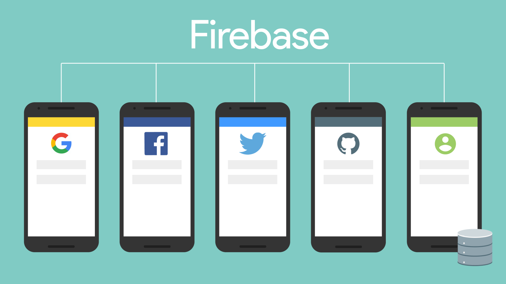

# Máster en Programación FullStack con JavaScript y Node.js
### JS, Node.js, Frontend, Backend, Firebase, Express, Patrones, HTML5_APIs, Asincronía, Websockets, Testing

## Clase 44

### Authentication



[Todas las funcionalidades](https://firebase.google.com/docs/auth/web/start)

**FirebaseUI**

FirebaseUI es una capa que recubre el módulo de autenticación de Firebase que provee de flujos visuales de autenticación con las plataformas más utilizadas de la web.

> Añade fácilmente autenticación visual mediante FirebaseUI

- **Multiple Providers**: Email, teléfono, Google, Facebook, Twitter and GitHub sign-in.
- **Account Linking**: Flujos definidos para almacenar la información del usuario.
- **Customization**: Permite sobreescribir los estilos CSS por defecto.
- **One-tap**: Un único click para autenticarse
- **Localized UI**: Internacionalización para 40 idiomas.

**Login con Google** (sólo cliente)

```javascript
const provider = new firebase.auth.GoogleAuthProvider();

// Open login pop-up
firebase.auth().signInWithPopup(provider).then((result) => {
  // This gives you a Google Access Token. You can use it to access the Google API.
  const token = result.credential.accessToken;
  // The signed-in user info.
  const user = result.user;
  // ...
}).catch((error) => {
  // Handle Errors here.
  const errorCode = error.code;
  const errorMessage = error.message;
  // The email of the user's account used.
  const email = error.email;
  // The firebase.auth.AuthCredential type that was used.
  const credential = error.credential;
  // ...
});
```
**Detectar cambios de usuario**

```javascript
firebase.auth().onAuthStateChanged((user) => {
  if (!user) {
    // Do something...
  }
});
```

### Firebase Authentication: Ejemplos
- [User-auth con Firebase](https://firebase.google.com/docs/auth?hl=es-419)
- [Ejemplo en jsfiddle](http://jsfiddle.net/firebase/a221m6pb/embedded/result,js,css/)
- [Ajustes de seguridad](https://firebase.google.com/docs/database/security/securing-data?hl=es)
- [Autenticar con JavaScript](https://firebase.google.com/docs/auth/web/password-auth?hl=es)
- [Administrar usuarios con JavaScript](https://firebase.google.com/docs/auth/web/manage-users)


### Firebase Authentication: Migración de 2.x a 3.x


**Actualización de tu código de autenticación**
- Antes
```javascript
  ref.authWithOAuthPopup("twitter", function(error, authData) {
    if (error) {
      // An error occurred
      console.error(error);
    } else {
      // User signed in!
      var uid = authData.uid;
    }
  });
```

- Ahora
```javascript
  var auth = firebase.auth();
  
  var provider = new firebase.auth.TwitterAuthProvider();
  auth.signInWithPopup(provider).then(function(result) {
    // User signed in!
    var uid = result.user.uid;
  }).catch(function(error) {
    // An error occurred
  });
```


**Obtener el token de acceso**

- Antes
```javascript
  ref.onAuth(function(authData) {
    if (authData) {
      var accessToken = authData.providerData[authData.provider].accessToken;
    }
  });
```

- Ahora
```javascript
  var auth = firebase.auth();
  
  var provider = new firebase.auth.GoogleAuthProvider();
  auth.signInWithPopup(provider).then(function(result) {
    var accessToken = result.credential.accessToken;
  });
```


**Controlar el estado de autenticación**

- Antes
```javascript
  ref.onAuth(function(authData) {
    if (authData) {
      // User signed in!
      var uid = authData.uid;
    } else {
      // User logged out
    }
  });
```

- Ahora
```javascript
  var auth = firebase.auth();
  
  auth.onAuthStateChanged(function(user) {
    if (user) {
      // User signed in!
      var uid = user.uid;
    } else {
      // User logged out
    }
  });
```

### Firebase: Hosting

**Recursos**
- [Deploy en Cloud](https://firebase.google.com/docs/hosting/deploying?hl=es-419)
- [Deploy usando Node](https://firebase.google.com/docs/hosting)
- [Pasos para desplegar](https://firebase.google.com/docs/hosting/deploying?hl=es-419)

**Pasos**

1. Instalar cli

  ```bash
  $ npm install -g firebase-tools
  ```

2. Inicializar aplicación:

  ```bash
  $ firebase init
  ```

3. Desplegar

  ```bash
  $ firebase deploy
  ```


### Ejercicios

**1 -** Crea un nuevo formulario que nos permita registrarnos en Firebase.

Objetivos:
- Comprobar si ese mismo usuario ya esta registrado (Email como ID), para evitar multiples inscripciones.
- Incluiremos en la página los usuarios que se van sumando.

**Solución:**

**2 -** Partiendo del ejercicio anterior... realizaremos un nuevo formulario que nos permita registrarnos usando nuestra cuenta de Github.

- Objetivos Opcionales:
  - Subir los datos proporcionados por Github a nuestra base de datos.
  - Incluir parte de los datos como el avatar y el nombre del usuario en el html 

- Documentación:
  - [GitHub User Authentication](https://firebase.google.com/docs/auth/web/github-auth?hl=es)

**Solución:**
