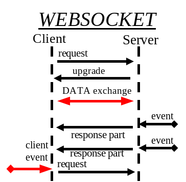

# Máster en Programación FullStack con JavaScript y Node.js
### JS, Node.js, Frontend, Backend, Firebase, Express, Patrones, HTML5_APIs, Asincronía, Websockets, Testing

## Clase 63

### WebSockets
- [WebSockets en Wikiwand](https://www.wikiwand.com/es/WebSocket)
- [Introducción a los WebSockets: incorporación de sockets a la Web en HTML5Rocks!](https://www.html5rocks.com/es/tutorials/websockets/basics/)
- [Beneficts of WebSockets](http://websocket.org/quantum.html)
- [Start Using HTML5 WebSockets Today](https://code.tutsplus.com/tutorials/start-using-html5-websockets-today--net-13270)
- [Dojo WebSocket](https://www.sitepen.com/blog/2010/10/31/dojo-websocket/)
- [Módulo WebSockets para server en node.js](https://github.com/websockets/ws)


- Protocolo de comunicación que se negocia sobre HTTP
- Full-duplex
- Única conexión permanente (Siempre conectado)
- Stream de mensajes
- Contenido en tiempo real
- Orientado a "eventos" (mensajes)
- Baja latencia


**Entendiendo los eventos**




**Negociación del protocolo WebSocket**

> Para establecer una conexión WebSocket, el cliente manda una petición de negociación WebSocket, y el servidor manda una respuesta de negociación WebSocket, como se puede ver en el siguiente ejemplo:
> [WebSockets en Wikiwand](https://www.wikiwand.com/es/WebSocket)

- Cliente:
```
  GET /demo HTTP/1.1
  Host: example.com
  Connection: Upgrade
  Sec-WebSocket-Key2: 12998 5 Y3 1 .P00
  Sec-WebSocket-Protocol: sample
  Upgrade: WebSocket
  Sec-WebSocket-Key1: 4 @1 46546xW%0l 1 5
  Origin: http://example.com

  ^n:ds[4U
```

- Servidor:
```
  HTTP/1.1 101 WebSocket Protocol Handshake
  Upgrade: WebSocket
  Connection: Upgrade
  Sec-WebSocket-Origin: http://example.com
  Sec-WebSocket-Location: ws://example.com/demo
  Sec-WebSocket-Protocol: sample

  8jKS'y:G*Co,Wxa-
```
> Los 8 bytes con valores numéricos que acompañan a los campos Sec-WebSocket-Key1 y Sec-WebSocket-Key2 son tokens aleatorios que el servidor utilizará para construir un token de 16 bytes al final de la negociación para confirmar que ha leído correctamente la petición de negociación del cliente.


### WS: Nativo

- [Soporte](http://caniuse.com/#search=websocket)
- [Documentación en MDN](https://developer.mozilla.org/en-US/docs/Web/API/WebSocket)
- [Ejemplo online de WebSocket nativo](https://javascript.info/websocket)

**Abrir la conexión**
```javascript
var myWebSocket = new WebSocket("ws://www.websockets.org");
```

**Gestión de Eventos**

- Siempre dispondremos del parametro event.
```javascript
myWebSocket.onopen = function() { console.log("Connection open ..."); };
myWebSocket.onmessage = function(evt) { console.log( "Received Message: ", evt.data); };
myWebSocket.onclose = function() { console.log("Connection closed."); };      
```

**Envio de mensajes**
```javascript
myWebSocket.send("Hello WebSockets!");
```

**Cerrar la conexión**
```javascript
myWebSocket.close();
```

### WS: Sockets.io


Caracrerísticas:
- Fácil
- Soporte a navegadores obsoletos (Fallback)
- Popular
- Extraordinariamente simple

Eventos reservados:
- socket.on("connect", cb)
- socket.on("disconnect", cb)
- socket.on("error", cb) *Solo cliente*
- socket.on("message", cb)

**Abrir la conexión**
```javascript
  var socket = io("url");
```

**Gestión de Eventos**
```javascript
  socket.on('channel', function(data) { 
    console.log( "Received Message: ", data); 
  });
```

**Envio de mensajoes**
```javascript
socket.emit('channel', data);
```

**Cerrar la conexión**
```javascript
socket.disconnect() 
socket.close(); // Si quieres reabrir. -> socket.connect();
```

### Nativo vs. Librerías

- [Differences between socket.io and websockets en Stackoverflow](http://stackoverflow.com/a/38558531)
- [WebSocket and Socket.IO by DWD](https://davidwalsh.name/websocket)
- [An Introduction to WebSockets by Matt West](http://blog.teamtreehouse.com/an-introduction-to-websockets)


### Ejemplos

- [IT Pulse](https://github.com/UlisesGascon/twitter-sentiments)
- [Curratelo](https://github.com/UlisesGascon/curratelo)
- [Ejemplo chat socket.io](https://socket.io/get-started/chat/)
- [Más ejemplos socket.io](https://socket.io/#examples)
- [Tutorial - socket.io - let's go to real time](https://openclassrooms.com/en/courses/2504541-ultra-fast-applications-using-node-js/2505653-socket-io-let-s-go-to-real-time)
- [Full socket.io client and server example](https://gist.github.com/luciopaiva/e6f60bd6e156714f0c5505c2be8e06d8)

### Ejercicios

**1 -** Utilizaremos la API de Blockchain.info para mostrar la información en tiempo real de las transacciones de Bitcoins.
- [Blockchain AP](https://blockchain.info/es/api)
- [Exchange Rates API](https://blockchain.info/es/api/exchange_rates_api)
- [Bitcoin Websocket API](https://blockchain.info/es/api/api_websocket)

**Detalles importantes:**
- Suscribete a "unconfirmed_sub" y "blocks_sub"
- Filtra las operaciones tipo "utx"
- Convierte los [Satoshis en Bitcoins](https://aulabitcoin.com/basicos/que-es-un-satoshi/). 
- 1 BTC = 100,000,000 Satoshi

**Consejos:**

- Puedes habilitar cors en la api de exchange rate con `https://blockchain.info/es/ticker?cors=true`.
- `{response}.op` nos permite filtrar por tipo de operación.
- `{response}.x.out` nos permite conocer todos los segmentos disponibles y concatenar sus valores `{response}.x.out[{i}].value`. 
- Recuerda que los segmentos estan en Satoshis y debemos convertirlos a BTC. 

**Concepto**


**[Solución](*)**