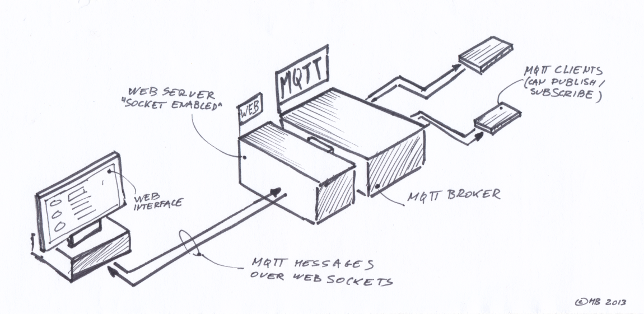
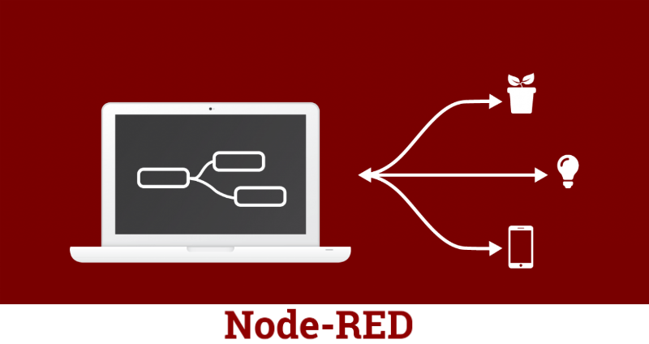
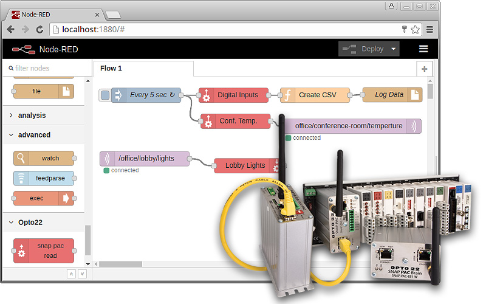

# Máster en Programación FullStack con JavaScript y Node.js
### JS, Node.js, Frontend, Backend, Firebase, Express, Patrones, HTML5_APIs, Asincronía, Websockets, Testing

## Clase 71

### MQTT


> MQTT es un protocolo de mensajería basado en ISO estándar publicación-suscripción. Funciona sobre el protocolo TCP / IP. Está diseñado para conexiones con ubicaciones remotas donde se requiere una "huella de código pequeño" o el ancho de banda de la red es limitado [Wikipedia](https://en.wikipedia.org/wiki/MQTT)

**Funcionamiento del protocolo**


**Esquema con web**



**Recursos**
- [How to Build an High Availability - MQTT Cluster for the Internet of Things](https://medium.com/@lelylan/how-to-build-an-high-availability-mqtt-cluster-for-the-internet-of-things-8011a06bd000)
- [IBM | Conociendo MQTT](https://www.ibm.com/developerworks/ssa/library/iot-mqtt-why-good-for-iot/index.html)
- [MQTT: un protocolo específico para el internet de las cosas](http://www.digitaldimension.solutions/es/blog-es/opinion-de-expertos/2015/02/mqtt-un-protocolo-especifico-para-el-internet-de-las-cosas/)

### Librerías de Real Time

**MQTT**
- [MQTT.js](https://github.com/mqttjs/MQTT.js) *The MQTT client for Node.js and the browser*
- [Mosca](https://github.com/mcollina/mosca) *MQTT broker as a module*
- [aedes](https://github.com/mcollina/aedes) *Barebone MQTT broker that can run on any stream server, the node way*
- [ascoltatori](https://github.com/mcollina/ascoltatori) *The pub/sub library for node backed by Redis, MongoDB, AMQP (RabbitMQ), ZeroMQ, MQTT (Mosquitto) or just plain node!*

**Web Sockets**

- [socket.io](https://github.com/socketio/socket.io) *Realtime application framework (Node.JS server)*
- [sockjs](https://github.com/sockjs/sockjs-node) *WebSocket emulation - Node.js server*
- [uWebSockets](https://github.com/uNetworking/uWebSockets) *Tiny WebSockets*
- [SocketCluster](https://github.com/SocketCluster/socketcluster) *Highly scalable realtime framework*
- [engine.io](https://github.com/socketio/engine.io) *Engine.IO is the implementation of transport-based cross-browser/cross-device bi-directional communication layer for Socket.IO.*
- [Kalmjs](https://github.com/kalm/kalm.js) *The MQTT client for Node.js and the browser*
- [rpc-websockets](https://github.com/elpheria/rpc-websockets) *JSON-RPC 2.0 implementation over WebSockets for Node.js and JavaScript*
- [deepstream.io-client-js](https://github.com/deepstreamIO/deepstream.io-client-js) *The Browser / Node.js Client for deepstream.io*

**Otras**
- [Faye](https://github.com/faye/faye) *Simple pub/sub messaging for the web*
- [Primus](https://github.com/primus/primus) *⚡️ Primus, the creator god of the transformers & an abstraction layer for real-time to prevent module lock-in.*
- [node-browserchannel](https://github.com/josephg/node-browserchannel) *An implementation of a google browserchannel server in node.js*

### Socket IO

**Servidor con `http`**

`public/index.html`

```html

<script src="http://localhost:3000/socket.io/socket.io.js"></script>
<script>
    var socket = io("http://localhost:3000");
    // use your socket
    socket.on("welcome", (message) => {
        // do something with the message.
    })
</script>
```

`server.js`
```js
const app = require('http').createServer(handler);
const io = require('socket.io')(app);
const fs = require('fs');

app.listen(80);

function handler (req, res) {
  fs.readFile(`${__dirname}/index.html`,
  (err, data) => {
    if (err) {
      res.writeHead(500);
      return res.end('Error loading index.html');
    }

    res.writeHead(200);
    res.end(data);
  });
}

io.on('connection', socket => {
  socket.emit('news', { hello: 'world' });
  socket.on('my other event', data => {
    console.log(data);
  });
});
```


**Servidor con `Express`**

`public/index.html`
```html

<script src="/socket.io/socket.io.js"></script>
<script>
  var socket = io();
</script>
```

`server.js`
```js
const app = require('express')();
const http = require('http').Server(app);
const io = require('socket.io')(http);

app.get('/', (req, res) => {
  res.sendFile(`${__dirname}/index.html`);
});

io.on('connection', socket => {
  console.log('a user connected');
});

http.listen(3000, () => {
  console.log('listening on *:3000');
});
```

**Recursos**
- [Web Site](https://socket.io/)
- [Socket.io | Blog](https://socket.io/blog/socket-io-2-0-1-2-0-2-and-2-0-3/)
- [Socket.io Docs | Overview](https://socket.io/docs/)
- [Socket.io | Demos](https://socket.io/demos/chat/)
- [Socket.io Docs | Server](https://socket.io/docs/server-api/)
- [Socket.io Docs | Client](https://socket.io/docs/client-api/)
- [Socket.io Docs | Introduction](https://socket.io/get-started/chat/)
- [Socket.io Docs | The web framework](https://socket.io/get-started/chat/#The-web-framework)
- [Socket.io Docs | Serving HTML](https://socket.io/get-started/chat/#Serving-HTML)
- [Socket.io Docs | Integrating Socket.IO](https://socket.io/get-started/chat/#Integrating-Socket-IO)
- [Socket.io Docs | Emitting events](https://socket.io/get-started/chat/#Emitting-events)
- [Socket.io Docs | Broadcasting](https://socket.io/get-started/chat/#Broadcasting)
- [Socket.io Docs | Homework](https://socket.io/get-started/chat/#Homework)
- [Socket.io Docs | Getting this example](https://socket.io/get-started/chat/#Getting-this-example)
- [How to build a real time chat application in Node.js using Express, Mongoose and Socket.io](https://medium.freecodecamp.org/simple-chat-application-in-node-js-using-express-mongoose-and-socket-io-ee62d94f5804)
- [Carlos Azaustre | WebSockets: Cómo utilizar Socket.io en tus aplicaciones web](https://carlosazaustre.es/websockets-como-utilizar-socket-io-en-tu-aplicacion-web/)
- [Introducción a Socket.io #nodejs](http://www.nodehispano.com/2012/09/introduccion-a-socket-io-nodejs/)
- [Servidor real time con socket.io](https://medium.com/@eddydecena/servidor-real-time-con-socket-io-18e84d39d12b)
- [You don't need express to get started with socket.io](https://dev.to/sadick/you-dont-need-express-to-get-started-with-socketio-4ieg)

### Mosca


**Claves**

- Standalone con `$ mosca`
- Puede embeberse en otras aplicaciones
- Autenticable con APIs
- Soporta AMQP, Mongo, Redis, y MQTT como pub/sub backends
- Necesita una base de datos como LevelDB, Mongo, o Redis
- Soporta websockets
- Rápido, 10k+ mensajes ruteados por segundo
- Escalable, 10k+ conexiones concurrentes

**Esquema de funcionamiento**


**Servidor standalone**
```js
var mosca = require('mosca');

var ascoltatore = {
  //using ascoltatore
  type: 'mongo',
  url: 'mongodb://localhost:27017/mqtt',
  pubsubCollection: 'ascoltatori',
  mongo: {}
};

var settings = {
  port: 1883,
  backend: ascoltatore
};

var server = new mosca.Server(settings);

server.on('clientConnected', function(client) {
    console.log('client connected', client.id);
});

// fired when a message is received
server.on('published', function(packet, client) {
  console.log('Published', packet.payload);
});

server.on('ready', setup);

// fired when the mqtt server is ready
function setup() {
  console.log('Mosca server is up and running');
}
```

**Recursos**
- [Mosca Wiki](https://github.com/mcollina/mosca/wiki)
- [Mosca Wiki | MQTT over Websockets](https://github.com/mcollina/mosca/wiki/MQTT-over-Websockets)
- [Mosca Wiki | Authentication & Authorization](https://github.com/mcollina/mosca/wiki/Authentication-&-Authorization)
- [Mosca Wiki | Docker support](https://github.com/mcollina/mosca/wiki/Docker-support)
- [Mosca Wiki | FAQ (Frequently asked questions)](https://github.com/mcollina/mosca/wiki/FAQ-(Frequently-asked-questions))
- [Mosca Wiki | Mosca & Redis & Ascoltatori](https://github.com/mcollina/mosca/wiki/Mosca-&-Redis-&-Ascoltatori)
- [Mosca Wiki | Mosca advanced usage](https://github.com/mcollina/mosca/wiki/Mosca-advanced-usage)
- [Mosca Wiki | Mosca as a standalone service](https://github.com/mcollina/mosca/wiki/Mosca-as-a-standalone-service.)
- [Mosca Wiki | Mosca basic usage](https://github.com/mcollina/mosca/wiki/Mosca-basic-usage)
- [Mosca Wiki | Mosca Showcase](https://github.com/mcollina/mosca/wiki/Mosca-Showcase)
- [Mosca Wiki | Persistence support](https://github.com/mcollina/mosca/wiki/Persistence-support)
- [Mosca Wiki | TLS SSL Configuration](https://github.com/mcollina/mosca/wiki/TLS-SSL-Configuration)
- [Mosca Wiki | Under the hood aka how mosca works](https://github.com/mcollina/mosca/wiki/Under-the-hood---aka-how-mosca-works)
- [Mosca in Github](https://github.com/mcollina/mosca)
- [MQTT and Node.js - Messaging in the Internet of Things](http://mcollina.github.io/mqtt_and_nodejs/)
- [Setting up private MQTT broker using Mosca in Node.js](https://medium.com/@alifabdullah/setting-up-private-mqtt-broker-using-mosca-in-node-js-c61a3c74f952)
- [Control your home using only Javascript](https://medium.com/@marassi/control-your-home-using-only-javascript-72a3b071c894)
- [Real time communications between IoT devices and Front-End JS apps](https://medium.com/@armova/real-time-communications-between-iot-devices-and-front-end-js-apps-20db4629b6f5)

### Node RED




**[Funcionamieto](https://www.youtube.com/watch?v=f5o4tIz2Zzc)**



**Recursos**
- [Node-RED](https://nodered.org/)
- [Node-RED | Blog](https://nodered.org/blog/)
- [Node-RED | Docs](https://nodered.org/docs/)
- [Node-RED | Flows](https://flows.nodered.org/?num_pages=1)
- [Node-RED Docs | Getting Started](https://nodered.org/docs/getting-started/)
- [Node-RED Docs | User Guide](https://nodered.org/docs/user-guide/)
- [Node-RED Docs | Node-RED Cookbook](https://cookbook.nodered.org/)
- [Node-RED Docs | Creating Nodes](https://nodered.org/docs/creating-nodes/)
- [Node-RED Docs | Developing Node-RED](https://nodered.org/docs/developing/)
- [Node-RED Docs | API Reference](https://nodered.org/docs/api/)
- [Github](https://github.com/node-red/node-red)
- [Introducción a Node-RED y Raspberry Pi con un sistema de alarma con Arduino](https://programarfacil.com/blog/raspberry-pi/introduccion-node-red-raspberry-pi/)
- [Node Red in 5 minutes](https://www.youtube.com/watch?v=f5o4tIz2Zzc)
- [Intro to Node-RED: Part 1 Fundamentals](https://www.youtube.com/watch?v=3AR432bguOY)
- [Node-RED un software para dominarlos a todos](https://www.youtube.com/watch?v=ZgG-rKLP_XI)
- [Programación Visual con Node-Red: Conectando el Internet de las Cosas con Facilidad](https://www.toptal.com/nodejs/programacion-visual-con-node-red-conectando-el-internet-de-las-cosas-con-facilidad/es)