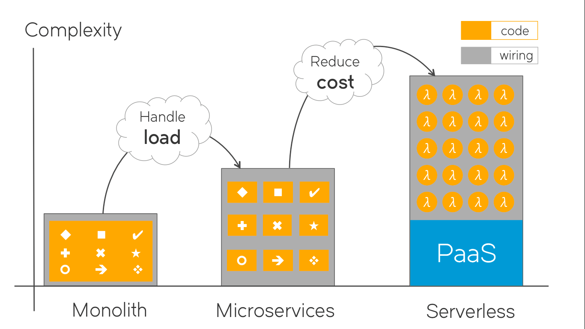
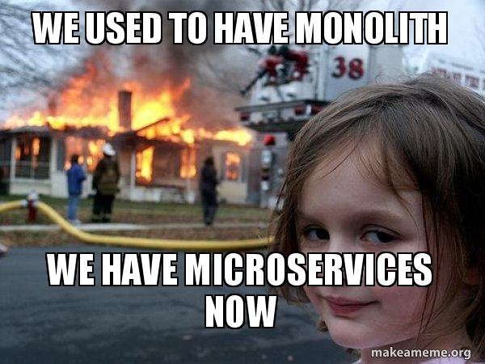
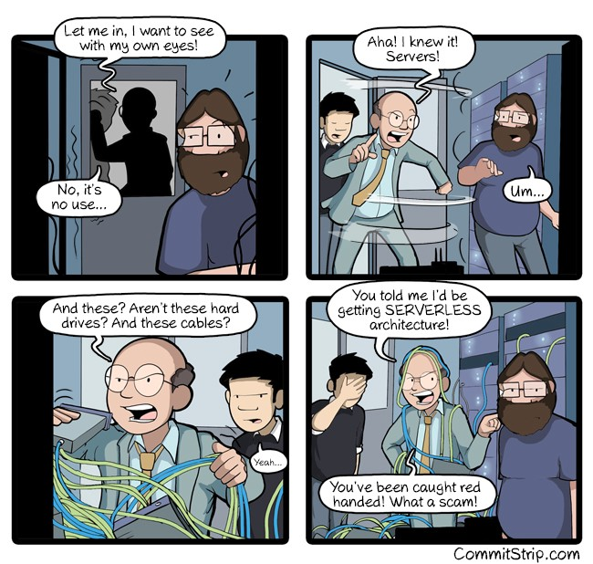
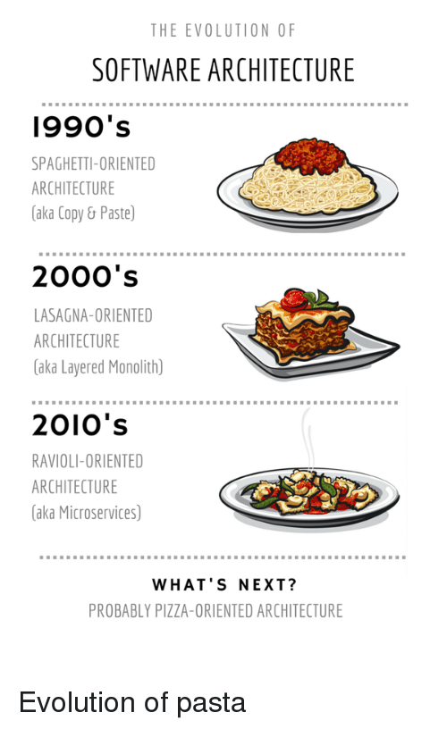
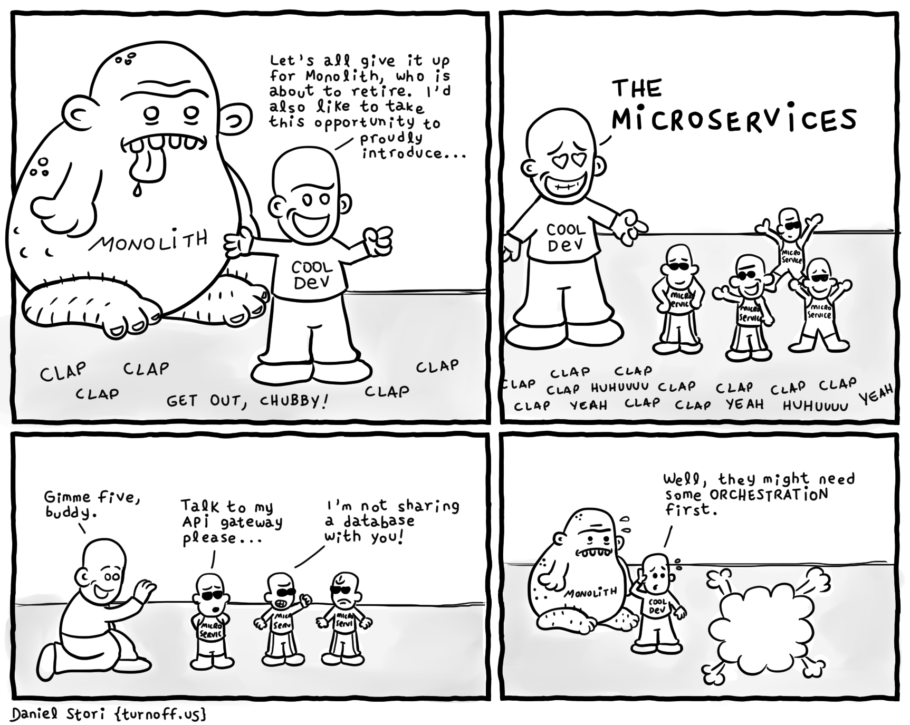

# Máster en Programación FullStack con JavaScript y Node.js
### JS, Node.js, Frontend, Backend, Firebase, Express, Patrones, HTML5_APIs, Asincronía, Websockets, Testing

## Clase 74

### Las nuevas arquitecturas

### [There is no cloud, just other people's computers](https://fsfe.org/activities/nocloud/)

### [The Twelve-Factor App](https://12factor.net/)

> En estos tiempos, el software se está distribuyendo como un servicio: se le denomina web apps, o software as a service (SaaS). “The twelve-factor app” es una metodología para construir aplicaciones SaaS que:
> 
> - Usan formatos declarativos para la automatización de la configuración, para minimizar el tiempo y el coste que supone que nuevos desarrolladores se unan al proyecto;
> - Tienen un contrato claro con el sistema operativo sobre el que trabajan, ofreciendo la máxima portabilidad entre los diferentes entornos de ejecución;
> - Son apropiadas para desplegarse en modernas plataformas en la nube, obviando la necesidad de servidores y administración de sistemas;
> - Minimizan las diferencias entre los entornos de desarrollo y producción, posibilitando un despliegue continuo para conseguir la máxima agilidad;
> - Y pueden escalar sin cambios significativos para las herramientas, la arquitectura o las prácticas de desarrollo.

**The Twelve-Factor App**

- [Código base (Codebase)](https://12factor.net/es/codebase) *Un código base sobre el que hacer el control de versiones y multiples despliegues*
- [Dependencias](https://12factor.net/es/dependencies) *Declarar y aislar explícitamente las dependencias*
- [Configuraciones](https://12factor.net/es/config) *Guardar la configuración en el entorno*
- [Backing services](https://12factor.net/es/backing-services) *Tratar a los “backing services” como recursos conectables*
- [Construir, desplegar, ejecutar](https://12factor.net/es/build-release-run) *Separar completamente la etapa de construcción de la etapa de ejecución*
- [Procesos](https://12factor.net/es/processes) *Ejecutar la aplicación como uno o más procesos sin estado*
- [Asignación de puertos](https://12factor.net/es/port-binding) *Publicar servicios mediante asignación de puertos*
- [Concurrencia](https://12factor.net/es/concurrency) *Escalar mediante el modelo de procesos*
- [Desechabilidad](https://12factor.net/es/disposability) *Hacer el sistema más robusto intentando conseguir inicios rápidos y finalizaciones seguras*
- [Paridad en desarrollo y producción](https://12factor.net/es/dev-prod-parity) *Mantener desarrollo, preproducción y producción tan parecidos como sea posible*
- [Historiales](https://12factor.net/es/logs) *Tratar los historiales como una transmisión de eventos*
- [Administración de procesos](https://12factor.net/es/admin-processes) *Ejecutar las tareas de gestión/administración como procesos que solo se ejecutan una vez*

### Monolito

**Problemas**
- Mucho código que gestionar
- Si el proyecto crece todo acaba desbordandose
- Si se cae algo... se cae todo completamente
- Escalar la aplicacion se hace en bloque aunque solo una parte especifica necesite más recursos
- Los precios de las maquinas dedicadas crecen junto al producto
- Las migraciones solo pueden hacerse en su totalidad
- Seguridad, infraestrcutura y todo lo demás es tambié nuestra responsabildiad
- No se puede escalar sin operaciones manuales, el sistema no es flexible

**Ventajas**
- Es facil desarrollar
- Todo puede quedarse en casa
- Menos dependencia de terceros

**Recursos**
- [De Monolito a microservicios](https://medium.com/laboratoria-how-to/de-monolito-a-microservicios-33c56746cd7b)
- [Arquitectura de microservicios vs arquitectura monolítica](https://apiumhub.com/es/tech-blog-barcelona/arquitectura-de-microservicios/)
- [¿Módulos o microservicios?](http://blog.altran.es/altran-smart-society/modulos-o-microservicios/) 

### Microservicios

**Problemas**
- El testing es complejo
- El exceso de segmentación complica la consistencia de datos
- El desarrollador asume problemas propios de SysAdmins
- La orquestación de servicios es un reto enorme
- Desmontar monolitos es un cuello de botella caro y complejo
- La planificación de nuevas funcionalides puede demorarse sin una arquitectura clara
- Versionar es dificil

**Ventajas**
- Depliegue y desarrollo independiente
- Los equipos pequeños pueden sacar servicios solos
- Multiparadigma y multilenguaje, al final todo es independiente
- Integración y despliegue muy automatizable con contenedores
- Migraciones por funcionalidad
- Funcionamiento modular, las caidas de servicio son parciales
- Facil de escalar
- Facil de integrarse con otros sistemas

**Recursos**

- [La Pastilla Roja | Microservicios](https://lapastillaroja.net/2014/07/microservicios/)
- [Wikipedia | Arquitectura de microservicios](https://es.wikipedia.org/wiki/Arquitectura_de_microservicios)
- [¿Qué es eso de los microservicios?](http://www.javiergarzas.com/2015/06/microservicios.html)
- [En mi local funciona | Arquitectura de microservicios](http://enmilocalfunciona.io/arquitectura-microservicios-1/)
- [RedHat | ¿Qué son los microservicios?](https://www.redhat.com/es/topics/microservices)
- [La muerte de la locura de los microservicios en 2018](https://www.campusmvp.es/recursos/post/la-muerte-de-la-locura-de-los-microservicios-en-2018.aspx)
- [Creando una arquitectura de microservicios en node.js y Kubernetes por Paul Goldbaum](https://www.todojs.com/creando-una-arquitectura-microservicios-node-js-kubernetes-paul-goldbaum/)
- [jdonsan | Recursos para aprender microservicios con NodeJS](https://github.com/jdonsan/microservicios-nodejs-recursos)
- [Microservicios, en qué lío me he metido - Ernesto Hernández y Miguel Ortega en T3chFest 2017](https://www.youtube.com/watch?v=pvLUp78ebtU)
- [How to build a NodeJS cinema microservice and deploy it with docker](https://medium.com/@cramirez92/build-a-nodejs-cinema-microservice-and-deploying-it-with-docker-part-1-7e28e25bfa8b)
- [5 easy steps to create your REST microservice in NodeJS](https://medium.com/moleculer/5-easy-steps-to-create-your-rest-microservice-in-nodejs-94aede3249fc)
- [Build your first Node.js microservice](https://mxstbr.blog/2017/01/your-first-node-microservice/)
- [The Best Node.js & Microservices Articles we Ever Wrote](https://blog.risingstack.com/top-nodejs-microservices-articles-risingstack/)
- [Github | mfornos/awesome-microservices](https://github.com/mfornos/awesome-microservices)
- [Awesome Node.js microservices in the cloud for (almost) free - Gojko Adzic](https://www.youtube.com/watch?v=mhNIXMV3-ZI)
- [Reddit - The Death of Microservice Madness](https://www.reddit.com/r/programming/comments/7pxriw/the_death_of_microservice_madness_in_2018/)
- [Hacker News - The Death of Microservice Madness](https://news.ycombinator.com/item?id=16200007)
- [Martin Fowler | Bounded Context](https://martinfowler.com/bliki/BoundedContext.html)
- [Martin Fowler | Microservices](https://martinfowler.com/articles/microservices.html)
- [30 questions to ask a serverless fanboy](https://www.iheavy.com/2017/03/13/30-questions-to-ask-a-serverless-fanboy/)

### Serverless (FaaS)

**Problemas**
- Posible vendorlocking si no controlas la abstracción
- Muy nuevo, faltan expertos y herramientas
- La monitorización es un reto significativo
- El entorno local puede ser complicado de crear
- El ecosistema está muy tierno
- Se requiere de una gran planificación y arquitectura para evitar que se te vaya de las manos.

**Ventajas**
- No te encargas de nada en plataformas (seguridad, puertos, maquinas, actualziaciones, parches...)
- Escala horizontalmente (adios clusters, balanceo, etc...)
- Pagas por lo que utilizas
- Tu provedor te ofrece una capa muuuy extensa de servicios que se acoplan de lujo

**Recursos**
- [serverless Framework](https://serverless.com/)
- [Qué es eso de serverless?](https://medium.com/@PamRucinque/qu%C3%A9-es-eso-de-serverless-f4f6c8949b87)
- [Martin Fowler | Serverless Architectures](https://www.martinfowler.com/articles/serverless.html)
- [Server-less architecture in the wild - Nikhila Ravi](https://www.youtube.com/watch?v=SwJUH3Le91s)
- [BBVA Serverless](https://www.bbva.com/es/serverless/)
- [Amazon | Creación de aplicaciones con arquitecturas sin servidor](https://aws.amazon.com/es/lambda/serverless-architectures-learn-more/)
- [Amazon | Sin servidor](https://aws.amazon.com/es/serverless/)
- [Wikipedia | Serverless computing](https://en.wikipedia.org/wiki/Serverless_computing)
- [Github | pmuens/awesome-serverless](https://github.com/pmuens/awesome-serverless)
- [A List of Serverless Frameworks](https://www.nkode.io/2017/09/12/serverless-frameworks.html)
- [Github | GalacticFog/awesome-serverless](https://libraries.io/github/GalacticFog/awesome-serverless)
- [Github | anaibol/awesome-serverless](https://github.com/anaibol/awesome-serverless)

### Resumen

### Decisiones

### Hablando de escalabilidad

**Recursos**
- [Scaling Node.js Applications](https://medium.freecodecamp.org/scaling-node-js-applications-8492bd8afadc)
- [Clustering in NodeJs — Performance Optimization](https://medium.com/tech-tajawal/clustering-in-nodejs-utilizing-multiple-processor-cores-75d78aeb0f4f)

