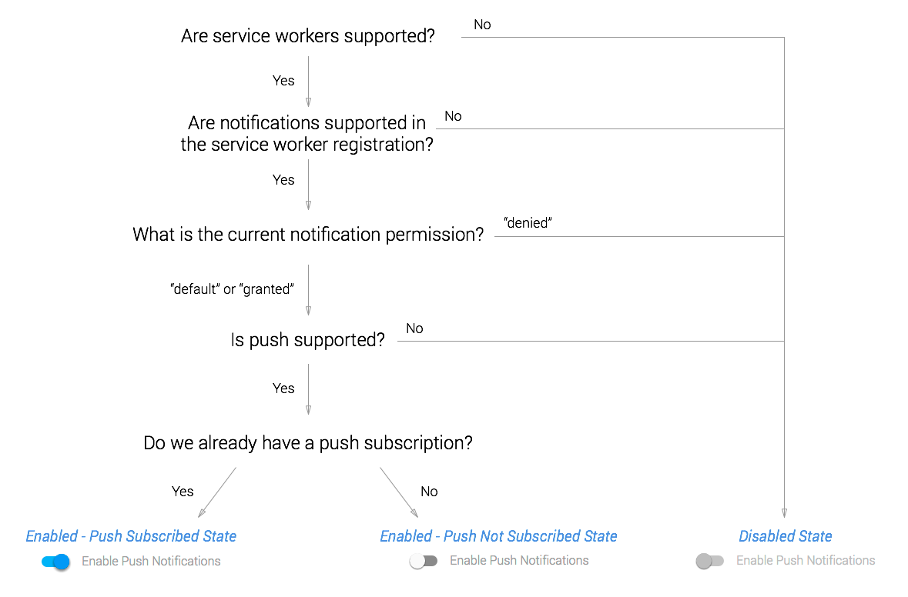
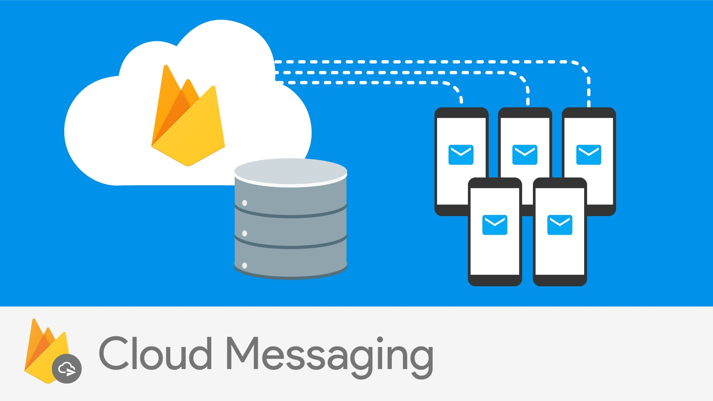
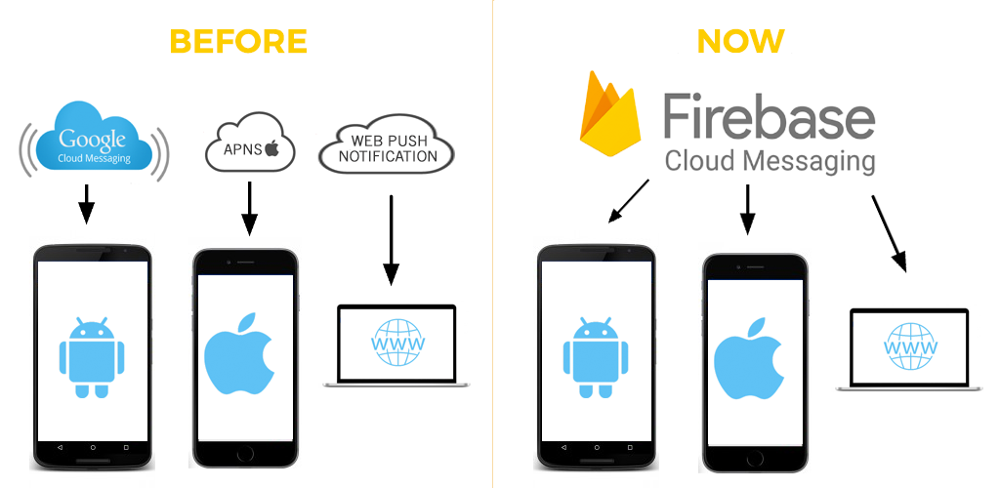
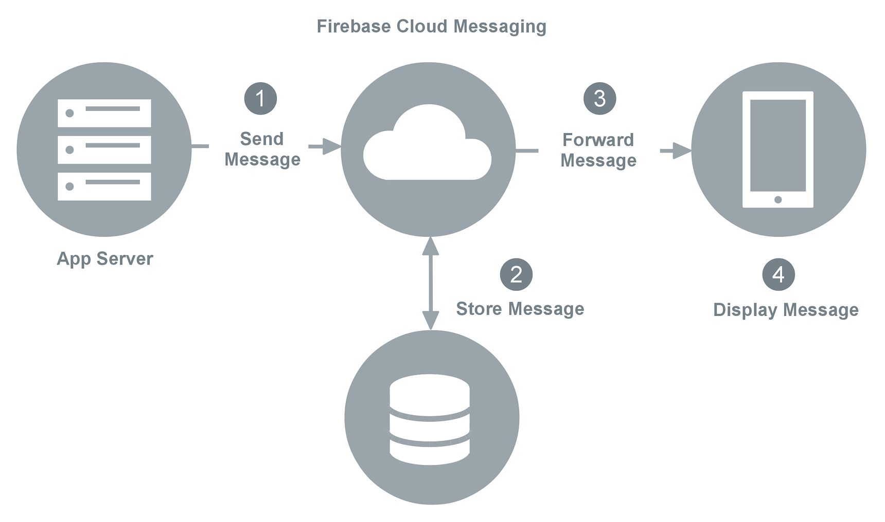

# Máster en Programación FullStack con JavaScript y Node.js
### JS, Node.js, Frontend, Backend, Firebase, Express, Patrones, HTML5_APIs, Asincronía, Websockets, Testing

## Clase 77

### HTML5 Push notifications

- Las notificaciones deben funcionar ne un segundo plano, por eso usaremso service workers
- Usamos [Push API](https://developer.mozilla.org/en-US/docs/Web/API/Push_API)] para mandar información desde el servirdor al service worker
- Usamos [Notifications API](https://developer.mozilla.org/en-US/docs/Web/API/Notifications_API) para renderrizar la notificación desde el web worker


**Esquema**



**Documentación**
- [MDN | Notifications API](https://developer.mozilla.org/en-US/docs/Web/API/Notifications_API)
- [MDN | Push API](https://developer.mozilla.org/en-US/docs/Web/API/Push_API)
- [IETF | Web Push Protocol](https://tools.ietf.org/html/draft-ietf-webpush-protocol)


**recursos**
- [Push Notifications on the Open Web](https://developers.google.com/web/updates/2015/03/push-notifications-on-the-open-web)
- [Web Push Notifications: Timely, Relevant, and Precise](https://developers.google.com/web/fundamentals/push-notifications/)
- [How can I do push notifications in an HTML5 Web application?](https://stackoverflow.com/a/32502379)
- [MDN | PushManager](https://developer.mozilla.org/en-US/docs/Web/API/PushManager)
- [MDN | Push API](https://developer.mozilla.org/en-US/docs/Web/API/Push_API)
- [Web Push Notifications: Timely, Relevant, and Precise](https://developers.google.com/web/fundamentals/push-notifications/)
- [ScaleDrone/html5-javascript-push-notifications](https://github.com/ScaleDrone/html5-javascript-push-notifications)
- [Sending Desktop HTML5 Notifications for Web Browsers](https://www.pubnub.com/blog/sending-desktop-html5-notifications-for-web-browsers-with-pubnub/)

### HTML5 Push Notifications: Configurando el Cliente


**Notas**
- Debemos pedir permisos al navegador (usuario final)
- Generar los detalles de `PushSubscription` y mandarlos al backend 
- `PushSubscription` tiene un formato standard
```json
{
  "endpoint": "https://random-push-service.com/some-kind-of-unique-id-1234/v2/",
  "keys": {
    "p256dh" :
"BNcRdreALRFXTkOOUHK1EtK2wtaz5Ry4YfYCA_0QTpQtUbVlUls0VJXg7A8u-Ts1XbjhazAkj7I99e8QcYP7DkM=",
    "auth"   : "tBHItJI5svbpez7KI4CCXg=="
  }
}
```


### HTML5 Push Notifications: Enviar una notificación Push al cliente


**Notas**
- El servidor envia el mensaje al dispositivo
- En el mensaje se definen varios parámetros
    - Tiempo de duración del mensaje. *Define la expiración para ser eliminado de la cola*
    - Urgencia del mensaje. *Define la importancia, que se vincula con estaos de ahorro de bateria, etc...*
    - Asunto del mensaje. *Define un asunto que luego podremos usar para filtrar* 

### HTML5 Push Notifications: Gestionar una notificación Push en cliente


**Notas**
- Cuando el dispositvo se conecta, el mensaje es enviado
- Cuando el mensaje caduca, si no pudo ser enviado se eliminará de la cola


### HTML5 Push Notifications: En la práctica
**Documentación**
- [Sucribiendo a un usuario](https://developers.google.com/web/fundamentals/push-notifications/subscribing-a-user)
- [Gestión de permisos](https://developers.google.com/web/fundamentals/push-notifications/permission-ux)
- [Enviar mensajes](https://developers.google.com/web/fundamentals/push-notifications/sending-messages-with-web-push-libraries)
- [El protocolo web push](https://developers.google.com/web/fundamentals/push-notifications/web-push-protocol)
- [Gestión de eventos push](https://developers.google.com/web/fundamentals/push-notifications/handling-messages)
- [Mostrar notificaciones](https://developers.google.com/web/fundamentals/push-notifications/display-a-notification)
- [El comportamiento de las notificaciones](https://developers.google.com/web/fundamentals/push-notifications/notification-behaviour)
- [Patrones de comportamiento en las notificaciones](https://developers.google.com/web/fundamentals/push-notifications/common-notification-patterns)
- [F.A.Q](https://developers.google.com/web/fundamentals/push-notifications/faq)


### Firebase Cloud Messaging



**NOTA: El SDK de FCM solo funciona en HTTPS**

**Documentación**
- [Web Oficial](https://firebase.google.com/docs/cloud-messaging/?hl=es-419)
- [Acerca de los mensajes de FCM](https://firebase.google.com/docs/cloud-messaging/concept-options?hl=es-419)
- [Configura una app cliente de Firebase Cloud Messaging en JavaScript](https://firebase.google.com/docs/cloud-messaging/js/client?hl=es-419)
- [Envía tu primer mensaje a una app en segundo plano](https://firebase.google.com/docs/cloud-messaging/js/first-message?hl=es-419)
- [Envía mensajes a varios dispositivos](https://firebase.google.com/docs/cloud-messaging/js/send-multiple?hl=es-419)
- [Recibe mensajes en un cliente de JavaScript](https://firebase.google.com/docs/cloud-messaging/js/receive?hl=es-419)
- [Mensajes por temas en Web/JavaScript](https://firebase.google.com/docs/cloud-messaging/js/topic-messaging?hl=es-419)
- [Casos de éxito: Firebase Cloud Messaging para Web (JavaScript)](https://firebase.google.com/docs/cloud-messaging/js/case-studies?hl=es-419)

**FCM vs GCM**




**Arquitectura**




**Ejemplo**
- [How to add push notifications to a web app with Firebase 🔔+🔥](https://medium.freecodecamp.org/how-to-add-push-notifications-to-a-web-app-with-firebase-528a702e13e1)
- [Ejemplo en Github](https://github.com/Leocardoso94/push-notification-demo)

**Recursos**
- [Firebase Cloud Messaging](https://firebase.google.com/docs/cloud-messaging/?hl=es-419)
- [Push Notifications with Firebase Cloud Messaging](https://www.pluralsight.com/guides/push-notifications-with-firebase-cloud-messaging)
- [GoogleChrome/samples/push-messaging-and-notifications/](https://github.com/GoogleChrome/samples/tree/gh-pages/push-messaging-and-notifications)


### Ejercicios

**1 -** Haz el codelab [Adding Push Notifications to a Web App](https://codelabs.developers.google.com/codelabs/push-notifications/#0)

**2 -** Haz el codelab [Firebase Web Codelab](https://codelabs.developers.google.com/codelabs/firebase-web/#15)
