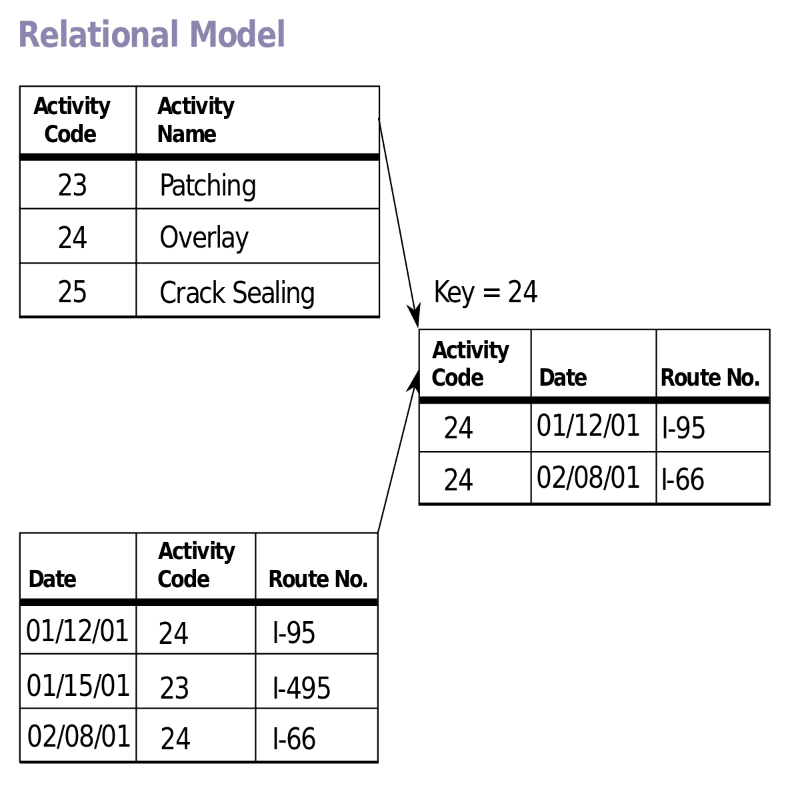
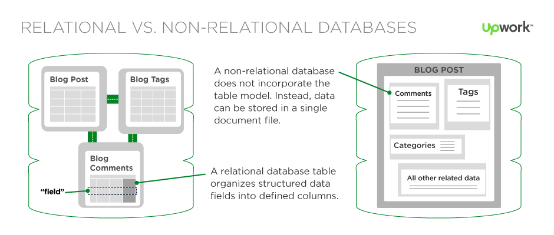
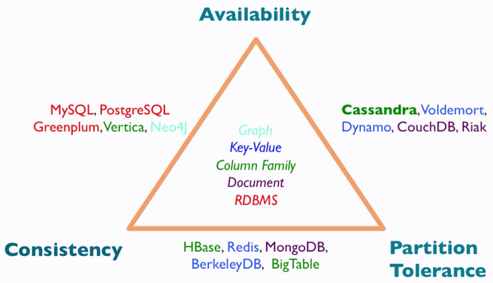
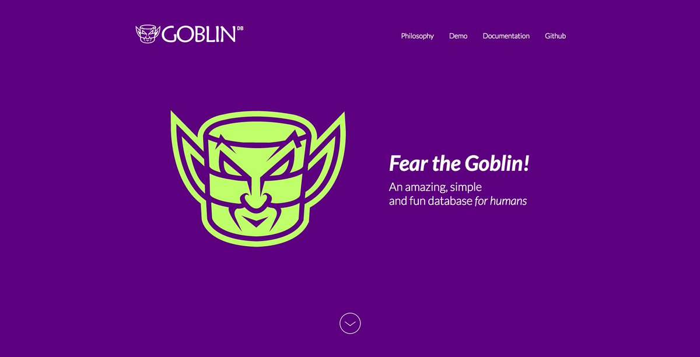

# Máster en Programación FullStack con JavaScript y Node.js
### JS, Node.js, Frontend, Backend, Firebase, Express, Patrones, HTML5_APIs, Asincronía, Websockets, Testing

## Clase 78

### Bases de datos


**Los objetivos**
- Organizar un colección de datos
- Guardar esa información y poder recuperarla posteriormente

**Codd's relational model**



> En este modelo todos los datos son almacenados en relaciones, y como cada relación es un conjunto de datos, el orden en el que estos se almacenen no tiene relevancia (a diferencia de otros modelos como el jerárquico y el de red). Esto tiene la considerable ventaja de que es más fácil de entender y de utilizar por un usuario no experto. La información puede ser recuperada o almacenada por medio de consultas que ofrecen una amplia flexibilidad y poder para administrar la información.
> Este modelo considera la base de datos como una colección de relaciones. De manera simple, una relación representa una tabla que no es más que un conjunto de filas, cada fila es un conjunto de campos y cada campo representa un valor que interpretado describe el mundo real. Cada fila también se puede denominar tupla o registro y a cada columna también se le puede llamar campo o atributo.
> Para manipular la información utilizamos un lenguaje relacional, actualmente se cuenta con dos lenguajes formales el Álgebra relacional y el Cálculo relacional. El Álgebra relacional permite describir la forma de realizar una consulta, en cambio, el Cálculo relacional solamente indica lo que se desea devolver.
> _[Wikipedia](https://es.wikipedia.org/wiki/Modelo_relacional)_


**12 reglas de Codd**

- Regla 0: *Regla de fundación. Cualquier sistema que se proclame como relacional, debe ser capaz de gestionar sus bases de datos enteramente mediante sus capacidades relacionales.*
- Regla 1: *Regla de la información. Toda la información en la base de datos es representada unidireccionalmente por valores en posiciones de las columnas dentro de filas de tablas. Toda la información en una base de datos relacional se representa explícitamente en el nivel Lógico exactamente de una manera: con valores en tablas.*
- Regla 2: *Regla del acceso garantizado. Todos los datos deben ser accesibles sin ambigüedad. Esta regla es esencialmente una nueva exposición del requisito fundamental para las llaves primarias. Dice que cada valor escalar individual en la base de datos debe ser lógicamente direccionable especificando el nombre de la tabla, la columna que lo contiene y la llave primaria.*
- Regla 3: *Regla del tratamiento sistemático de valores nulos. El sistema de gestión de base de datos debe permitir que haya campos nulos. Debe tener una representación de la "información que falta y de la información inaplicable" que sea sistemática y distinta de todos los valores regulares.*
- Regla 4: *Catálogo dinámico en línea basado en el modelo relacional. El sistema debe soportar un catálogo en línea, el catálogo relacional, que da acceso a la estructura de la base de datos y que debe ser accesible a los usuarios autorizados.*
- Regla 5: *Regla comprensiva del sublenguaje de los datos. El sistema debe soportar por lo menos un lenguaje relacional que: Tenga una sintaxis lineal. Puede ser utilizado de manera interactiva. Tenga soporte de operaciones de definición de datos, operaciones de manipulación de datos (actualización así como la recuperación), de control de la seguridad e integridad y operaciones de administración de transacciones.*
- Regla 6: *Regla de actualización de vistas. Todas las vistas que son teóricamente actualizables deben poder ser actualizadas por el sistema.*
- Regla 7: *Alto nivel de inserción, actualización y borrado. El sistema debe permitir la manipulación de alto nivel en los datos, es decir, sobre conjuntos de tuplas. Esto significa que los datos no solo se pueden recuperar de una base de datos relacional a partir de filas múltiples y/o de tablas múltiples, sino que también pueden realizarse inserciones, actualización y borrados sobre varias tuplas y/o tablas al mismo tiempo y no solo sobre registros individuales.*
- Regla 8: *Independencia física de los datos. Los programas de aplicación y actividades del terminal permanecen inalterados a nivel lógico aunque realicen cambios en las representaciones de almacenamiento o métodos de acceso.*
- Regla 9: *Independencia lógica de los datos. Los programas de aplicación y actividades del terminal permanecen inalterados a nivel lógico aunque se realicen cambios a las tablas base que preserven la información. La independencia de datos lógica es más difícil de lograr que la independencia física de datos.*
- Regla 10: *Independencia de la integridad. Las restricciones de integridad se deben especificar por separado de los programas de aplicación y almacenarse en la base de datos. Debe ser posible cambiar esas restricciones sin afectar innecesariamente a las aplicaciones existentes.*
- Regla 11: *Independencia de la distribución. La distribución de porciones de base de datos en distintas localizaciones debe ser invisible a los usuarios de la base de datos. Los usos existentes deben continuar funcionando con éxito: cuando una versión distribuida del SGBD se carga por primera vez cuando los datos existentes se redistribuyen en el sistema.*
- Regla 12: *La regla de la no subversión. Si el sistema proporciona una interfaz de bajo nivel de registro, aparte de una interfaz relacional, esa interfaz de bajo nivel no debe permitir su utilización para subvertir el sistema. Por ejemplo para sortear las reglas de seguridad relacional o las restricciones de integridad. Esto es debido a que a algunos sistemas no relacionales previamente existentes se les añadió una interfaz relacional pero, al mantener la interfaz nativa, seguía existiendo la posibilidad de trabajar no relacionalmente.*


### Bases de datos Relacionales


> Una base de datos relacional es un conjunto de una o más tablas estructuradas en registros (líneas) y campos (columnas), que se vinculan entre sí por un campo en común, en ambos casos posee las mismas características como por ejemplo el nombre de campo, tipo y longitud; a este campo generalmente se le denomina ID, identificador o clave. A esta manera de construir bases de datos se le denomina modelo relacional.
> 
> Las bases de datos relacionales pasan por un proceso al que se le conoce como normalización de una base de datos, el cual es entendido como el proceso necesario para que una base de datos sea utilizada de manera óptima.
> _[Wikipedia](https://es.wikipedia.org/wiki/Modelo_relacional)_


**Puntos comunes**

- Una base de datos se compone de varias tablas o relaciones.
- No pueden existir dos tablas con el mismo nombre ni registro.
- Cada tabla es a su vez un conjunto de campos (columnas) y registros (filas).
- La relación entre una tabla padre y un hijo se lleva a cabo por medio de las claves primarias y claves foráneas (o ajenas).
- Las claves primarias son la clave principal de un registro dentro de una tabla y estas deben cumplir con la integridad de datos.
- Las claves ajenas se colocan en la tabla hija, contienen el mismo valor que la clave primaria del registro padre; por medio de estas se hacen las formas relacionales.


### Bases de datos NO relacionales



> Las bases de datos NoSQL están diseñadas específicamente para modelos de datos específicos y tienen esquemas flexibles para crear aplicaciones modernas. Las bases de datos NoSQL son ampliamente reconocidas porque son fáciles de desarrollar, su funcionalidad y el rendimiento a escala. Usan una variedad de modelos de datos, que incluyen documentos, gráficos, clave-valor, en-memoria y búsqueda. Esta página incluye recursos para ayudarlo a comprender mejor las bases de datos NoSQL y comenzar.
> 
> Durante décadas, el modelo de datos predominante que se usó para el desarrollo de aplicaciones fue el modelo de datos relacionales utilizado por bases de datos relacionales como Oracle, DB2, SQL Server, MySQL y PostgreSQL. No fue sino hasta mediados y finales de la década del 2000 que otros modelos de datos comenzaron a adoptarse y aumentó su uso significativamente. Para diferenciar y categorizar estas nuevas clases de bases de datos y modelos de datos, se acuñó el término "NoSQL". En general, este término se usa de manera intercambiable con "no relacional".
> [Amazon AWS](https://aws.amazon.com/es/nosql/)


**¿Por qué debería usar una base de datos NoSQL?**
- Flexibilidad
- Escalabilidad
- Alto rendimiento
- Altamente funcional


**Tipos de bases de datos NoSQL**
- [Clave-valor](https://aws.amazon.com/es/nosql/key-value/) _Las bases de datos clave-valor son altamente divisibles y permiten escalado horizontal a escalas que otros tipos de bases de datos no pueden alcanzar. Los casos de uso como juegos, tecnología publicitaria e IoT se prestan particularmente bien con el modelo de datos clave-valor._
- [Documento](https://aws.amazon.com/es/nosql/document/) _Algunos desarrolladores no piensan en su modelo de datos en términos de filas y columnas desnormalizadas._
- [Gráfico/grafos](https://aws.amazon.com/es/nosql/graph/), _Los casos de uso típicos para una base de datos de gráficos incluyen redes sociales, motores de recomendaciones, detección de fraude y gráficos de conocimiento._
- [En memoria](https://aws.amazon.com/es/nosql/in-memory/) _Las aplicaciones de juegos y tecnología publicitaria tienen casos de uso como tablas de clasificación, tiendas de sesión y análisis en tiempo real que requieren tiempos de respuesta de microsegundos y pueden tener grandes picos de tráfico en cualquier momento._


### Teorema CAP o Conjetura de Brewer




> En Ciencias de la computación, el teorema CAP, también llamado Conjetura de Brewer, enuncia que es imposible para un sistema de cómputo distribuido garantizar simultáneamente:
> 
> - La [consistencia (Consistency)](https://es.wikipedia.org/wiki/Consistencia_de_datos), es decir, que todos los nodos vean la misma información al mismo tiempo.
> - La [disponibilidad (Availability)](https://es.wikipedia.org/wiki/Disponibilidad), es decir, la garantía de que cada petición a un nodo reciba una confirmación de si ha sido o no resuelta satisfactoriamente.
> - La tolerancia al particionado (Partition Tolerance), es decir, el sistema sigue funcionado incluso si algunos nodos fallan.
>
> Según el teorema, un sistema no puede asegurar más de dos de estas tres características simultáneamente.
> _[Wikipedia](https://es.wikipedia.org/wiki/Teorema_CAP)_

### GoblinDB



- [Web](http://goblindb.osweekends.com/)
- [Twitter](https://twitter.com/goblindb)
- [NPM](https://www.npmjs.com/package/@goblindb/goblindb)
- [Github](https://github.com/GoblinDBRocks)

**Presentaciones**
- [GoblinDB: Open expo 2018](https://slides.com/ulisesgascon/goblindb-open-expo-2018#/)

**Vídeos**
- [Goblin DB: una base de datos diferente | Ulises Gascón Organizador de Open Source Weekends](https://www.youtube.com/watch?v=PY48FxvFvOM)

**Proyectos**
- [AireMAD](http://airemad.com/#/)
- [Vanity.pillarsjs](https://github.com/pillarsjs/vanity/tree/dev)

### LowDB
> A small local database for small projects  (powered by lodash API)

- [NPM](https://www.npmjs.com/package/lowdb)
- [Github](https://github.com/typicode/lowdb)
- [Tutorial](https://www.diycode.cc/projects/typicode/lowdb)

### Ejercicios

**1 -** Migrar la versión server render de MovieFire con Express a GoblinDB

```js
// Tu solución
```


**2 -** Migrar la versión Api REST de MovieFire con Express a GoblinDB

```js
// Tu solución
```