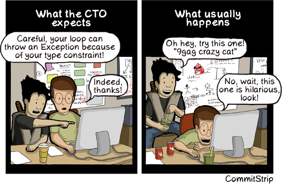

# Máster en Programación FullStack con JavaScript y Node.js
### JS, Node.js, Frontend, Backend, Firebase, Express, Patrones, HTML5_APIs, Asincronía, Websockets, Testing

## Clase 86

### Code Review

> Revisión de código es la examinación sistemática (como en la revisión por pares) del código fuente de un programa informático. Se practica con el objetivo de mejorar la calidad del código que se genera en el proceso de desarrollo del software, mediante la detección temprana de errores en el código de los programas o alternativas más eficientes a la implementación inicial. También se utiliza como técnica para mejorar las cualidades de los desarrolladores involucrados en la práctica, mediante la discusión abierta de posibles mejoras en el programa.

> Se realizan principalmente revisiones de código por parte de las metodologías ágiles que practican programación en pareja como parte del proceso, o en otras que pueden implementar revisiones periódicas de código, tanto informales como formales. [Wikipedia](https://es.wikipedia.org/wiki/Revisi%C3%B3n_de_c%C3%B3digo)

**Las claves**
- Forma parte de algunas metodologías ágiles
- Mejora la comunicación y la calidad del grupo
- No culpar a nadie, ni tomarselo personal
- La culpa de un bug es ahora compartida
- Se sugieren los cambios y se discuten

**¿Que revisar?**
- Arquitectura/Diseño (patrones, errores potenciales, manejo de errores, eficiencia...)
- Estilo (Longitudes, legibilidad, nombres...)
- Testing (Cobertura, mocks, etc...)

**Herramientas**
- [Upsource](https://www.jetbrains.com/upsource/)
- [Crucible](https://es.atlassian.com/software/crucible)
- [Gerrit](https://www.gerritcodereview.com/)
- [Github Code Review](https://github.com/features/code-review/)

### Pair coding

> La Programación en Pareja (o Pair Programming en inglés) requiere que dos programadores participen en un esfuerzo combinado de desarrollo en un sitio de trabajo. Cada miembro realiza una acción que el otro no está haciendo actualmente: Mientras que uno codifica las pruebas de unidades el otro piensa en la clase que satisfará la prueba, por ejemplo.

> La persona que está haciendo la codificación se le da el nombre de controlador mientras que a la persona que está dirigiendo se le llama el navegador. Se sugiere a menudo para que a los dos socios cambien de papeles por lo menos cada media hora o después de que se haga una prueba de unidad. [Wikipedia](https://es.wikipedia.org/wiki/Programaci%C3%B3n_en_pareja)

**Lo bueno**
- Mejor código
- Equipo más fuerte y cohesionado
- Se aprende mucho más
- Mejora la propiedad colectiva del código
- Mejora las habilidades sociales
- Reduce el número de bugs

**Lo malo**
- No todo el mundo se siente cómodo
- No es facil juntar niveles distintos
- Es dificil combinar tiempos (balance, vida personal, etc....)
- Es más dificil en remoto
- Los tiempos de desarrollo son distintos

### QA (Quality Assurance)

**Las claves**
- Persona especializada en asegurar la calidad del proyecto
- Se encarga del diseño y ejecucción de pruebas
- Se encarga de validar la calidad técnica (rendimeinto, optimización, etc...)
- Define standares, medidas y metricas que debemos cumplir
- Revisa y mantiene seguimiento de la calidad
- Coordina el testeo
- Las funciones pueden cambiar entre proyectos y empresas

**Recursos**
- [¿Qué es QA y por qué no debe faltar en tu proyecto?](https://bbvaopen4u.com/es/actualidad/que-es-qa-y-por-que-no-debe-faltar-en-tu-proyecto)
- [¿Que es un QA Tester?](http://iwantic.com/que-es-un-qa-tester/)
- [Tester vs Quality Assurance](https://www.paradigmadigital.com/dev/tester-vs-quality-assurance/)
- [Wikipedia | Aseguramiento de la calidad](https://es.wikipedia.org/wiki/Aseguramiento_de_la_calidad)
- [Qué es QA](https://josehuerta.es/gestion/proyectos/calidad/que-es-qa)
- [La misión del QA Manager dentro de la Organización](https://www.globetesting.com/2014/06/la-mision-del-qa-manager-dentro-de-la-organizacion/)
- [QA (Quality Assurance) y su mundo](http://blogs.encamina.com/piensa-en-software-desarrolla-en-colores/2017/11/02/qa-quality-assurance-y-su-mundo/)

### Testing

> Las pruebas de software (en inglés software testing) son las investigaciones empíricas y técnicas cuyo objetivo es proporcionar información objetiva e independiente sobre la calidad del producto a la parte interesada o stakeholder. Es una actividad más en el proceso de control de calidad. [Wikipedia](https://es.wikipedia.org/wiki/Pruebas_de_software)

**Tipos de pruebas**
- Estáticas, No necesitan ejecutar código alguno
- Dinámicas, que requieren ejecucción de código

**Según su ejecucción**
- Manuales, requieren de nuestra interacción para funcionar
- Automáticas, la propia máquina es capaz de relaizar las pruebas sin sufrir alteraciones

**Según el enfoque**
- [Caja Blanca](https://es.wikipedia.org/wiki/Pruebas_de_caja_blanca), nos centramos en el funcionamiento interno de las cosas
- [Caja Negra](https://es.wikipedia.org/wiki/Caja_negra_(sistemas)), nos centramos en las entradas (input) y salidas (output) de las clsas y no en su funcionamiento
- [Pruebas aleatorias](https://en.wikipedia.org/wiki/Random_testing), variante de la caja negra donde el input es aletorio

### Testing: ¿Qué podemos testear?

- [Pruebas unitarias (Unit Testing)](https://es.wikipedia.org/wiki/Prueba_unitaria)
- [Pruebas de integración (Integration testing)](https://es.wikipedia.org/wiki/Pruebas_de_integraci%C3%B3n)
- [Pruebas de sistema (System testing)](https://en.wikipedia.org/wiki/System_testing)
- [Pruebas de sanidad (Sanity check)](https://en.wikipedia.org/wiki/Sanity_testing)
- [Pruebas de humo (Smoke testing)](https://es.wikipedia.org/wiki/Pruebas_de_humo)
- [Pruebas alpha (Alpha Testing)](https://es.wikipedia.org/wiki/Pruebas_alpha)
- [Pruebas beta (Beta Testing)](https://es.wikipedia.org/wiki/Pruebas_beta)
- [Pruebas de aceptación (Acceptance Testing)](https://es.wikipedia.org/wiki/Pruebas_de_aceptaci%C3%B3n_(inform%C3%A1tica))
- [Pruebas de regresión (Regression testing)](https://es.wikipedia.org/wiki/Pruebas_de_regresi%C3%B3n)
- [Pruebas de compatibilidad](https://es.wikipedia.org/wiki/Pruebas_de_compatibilidad)
- [Pruebas de Accesibilidad (Accessibility testing)](https://en.wikipedia.org/wiki/Accessibility)
- [Pruebas de seguridad (Security Testing)](https://en.wikipedia.org/wiki/Security_testing)
- [Pruebas de destrucción (Destructive testing)](https://en.wikipedia.org/wiki/Destructive_testing)
- [Pruebas de Stress (Stress Testing)](https://en.wikipedia.org/wiki/Stress_testing)
- [Pruebas de Carga (Load Testing)](https://en.wikipedia.org/wiki/Load_testing#Software_load_testing)
- [Pruebas de usabilidad (Usability testing)](https://es.wikipedia.org/wiki/Prueba_de_usabilidad)
- [Pruebas de rendimiento (Performance Testing)](https://en.wikipedia.org/wiki/Software_performance_testing)
- [Pruebas de internacionalización y localización](https://en.wikipedia.org/wiki/Internationalization_and_localization)
- [Pruebas de escalabilidad](https://es.wikipedia.org/wiki/Pruebas_de_escalabilidad)
- [A/B testing](https://en.wikipedia.org/wiki/A/B_testing)
- [Pruebas de concurrencia (Concurrent testing)](https://en.wikipedia.org/wiki/Concurrent_testing)
- [Prueba de conformidad (Conformance testing)](https://en.wikipedia.org/wiki/Conformance_testing)

### Testing: ¿Que testeamos en JavaScript?

- Unit Testing
- Integration testing
- End-To-End Testing (e2e)
- Alpha & Beta Testing
- Accessibility testing
- Security Testing
- Stress Testing & Load Testing
- A/B testing

### TDD (Test-Driven Development)

> Desarrollo guiado por pruebas de software, o Test-driven development (TDD) es una práctica de ingeniería de software que involucra otras dos prácticas: Escribir las pruebas primero (Test First Development) y Refactorización (Refactoring). Para escribir las pruebas generalmente se utilizan las pruebas unitarias (unit test en inglés). En primer lugar, se escribe una prueba y se verifica que las pruebas fallan. A continuación, se implementa el código que hace que la prueba pase satisfactoriamente y seguidamente se refactoriza el código escrito. El propósito del desarrollo guiado por pruebas es lograr un código limpio que funcione. La idea es que los requisitos sean traducidos a pruebas, de este modo, cuando las pruebas pasen se garantizará que el software cumple con los requisitos que se han establecido. [Wikipedia](https://en.wikipedia.org/wiki/Test-driven_development)

**Las claves**
- Implementar solo lo necesario
- Evitar bugs a toda costa
- Creamos software modular y reutilizable
- No tener miedo de tocar "legacy"

**El Ciclo de desarrollo**
- Elegir un requisito
- Escribir las pruebas
- Verificar que fallan las pruebas
- Escribir suficiente código para pasar las preubas
- Pasar las pruebas
- Refactorizar y pasar las pruebas (hasta estar listo)
- El requisito ha sido implementado

**Filosofías derivadas**
- [Acceptance test–driven development (ATDD)](https://en.wikipedia.org/wiki/Acceptance_test%E2%80%93driven_development)
- [Behavior-driven development (BDD)](https://en.wikipedia.org/wiki/Behavior-driven_development)

**Recursos**
- [BDD + TDD para descubrir el diseño de tu código](http://enmilocalfunciona.io/bdd-tdd-para-descubrir-el-diseno-de-tu-codigo/)
- [TDD, BDD & Test de Aceptación](https://www.adictosaltrabajo.com/tutoriales/tdd-bdd-test-de-aceptacion/)
- [TDD vs BDD vs ATDD](https://josepablosarco.wordpress.com/2015/03/31/tdd-vs-bdd-vs-atdd/)
- [BDD y TDD en el mundo real (I) – Metodologías y herramientas](https://www.bit.es/knowledge-center/bdd-y-tdd-en-el-mundo-real-i/)
- [BDD y TDD en el mundo real (II) – Ciclo desde la fuente](https://www.bit.es/knowledge-center/bdd-y-tdd-en-el-mundo-real-ii/)
- [The Difference Between TDD and BDD](https://joshldavis.com/2013/05/27/difference-between-tdd-and-bdd/)
- [Orígenes de TDD, BDD, ATDD y sus diferencias](http://ecosistemasagiles.elecnor-deimos.com/index.php/2018/01/19/origenes-de-tdd-bdd-atdd-y-sus-diferencias/)
- [Wikipedia | Desarrollo guiado por comportamiento](https://es.wikipedia.org/wiki/Desarrollo_guiado_por_comportamiento)
- [¿ATDD? ¿BDD?… ¿Cómo? Aclarando el lío de siglas en Testing](http://www.javiergarzas.com/2015/08/atdd-bdd-como-aclarando-el-lio-de-siglas-en-testing.html)
- [Youtube | BDD vs TDD (explained)](https://www.youtube.com/watch?v=mT8QDNNhExg)
- [De testers y code reviews](https://testingfuncional.wordpress.com/2014/12/02/de-testers-y-code-reviews/)

### Piramide de Test creada por Mike Cohn

