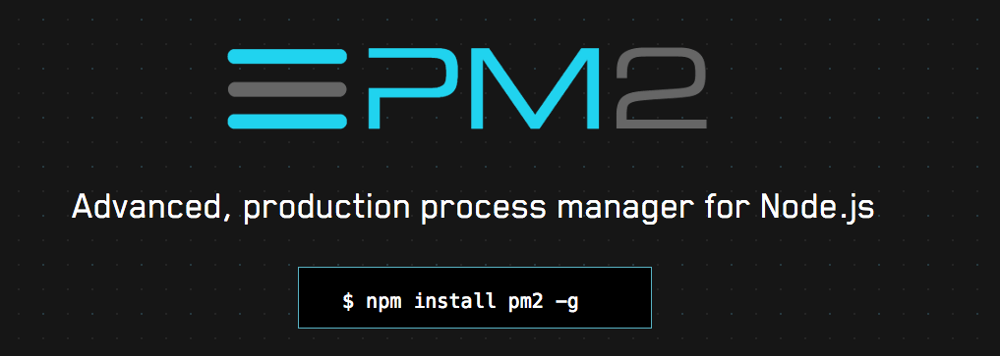
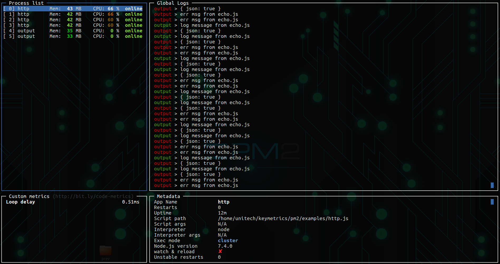
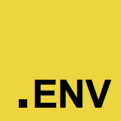

# Máster en Programación FullStack con JavaScript y Node.js
### JS, Node.js, Frontend, Backend, Firebase, Express, Patrones, HTML5_APIs, Asincronía, Websockets, Testing

## Clase 91


### node-inspector 

**Características** 
- Instalación global.
- Utilizar `debugger;` para lanzar las herrameintas de depuración del navegador.
```
node-debug server.js
```

# Node inspector nativo para debugging
- [debugging-getting-started](https://nodejs.org/en/docs/guides/debugging-getting-started/)
- [inspector](https://nodejs.org/api/inspector.html)
- [debugging-node-js-with-google-chrome](https://medium.com/the-node-js-collection/debugging-node-js-with-google-chrome-4965b5f910f4)

### nodemon
- ¿Cómo hacer que se refresque el servidor automáticamente?


**Características** 
- Relanza la aplicación por cada cambio que realizemos
- [Documentación](https://github.com/remy/nodemon#nodemon)
- [NPM Nodemon](https://www.npmjs.com/package/nodemon)
- [Reinicia tus aplicaciones node js automáticamente con nodemon](https://www.returngis.net/2019/08/reinicia-tus-aplicaciones-node-js-automaticamente-con-nodemon/)
```
npm install -g nodemon
```  
```
nodemon server.js
```

### forever

**Características** 
- Relanza la aplicación cuando deja de funcionar
- Opciones adiccionales
- Muy popular
- [Documentación](https://github.com/foreverjs/forever)
```
forever start/stop server.js
```

### PM2



**Características**
- Pensada para producción
- Muchas opciones de configuración
- Monitorización activa de muchos detalles clave de la aplicación
- [Documentación](http://pm2.keymetrics.io/)

### Super Features




### PM2: Comandos

**Arrancar**
```
pm2 start/stop server.js
```

**Parar un proceso**
```
pm2 stop app
```

**Lanzar el proceso de nuevo**
```
pm2 start app
```

**Listar procesos**
```
pm2 ls
```

**Borrar un proceso**
```
pm2 delete app
```

**Arrancar otros Lenguajes**
```
pm2 start echo.py
```

**Reinciar procesos**
```
pm2 restart app
```

**Monitorizar**
```
pm2 monit
```

**Mostrar todos los logs**
```
pm2 logs
```

**Borrar logs**
```
pm2 flush
```

### PM2: Avanzado

- [Load-Balancing (cluster mode)](https://pm2.io/docs/runtime/guide/load-balancing/)
- [Environment Variables in Node.js](https://pm2.keymetrics.io/docs/usage/environment/)
- [PM2 Module System](https://pm2.keymetrics.io/docs/advanced/pm2-module-system/)
- [Using PM2 with Docker](https://pm2.keymetrics.io/docs/usage/docker-pm2-nodejs/)
- [CLI reference](https://pm2.io/docs/runtime/reference/pm2-cli/)
- [Programmatic](https://pm2.io/docs/runtime/reference/pm2-programmatic/)
- [PM2 Plus](https://pm2.io/docs/plus/overview/)


### dotenv



> Dotenv is a zero-dependency module that loads environment variables from a .env file into process.env. Storing configuration in the environment separate from code is based on The Twelve-Factor App methodology.

**Instalación**
```bash
npm install dotenv
```

**Uso en ficheros, es necesario inicializar lo antes posible**
```js
require('dotenv').config()

const db = require('db')
db.connect({
  host: process.env.DB_HOST,
  username: process.env.DB_USER,
  password: process.env.DB_PASS
})
```

**Fichero `.env` en la raiz**
```bash
DB_HOST=localhost
DB_USER=root
DB_PASS=s1mpl3
```


### Gestión de versiones
- [tj/n](https://github.com/tj/n) *Node.js version management*
- [creationix/nvm](https://github.com/creationix/nvm) *Node Version Manager - Simple bash script to manage multiple active node.js versions*
- [n now works on windows 10 (using windows subsystem for linux)](https://github.com/tj/n/issues/511)
- [Nodist for windows](https://github.com/nullivex/nodist)
- [node-version-manager-nvm-on-windows](https://stackoverflow.com/questions/25654234/node-version-manager-nvm-on-windows)
- [Switching between Node versions during development](https://stackoverflow.com/questions/25654234/node-version-manager-nvm-on-windows)

### Ejemplos de despliegue en Digital Ocean con PM2
- [Deploying a Node App to Digital Ocean](https://scotch.io/tutorials/deploying-a-node-app-to-digital-ocean)
- [Cómo configurar una aplicación de Node.js para producción en Ubuntu 18.04](https://www.digitalocean.com/community/tutorials/como-configurar-una-aplicacion-de-node-js-para-produccion-en-ubuntu-18-04-es)
- [How To Use PM2 to Setup a Node.js Production Environment On An Ubuntu VPS](https://www.digitalocean.com/community/tutorials/how-to-use-pm2-to-setup-a-node-js-production-environment-on-an-ubuntu-vps)

### Próximamente estaremos desplegando en entornos como ...
- [Digital Ocean](https://www.digitalocean.com/)
- [OVH](https://www.ovh.es/)
- [Heroku](https://cloud.google.com/?hl=es)


