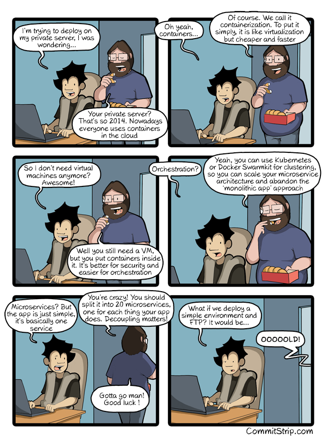
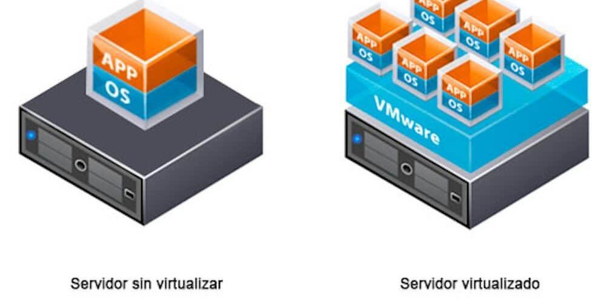
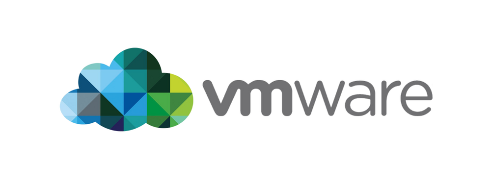
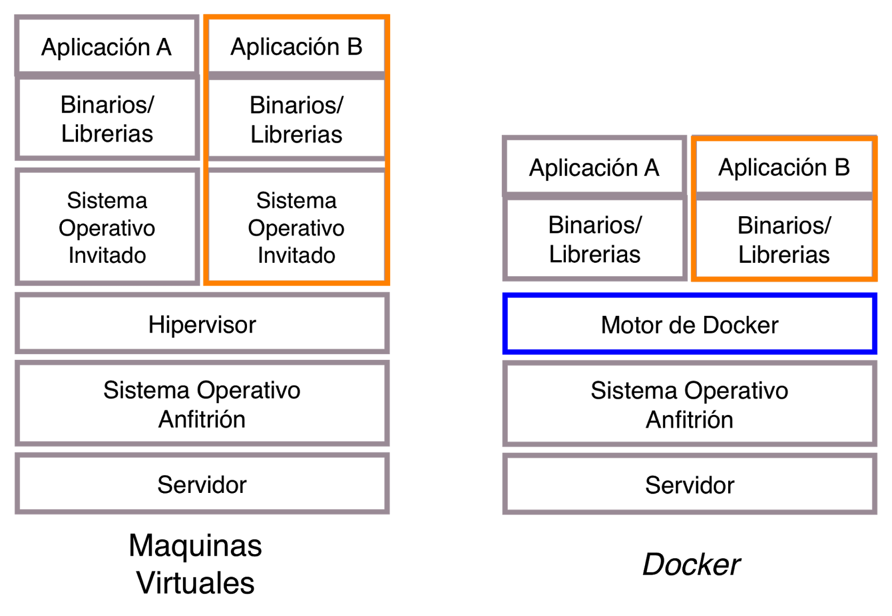
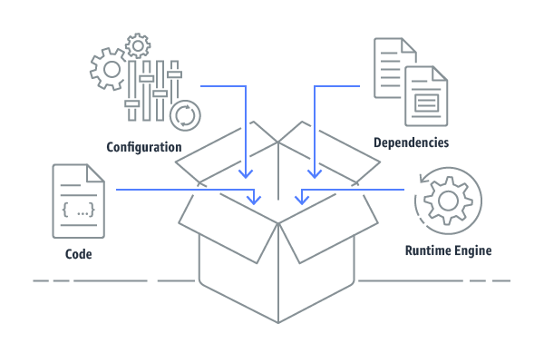
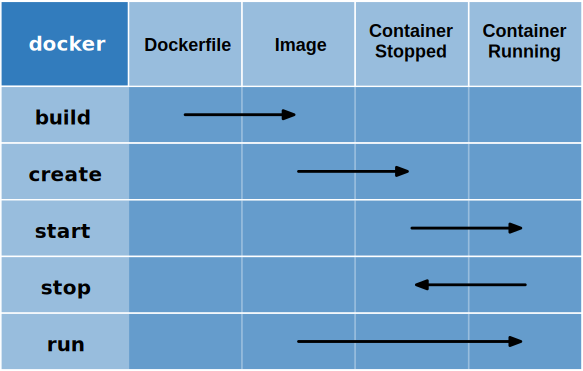
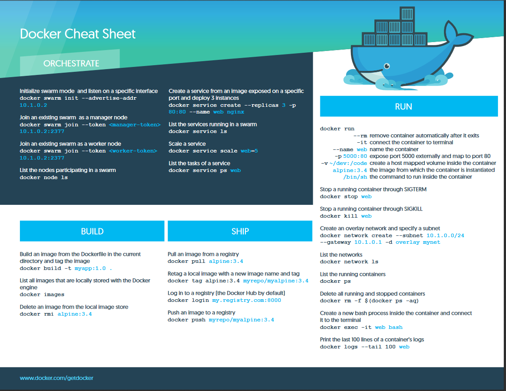
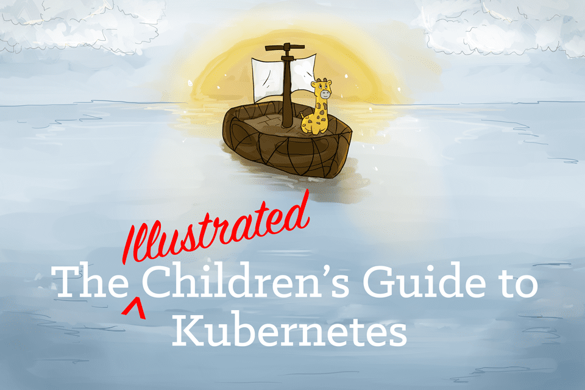
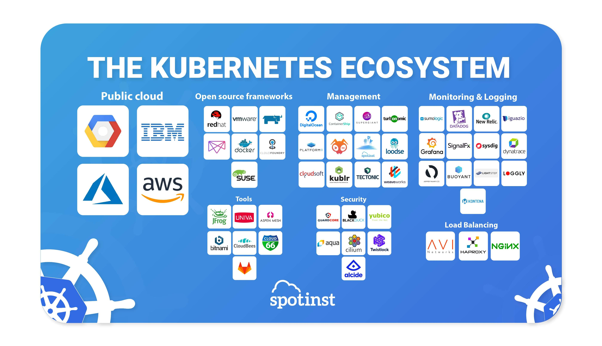

# Máster en Programación FullStack con JavaScript y Node.js
### JS, Node.js, Frontend, Backend, Firebase, Express, Patrones, HTML5_APIs, Asincronía, Websockets, Testing

## Clase 97




### Virtualización

> En Informática, la virtualización es la creación a través de software de una versión virtual de algún recurso tecnológico, como puede ser una plataforma de hardware, un sistema operativo, un dispositivo de almacenamiento u otros recursos de red. En los ámbitos de habla inglesa, este término se suele conocer por el numerónimo "v12n".
> 
> Dicho de otra manera, se refiere a la abstracción de los recursos de una computadora, llamada Hypervisor o VMM (Virtual Machine Monitor) que crea una capa de abstracción entre el hardware de la máquina física (host) y el sistema operativo de la máquina virtual (virtual machine, guest), dividiéndose el recurso en uno o más entornos de ejecución.
> 
> Esta capa de software (VMM) maneja, gestiona y arbitra los cuatro recursos principales de una computadora (CPU, Memoria, Dispositivos Periféricos y Conexiones de Red). Así podrá repartir dinámicamente estos recursos entre todas las máquinas virtuales definidas en el computador central. Esto hace que se puedan tener varios ordenadores virtuales ejecutándose en el mismo ordenador físico. [Wikipedia](https://es.wikipedia.org/wiki/Virtualizaci%C3%B3n)

**Problemas**
- Menos rendimiento ya que todo es virtualizado
- Las maquinas en ocasiones deben ser especializadas
- Es necesario conocer el manejo de la virtualización

**Ventajas**
- Menos costes ya que tienes menos servidores físicos
- Menos costes porque reduces los tiempos de inactividad de las máquinas
- Permite hacer backups constantes
- Es más facil recuperar los sistemas


**Sin vitualizar**


**Con virtualización**


**Recursos**
- [What is virtualization?](https://opensource.com/resources/virtualization)
- [¿Qué es la virtualización?](https://www.redhat.com/es/topics/virtualization/what-is-virtualization)
- [Github | Wenzel/awesome-virtualization](https://github.com/Wenzel/awesome-virtualization)


### Vagrant


**Recursos**
- [vagrantup.com](https://www.vagrantup.com/)
- [Vagrant | Intro](https://www.vagrantup.com/intro/index.html)
- [Vagrant | Docs](https://www.vagrantup.com/docs/index.html)
- [Wikipedia | Vagrant](https://es.wikipedia.org/wiki/Vagrant_(software))
- [Vagrant in 5 minutes](https://www.youtube.com/watch?v=cx79jOpZVE8)
- [Introducción a Vagrant](https://guiadev.com/vagrant/)
- [What is Vagrant?](https://opensource.com/resources/vagrant)
- [Github | hashicorp/vagrant](https://github.com/hashicorp/vagrant)
- [Docker vs Vagrant](https://guiadev.com/docker-vs-vagrant/)


### VMWare



**Recursos**
- [Wikipedia | VMware](https://es.wikipedia.org/wiki/VMware)
- [vmware.com](https://www.vmware.com/es.html#)
- [¿Qué es Vmware vSphere?](https://virtualizadesdezero.com/que-es-vmware-vsphere/)
- [VMware Cloud on AWS](https://aws.amazon.com/es/vmware/)
- [Soluciones IBM Cloud for VMware](https://www.ibm.com/es-es/cloud/vmware)

### Oracle VM VirtualBox


**Recursos**
- [Wikipedia | Virtualbox](https://es.wikipedia.org/wiki/VirtualBox)
- [VirtualBox.org](https://www.virtualbox.org/)
- [VirtualBox.org | End-user documentation](https://www.virtualbox.org/wiki/End-user_documentation)
- [VirtualBox.org | Technical documentation](https://www.virtualbox.org/wiki/Technical_documentation)
- [VirtualBox.org | Community](https://www.virtualbox.org/wiki/Community)
- [Oracle | Desarrollo mediante VM Virtual Box, despliegue en cualquier parte](https://www.oracle.com/es/virtualization/virtualbox/)


### Contenedores


**La idea**




**Un contenedor**




**Recursos**
- [Máquinas Virtuales vs Contenedores, ¿Qué son y cómo elegir entre estas tecnologías?](https://www.fayerwayer.com/2016/06/maquinas-virtuales-vs-contenedores-que-son-y-como-elegir-entre-estas-tecnologias/)
- [Microsoft | Introducción a Containers y Docker](https://docs.microsoft.com/es-es/dotnet/standard/microservices-architecture/container-docker-introduction/)
- [Los beneficios de utilizar Docker y contenedores a la hora de programar](https://www.campusmvp.es/recursos/post/los-beneficios-de-utilizar-docker-y-contenedores-a-la-hora-de-programar.aspx)
- [Para qué sirven los contenedores en software](https://blogthinkbig.com/para-que-sirven-los-contenedores-en-software)
- [AWS | ¿Qué es un contenedor?](https://aws.amazon.com/es/containers/)
- [Docker vs Máquinas Virtuales: ¿qué es mejor?](https://guiadev.com/docker-vs-maquinas-virtuales-mejor/)


### Docker


**Filosofía**
- Build
- Ship
- Run


**Estados**




**Docker en Resumen**




**Docker resumen detallado de comandos**


**Recursos**
- [Introducción a Docker para principiantes](https://guiadev.com/introduccion-a-docker/)
- [AWS | ¿Qué es Docker?](https://aws.amazon.com/es/docker/)
- [¿Qué es Docker? ¿Para qué se utiliza? Explicado de forma sencilla](https://www.javiergarzas.com/2015/07/que-es-docker-sencillo.html)
- [Wikipedia | Docker](https://es.wikipedia.org/wiki/Docker_(software))
- [Docker](https://www.docker.com/)
- [Docker | What?](https://www.docker.com/what-docker)
- [Docker | Docs](https://docs.docker.com/)
- [Red Hat | ¿Qué es DOCKER?](https://www.redhat.com/es/topics/containers/what-is-docker)
- [What is Docker?](https://opensource.com/resources/what-docker)
- [What is Docker and why is it so darn popular?](https://www.zdnet.com/article/what-is-docker-and-why-is-it-so-darn-popular/)
- [Living in a Docker world](https://www.theverge.com/circuitbreaker/2018/5/25/17386716/docker-kubernetes-containers-explained)
- [Github | veggiemonk/awesome-docker](https://github.com/veggiemonk/awesome-docker)
- [Para los que empiezan: crear y ejecutar una imagen propia en un contenedor Docker](https://www.javiergarzas.com/2015/11/para-los-que-empiezan-crear-y-ejecutar-una-imagen-propia-en-un-contenedor-docker-12.html)


### Docker: ¡Simplificando!
- Necesitas [bajarte Docker e instalarlo](https://docs.docker.com/install/) en la máquina
- Generas tu aplicación normalmente, pero usas variables de entorno como `process.ENV.PORT` en tu `config.js`
- Necesitas generar una imagen de docker y para ello necesitas generar un `Dockerfile`
    ```yml
    FROM node:8
    
    # Create app directory
    WORKDIR /usr/src/app
    
    # Install app dependencies
    # A wildcard is used to ensure both package.json AND package-lock.json are copied
    # where available (npm@5+)
    COPY package*.json ./
    
    RUN npm install
    # If you are building your code for production
    # RUN npm ci --only=production
    
    # Bundle app source
    COPY . .
    
    EXPOSE 8080
    CMD [ "npm", "start" ]
    ```
- Docker Build: `$ docker build -t <your username>/node-web-app .`
- Verificar que esta creada... `docker images`
- Dcoker Run: `$ docker run -p 49160:8080 -d <your username>/node-web-app`
- Identificar el container `$ docker ps`
- Saca los mensajes de consola `$ docker logs <container id>`
- Entra en el contenedor `$ docker exec -it <container id> /bin/bash`
- Verifica que funciona y chequea el puerto `$ docker ps`
- Verifica que el puerto esta expuesto `$ curl -i localhost:49160`

**Recursos**
- [Repaso rápido: Docker with Node.js in 5-minutes](https://www.youtube.com/watch?v=edPrPcgjTgw)
- [Dockerizing a Node.js web app](https://nodejs.org/en/docs/guides/nodejs-docker-webapp/)

### Kubernetes (K8s)


[](https://www.youtube.com/watch?v=4ht22ReBjno)


> Kubernetes (k8s) is an open-source system for automating deployment, scaling, and management of containerized applications.


**Funcionalidades**
- [Service discovery and load balancing](https://kubernetes.io/docs/concepts/services-networking/service/)
- [Storage orchestration](https://kubernetes.io/docs/concepts/storage/persistent-volumes/)
- [Automated rollouts and rollbacks](https://kubernetes.io/docs/concepts/workloads/controllers/deployment/)
- [Batch execution](https://kubernetes.io/docs/concepts/workloads/controllers/jobs-run-to-completion/)
- [Automatic binpacking](https://kubernetes.io/docs/concepts/configuration/manage-compute-resources-container/)
- [Self-healing](https://kubernetes.io/docs/concepts/workloads/controllers/replicationcontroller/#how-a-replicationcontroller-works)
- [Secret and configuration management](https://kubernetes.io/docs/concepts/configuration/secret/)
- [Horizontal scaling](https://kubernetes.io/docs/tasks/run-application/horizontal-pod-autoscale/)

**Diseño**
- Cápsulas(Pods)
- Etiquetas y selectores
- Controladores
- Servicios

**Módulos básicos**
- Creación de un clúster de Kubernetes
- Despliegue de una aplicación
- Exploración de aplicaciones
- Mantenimiento de Pods
- Ampliación de aplicaciones
- Actualización de aplicaciones

**Arquitectura**
- etcd
- Servidor de API
- Planificador
- Administrador del controlador
- Nodo Kubernetes
- Kubelet
- Kube-Proxy
- cAdvisor


**Ecosistema**




**Arquitectura en detalles**


**Recursos**
- [Wikipedia | Kubernetes](https://es.wikipedia.org/wiki/Kubernetes)
- [Wired | Google Open Sources Its Secret Weapon in Cloud Computing](https://www.wired.com/2014/06/google-kubernetes/)
- [Why Red Hat Chose Kubernetes for OpenShift](https://blog.openshift.com/red-hat-chose-kubernetes-openshift/)
- [Kubernetes](https://kubernetes.io/)
- [Kubernetes | Docs](https://kubernetes.io/docs/home/)
- [Kubernetes | Blog](https://kubernetes.io/blog/)
- [Paradigma | Por qué todos apuestan por Kubernetes](https://www.paradigmadigital.com/techbiz/por-que-todos-apuestan-por-kubernetes/)
- [Kubernetes for dummies. Explicado en 10 minutos](http://www.javiergarzas.com/2016/02/kubernetes-for-dummies-explicado-en-10-minutos.html)
- [FCC | Learn Kubernetes in Under 3 Hours: A Detailed Guide to Orchestrating Containers](https://medium.freecodecamp.org/learn-kubernetes-in-under-3-hours-a-detailed-guide-to-orchestrating-containers-114ff420e882)
- [Kubernetes in 5 mins](https://www.youtube.com/watch?v=PH-2FfFD2PU)
- [Github | kubernetes/kubernetes](https://github.com/kubernetes/kubernetes)
- [Github | ramitsurana/awesome-kubernetes](https://github.com/ramitsurana/awesome-kubernetes)


